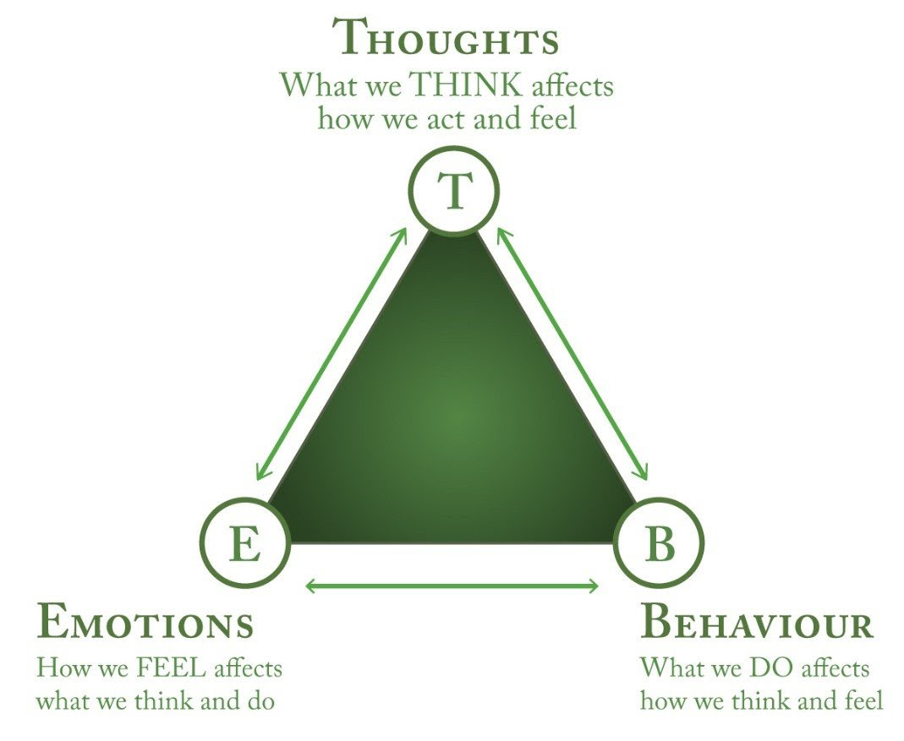

> _“Emotion arises at the place where mind & body meet. It is the body’s reaction to mind.” — Eckhart Tolle_

> _“We as a culture seem to be dedicated to the idea that ‘negative’ human emotions need to be fixed, managed, or changed—not experienced as part of a whole life. We are treating our own lives as problems to be solved as if we can sort through our experiences for the ones we like and throw out the rest.” — Steven C. Hayes_

---

|  |
| :---: |
|  [體現認知 (Embodied Cognition)](https://www.google.com/search?q=Embodied+Cognition) — 我們的身體狀態與心智狀態密切相關，彼此相互影響 ([Source](https://integralsomaticpsychology.com/science-embodied-cognition-and-enactive-emotion-implications-for-improving-outcomes-in-all-therapies/)) |

---

= ACT, typically pronounced as the word “act” [@hayesGetOutYour20]

---

was developed in the 1980s by psychologist [Steven C. Hayes](https://stevenchayes.com/)

---

It is a type of mental health therapy (psychotherapy) / an empirically-based psychological intervention that uses acceptance and mindfulness strategies along with commitment and behavior-change strategies to increase psychological flexibility.

---

Instead of avoiding, denying, or battling your [negative thoughts and emotions](What%20to%20do%20when%20you%20have%20negative%20thoughts%20or%20emotions.md), ACT encourages people to face them with [openness](be-ready-to-change-your-mind-completely-at-any-given-time.md)—_**accepting**_ that these deeper feelings are natural and appropriate responses to certain situations, rather than reasons to avoid them. By embracing this perspective, you begin to accept your challenges and focus on committing to meaningful changes in your behavior.

---

# Steps

1. 接受你的反應 (Accept your reactions)
2. 選擇價值觀方向 (Choose a valued direction)
3. 採取行動 (Take action)

---

Imagine you’re scheduled to give a presentation at work. You might think, “_I’m nervous, and I’m going to mess it up._” Feeling nervous before a presentation is a realistic expectation to have. ACT can help you [reframe your thoughts](a-true-transformation-begins-with-a-mental-shift.md) to: “_I know I feel nervous, and that’s OK. I’m going to practice giving my presentation before the meeting so I feel more confident._”
