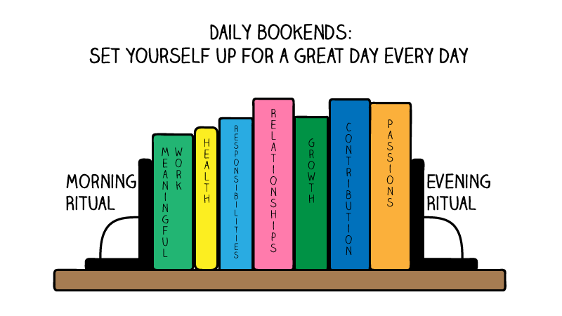

> _“Every morning in Africa, a gazelle wakes up, it knows it must outrun the fastest lion or it will be killed. Every morning in Africa, a lion wakes up. It knows it must run faster than the slowest gazelle, or it will starve. It doesn't matter whether you're the lion or a gazelle-when the sun comes up, you'd better be running.” — Christopher McDougall_

> _“Write it on your heart that every day is the best day in the year. He is rich who owns the day, and no one owns the day who allows it to be invaded with fret and anxiety. Finish every day and be done with it. You have done what you could.” — Ralph Waldo Emerson_

---

<https://routinebase.com>

Devote _the same_ amount of time and energy to your Morning Routine AND Evening Routine. They're both equally critical to achieving your goals.

Reserve the first and last part of your day for activities that support your mental health (_meditation_, _reading_, _journaling_, _walking_, _yoga stretching_, etc.)

⭐️ It's crucial to balance rigid [discipline](discipline-equals-freedom.md) with flexible wiggle room. Too much order is fragile. Have minimal structure in terms of routines over the course of your day to accommodate unexpected surprises.

---

# Evening Routine

> _“Quality time off, leads to quality time on.” — Max Klein_

Morning routines _start with evening routines the night before_: If you want to win the day, you have to win the morning, but in reality, to win the morning, you have to win the evening first. [^1]

---

聖經《創世紀》第一章中記載了上主用六天創造天地的過程，每一天的敘述都以同一句話作結：「有晚上，有早晨。」這樣的陳述很有意思 — 為什麼不是「有早晨，有晚上」呢？我想，或許這正提醒我們，唯有經過充足的休息、睡眠與沉澱，才能開啟充滿生產力和創造力的一天吧！

具體來說，《創世紀》1:5、1:8、1:13、1:19、1:23、1:31 等經文中都寫道：

* **Genesis 1:5**: ["And there was evening, and there was morning—the first day."](https://biblehub.com/genesis/1-5.htm)
* **Genesis 1:8**: ["And there was evening, and there was morning—the second day."](https://biblehub.com/genesis/1-8.htm)
* **Genesis 1:13**: ["And there was evening, and there was morning—the third day."](https://biblehub.com/genesis/1-13.htm)
* **Genesis 1:19**: ["And there was evening, and there was morning—the fourth day."](https://biblehub.com/genesis/1-19.htm)
* **Genesis 1:23**: ["And there was evening, and there was morning—the fifth day."](https://biblehub.com/genesis/1-23.htm)
* **Genesis 1:31**: ["And there was evening, and there was morning—the sixth day."](https://biblehub.com/genesis/1-31.htm)

這種「有晚上，有早晨」的表達方式在猶太傳統中具有特殊意義，象徵著一天的開始是從傍晚開始的，而非清晨。

---

## 3Rs For Unwind Routine

1. Review
2. Read (Light/Pleasure Reading)
3. Relax

---

## Wind Down 就像結束一天的駕駛，把車停到車庫裡一樣

因為一整天的忙碌工作（駕駛）通常需要保持高度集中和警覺，而 Wind Down（停車）意味著給大腦和身體一個停頓的空間，放慢節奏，逐漸從「活躍狀態」過渡到「平靜狀態」，讓身心準備好進入休息和恢復階段，真正放下壓力和思緒，為接下來全新的一天做好準備。

---

After sunset and in the hours before bedtime, opt for _dim, low-positioned lights, such as table lamps, instead of overhead lights_. This low ambient light supports natural melatonin production and makes it easier to fall asleep.

---

# Morning Routine

Your best work is going to be done anywhere from 4 to 6 hours after your [temperature minimum](temperature-minimum.md). [^2]

## The Paradox Of Morning Routines — You Don't Need To Follow An Extensive Morning Routine For A Productive Morning

* Instead of encouraging you to start meaningful activities that set you up for success, excessive morning routines merely create a sense of [busyness](busyness.md) that disguises as productivity—while also exhausting you.
* In many cases, they serve as nothing more than a form of [procrastination](Procrastination.md). _Most people don't need another “to-do list” in their mornings, but a list of what NOT to do._ _A morning routine, no matter how simple, is still a task._ Your morning routine is the reason you're losing your productivity as you waste your most productive hours doing it.
* Remember: our morning routine is meant to _serve_ you, not _own_ you.

## Do The Opposite

Rather than squandering this prime mental state on activities meant to _prepare_ you for optimal flow, the easiest flow state you can experience ever, leverage these golden moments for the most important task.

* <u>The “One-Priority-Only” (Reverse / Inverse) Morning Routine</u>
	1. Dive straight into the highest-priority task right after waking up
		* [Spend the first 90 minutes of your day working on your no.1 priority in life without any distractions and interruption.](Eat%20the%20biggest%20frog%20first%20thing%20in%20the%20morning.md) It's that simple.
	2. Do your normal morning routine (yoga, meditation, etc.)
* _“Whenever I see another entrepreneur who's obsessive about their routines things like if I don't have my morning routine I'm a mess or I can't even function I am so grateful because it just shows how weak they are.” — Alex Hormozi_
	* _Alex Hormozi's Morning Routine_
		1. Wake up
		2. Drink coffee
		3. Get to work
	* When designing your morning routine, always keep asking yourself: “_How quickly can I get to work after waking?_”

## Why?

Every morning, you naturally wake up in a flow zone—your brain operates at theta or delta wave levels—ideal for deep focus. Additionally, the light cognitive load in the morning makes it easier to focus instantly.

## The Only Thing You Need For A Productive Morning

The key to a productive morning is preparation the night before. Your [to-do list](Variants%20of%20to-do%20list.md) should be ready before you sleep—waiting until morning to plan means you're already too late. _Today's to-do list is for tomorrow._

A little [planning, preparation](Planning%20and%20preparation%20help%20maximize%20your%20productivity.md), and visualization is a small nightly habit that pays major dividends.

1. Spend 10-15 minutes writing down and setting up everything for the top 2-3 priority tasks _the night before (at the end of your workday)_, in order to remove the friction for getting started on [the ONE THING](Eat%20the%20biggest%20frog%20first%20thing%20in%20the%20morning.md) for _the next morning_. By making your to-do list the night before, you can wake up and get right to work immediately without thinking too much. _Morning is for [action](cultivate-a-strong-bias-towards-action.md), not [decision-making](decision-making.md)._ [Decision fatigue](decision-fatigue.md) will stop you from getting into the flow state as you'll have to decide what to do rather than diving in head first.
2. At the end of your day, conclude your conscious thinking on the [Most Important Question (MIQ)](https://mindfulambition.net/most-important-question-journal/)—_a highest-order question, hat, if answered, would create the biggest positive impact in your life_—and hand it over to your unconscious mind to process overnight. Let go, rest, and avoid stressing about it. Then, revisit the MIQ before exposing yourself to new inputs **[before exposing yourself to any new inputs](https://www.youtube.com/watch?v=wAnDWfEIwoE&t=2h56m30s)** in the morning. [^3]

---

### See Also

* [How to structure your day](Frameworks%20to%20structure%20your%20day.md)

[^1]: 別把睡前儀式 (或 [睡眠](sleep.md)) 視為一天的結束，而是為明天的美好開端做好準備。
[^2]: <https://www.hubermanlab.com/episode/maximizing-productivity-physical-and-mental-health-with-daily-tools>
[^3]: I learned this mental tool from Joshua Waitzkin: [Source 1.](https://www.youtube.com/watch?v=wAnDWfEIwoE&t=1h19m16s) [Source 2.](https://www.youtube.com/FEOjCUkjG0k?t=2m56s)
