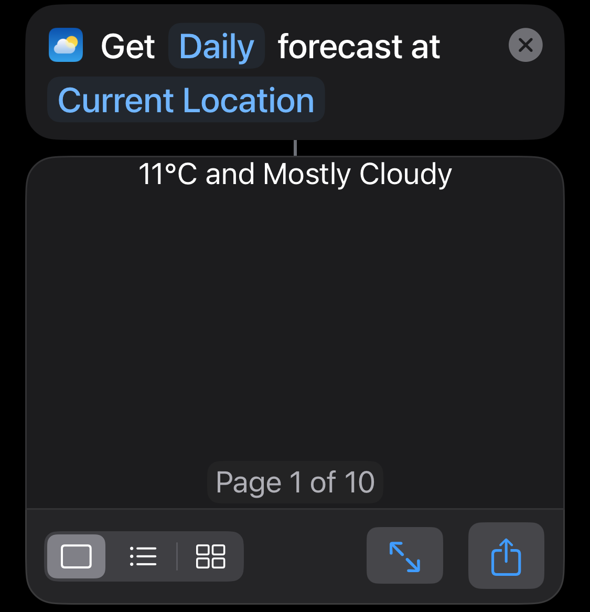

[比較]

* iOS: Apple’s Shortcuts
* Android: Google’s Action Blocks

Actions

* “Reveal Action” \& “Quick Look”
* “Take Screenshot” + “Extract Text from Image” (for OCR)
* Get Dictionary Value → Options: “Value”, “All Keys”, “All Values”
	* Often: “Choose from List” + “All Keys”
		* **Tip:** “Choose from List” can also be used for a “Dictionary”!
			* Get “Value” for “Chosen Item → _**Name**_” from “Dictionary”
* Get “Item” from List → Options: “First Item”, “Last Item”, \*“Random Item”, “Item at Index”, “Items in Range”
* \*Get random items from List
	* Single: “Get Item from List” → Choose “Random Item”
	* Multiple: “Filter Files” → Choose “Random” in “Sort by” → Enable “Limit” → Select the number of random items you want to get
* “Is Charging” v.s “Is Connected to Charger” (Get Battery Status)
	* Former: Is the device gaining battery charge?
	* Latter: Is the device connected to a charger that at least is slowing down the rate the battery drains?
		* For Optimized Battery Charging: being connected to a charger but not charging
* “Add to Variable” → List
	* **Tip:** “Repeat with each item” + “Text” → “Repeat Results” is already a list of “Text”, not need to use “Add to Variable” for each iteration → simplify code!
* How to use Boolean variables?
* Method I: Type = Boolean → `If "myBooleanVar"`
* Method II: Type = Text → `If "myBooleanVar" is Yes/No`
* ? “Run Script over SSH”
* ? “Get Contents of URL” → make webhook calls
* “Open X-Callback URL” (= [URL_Schemes](URL_Schemes.md))
* Allow you to go beyond “Open App” in Shortcuts
* They are helpful in the Shortcuts app when the App itself doesn’t have any Shortcut Actions support available by default
* **Tip:** If you’d like to run one shortcut from another shortcut, use the `Run Shortcut` action instead of a URL scheme. You should only run shortcuts with a URL if you’re integrating from another app outside of Shortcuts
* [Run a shortcut using a URL scheme on iPhone or iPad](https://support.apple.com/en-gb/guide/shortcuts/apd624386f42/ios)
	* Import Shortcut: `shortcuts://import-shortcut/?url=[url]&name=[name]`
		* Parameters:
			* url: download url for a `.shortcut` file
			* name (optional): name for shortcut, defaults to shortcut filename
			* silent (optional): `true` to import without opening the shortcut, `false` by default to open and display the shortcut to the user
		* Example: `shortcuts://import-shortcut/?name=Awesome%20Shortcut&url=https%3A%2F%2Fdownloadwebsite.com`
	* Open Shortcut:
		* `shortcuts://` to launch app to last-used state
		* `shortcuts://create-shortcut` to create a new shortcut
		* `shortcuts://open-shortcut?name=[name]` to open the app to the shortcut of a given name
	* Run Shortcut: `shortcuts://run-shortcut`
		* Query parameters:
			* name: string name for shortcut
			* input (optional): initial input into the shortcut, a text string or the word `clipboard` to use the contents of the clipboard
		* Example: `shortcuts://run-shortcut/?name=Shortcut%20to%20Run`
	* `shortcuts://x-callback-url/run-shortcut?name=[name]&x-success=[your-application-url]`
		* Callback URL work with 3 parameters:
			* `x-success` — To handle Successful execution
			* `x-cancel` — To handle interruptions in execution
			* `x-error` — To handle errors in execution
	* Open the Shortcuts Gallery
		* `shortcuts://gallery`
	* Search the Shortcuts Gallery
		* `shortcuts://gallery/search?query=[query]`
* _Run Shortcut_ v.s _URL Scheme_
	* Difference
		* _URL Scheme_ requires to open the Shortcuts app, while _Run Shortcut_ doesn’t.
	* Command-line version of `shortcuts://run-shortcut` from Terminal ([Run Shortcuts from the command line](https://sixcolors.com/post/2021/12/run-shortcuts-from-the-mac-command-line/)) [^1]
		* Run Shell Script
			* Select shell as `bin/bash`
			* Enter the command: `shortcuts run <YOUR_SHORTCUT_NAME>`
* List
	* Comma-separated text
	* Each item is encoded
* Dictionary
	* JSON string

---

**“Get Weather Forecast” (↔ “Get Current Weather”)**
* **Hourly:** Retrieves results for the next 24 hours in a list of 25 items—the first represents the current conditions, followed by the forecasts for the next 24 hours.
	

* **Daily:** Retrieves results for the next 10 days in a list of 10 items.
	

---

[比較]

* `Open X-Callback URL`: If your Shortcut has to wait for response
* `Open URLs`: If your Shortcut doesn’t have to wait for response

Troubleshooting Tips

	* Magic variables
	* Time limitation: a running shortcut will only stay active for a short period of time (around 3 mins) when you are away from the Shortcuts application
	* 如何透過 Siri 呼叫 “Ask for Input” (not just “Dictate Text”) 指令? Add “Dismiss Siri and Continue” in the very beginning
	* “Export for Pushcut” Can’t Be Opened: Since iOS 13 any shortcut from an external link is considered “untrusted” by Apple. If you get this error, please go to Settings -> Shortcuts and check Allow Untrusted Shortcuts. You only need to do this once.

Use “Get Images from Input” action to get Shortcut icon

[Apple’s Uniform Type Identifiers (UTIs)](https://en.wikipedia.org/wiki/Uniform_Type_Identifier)

* A framework used in macOS and iOS for identifying data types and file formats in a standardized and consistent way.
* Strings that uniquely identify types of data.
* Examples
	* Public UTIs
		* `public.text`
		* `public.image`
		* `public.json`
	* Private UTIs
		* `com.example.myapp.myformat`
		* `com.adobe.pd`
		* `com.apple.plist` = `com.apple.property-list`
		* `com.apple.shortcuts.action`

What do iCloud Shortcut share links actually link to?

* It’s a link to a point-in-time snapshot at the time you shared it. Any further changes you make will not be reflected in that link.
* It’s permanent, so make a copy and remove the personal information before sharing.
* It presumably gets uploaded to the generic iCloud server that doesn’t belong to anyone’s account, along with some metadata. Although it’s still tied to your account (and that’s why you’re able to stop sharing at any time), no one sees the account info from the shortcut. You can check the metadata by inserting `/api/records/` to the iCloud URL → Change the url part from “icloud.com/shortcuts/\<identifier\>” to “icloud.com/shortcuts/api/records/\<identifier\>”, then you could access a dictionary including a download url.

---

Two ways to set and view binding keyboard hotkeys for Shortcuts

1. Settings → Keyboard → Keyboard Shortcuts → Services → Shortcuts
2. Shortcuts App on macOS → “Quick Actions” in the sidebar

Dictionaries are a great way of storing multiple pieces of information at once. In Shortcuts, they are converted into JSON plain-text object.

---

[There are some web services for which developers haven’t (yet) added Shortcuts support, there is no app, or that enable you to do more by working directly with the service through its REST (Representational state transfer) API (Application Programming Interface). An API is a way we can talk to (web) applications and get information or send them commands, and a REST API is a common, standardized format for web services.](https://www.takecontrolbooks.com/samples/TCoShortcuts-2.1-sample.pdf)

---

Keep Automation simple and intuitive. If a workflow is complex, package it as a custom Shortcut and use the “Run Shortcut” action. This makes sharing and maintainability much easier.

[^1]: [Run shortcuts from the command line - Apple Support](https://support.apple.com/guide/shortcuts-mac/run-shortcuts-from-the-command-line-apd455c82f02/mac)
