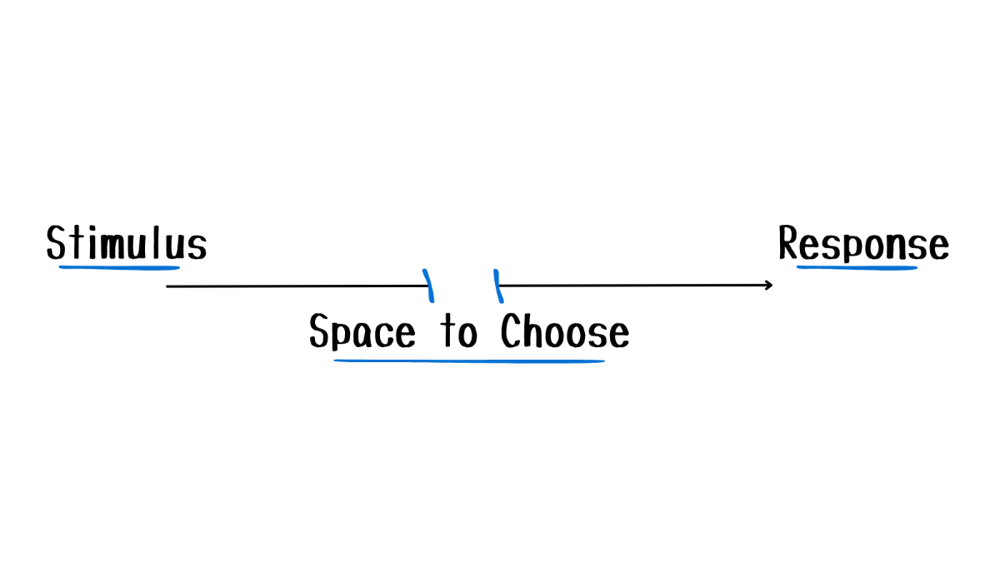
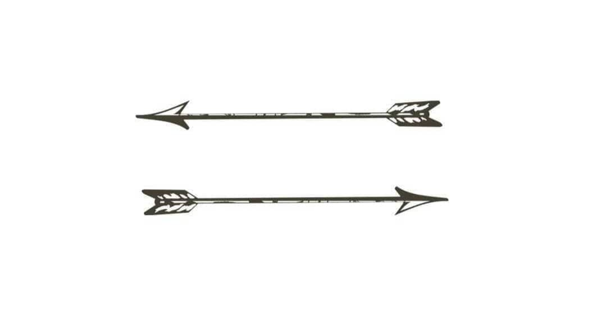

> _“It is the set of the sails, not the direction of the wind that determines which way we will go.” — Jim Rohn_

> _“Between (triggering) stimulus and (emotional) response there is a space (gap). In that space is our power to choose our response. In our response lies our growth and our freedom.” — Viktor E. Frankl_

> _“When things go wrong, don't go with them.” — Elvis Presley_

---

---

---

It's not what happens to us that shapes our lives, but how we _choose to_ respond.

---

Knowing when to stop is a superpower. You don't need to attend every argument you're invited to, nor should you [waste your energy](Energy%20Management.md) every time.

---

You are not the cause of everything that happens to you, but you are responsible for how you respond to everything that happens to you.

---

Most of life's conflicts come from people _reacting_ to situation father than _responding_ to it. <u>Man who cannot control his words cannot control himself.</u>

Example:

* REACTING
	* Person 1: “_Why did you do it like that?_”
	* Person 2: “_What do you mean? What's wrong with how l've done it?_”
* RESPONDING
	* Person 1: “Why did you do it like that?”
	* Person 2: “_I did it like that because I've done it in a similar way before - it's the most efficient method._”

---

To follow up an error with a foolish reaction is to lose twice.

---

既狹隘又封閉 の「熱」情緒處理（Hot Emotional Processing）

---

Pause before insulting or attacking others instead of reacting in the heat of the moment.

---

**Progressive Aggression:** By reacting to aggression with aggression we lose the opportunity to spiritually benefit from the experience.

---

# The Two Arrows

In life, we cannot always control the first arrow. However, the second arrow is our REACTION to the first. The second arrow is always optional.

Most people don't stop at the first arrow. They fire a second one at themselves.

* The rejection wasn't enough—they add self-doubt.
* The mistake wasn't enough—they add self-criticism.
* The failure wasn't enough—they add shame.

---

See also:

* [A true transformation begins with a mental shift](A%20true%20transformation%20begins%20with%20a%20mental%20shift.md)
* [Peace from mind](Peace%20from%20mind.md)
