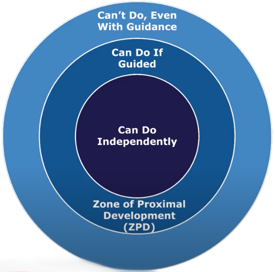

> _“Practice does not make perfect. Perfect practice makes perfect.” — Vince Lombardi_

---

[@ericssonRoleDeliberatePractice1993]

by Anders Ericsson (研究世界專家的世界專家)

---

可以是「有人指導」(_recommended_)，也可以是「自己摸索」

---

Constantly improve/revise in an _iterative_ manner → Don’t track number of _hours_, track number of _iterations (error corrections)_.

---

10,000 hours of repetitions doing the same thing → 10,000 hours of iterations with 9,999 failed attempts

---

Similar to the concept of Progressive Overload in Strength Training — “Reps, Reps, Reps.”

---

# Steps

1. [設定明確的最終目標](Goal%20Setting.md)
2. 建立 [系統化](Systems%20over%20goals.md) 的練習方法
3. ⭐️ 選擇勉強可完成的挑戰 ([Challenging Limits](Push%20your%20limits.md))
	* Working on tasks or problems that are _neither too easy (which might lead to boredom) nor impossibly hard (which might cause frustration), but rather difficult enough to stretch your abilities_
	* Taking on challenges that are _manageable enough that you win most of the time, but meaningful enough that you improve as well_
	* The common narrative is that kids learn faster than adults, but if you observe any toddler, they spend a large portion of the day attempting things that are _on the edge of their ability_ .[^1] The key is to enjoy hanging out on the edge. That is, you find it interesting to attempt things _one step beyond where you are right now_.
	* Examples:
		* A student solving math problems slightly above their comfort level.
		* An athlete attempting a personal best in a challenging competition.
		* An artist trying a new technique that requires them to expand their skills.
4. 專注地獨立練習 ([Deeply Engaged](flow-state.md))
5. 反思 ([Reassess](reflect-and-review.md)) 並尋求立即性的 [意見回饋](Feedback%20Loop.md)

---

**[“The Capability Gap” by Nick Saban](https://x.com/SahilBloom/status/1730586779730772302)**

* What you’re capable of, relative to what you are doing
* Better terms for “potential”
* It requires an understanding/awareness of:
	* Your current delivery
	* Your full capability

---

**Zone of Proximal Development (ZPD)**
* developed by psychologist Lev Vygotsky
* is the range where the learner is able to perform, but only with support from a teacher or a peer with more knowledge or expertise (a “more knowledgeable other”)

[^1]: The phrase “on the edge of their ability” refers to someone operating at the boundary of their current skills, knowledge, or capacity/competence. It describes a sweet spot where a person is challenged to the fullest extent of what they are capable of achieving, often fostering growth and improvement through effort and practice.
