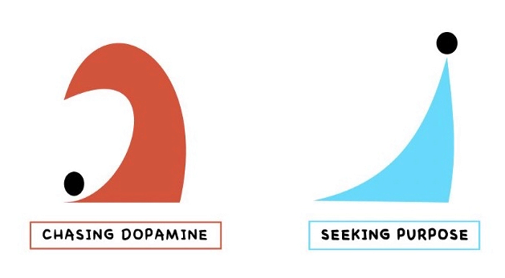

> _“Persons with severe addictions are among those contemporary prophets that we ignore to our own demise, for they show us who we truly are. (重度成癮者是當代的預言家，不把他們當一回事，沒有好下場的是我們，因為他們反映的正是我們真實的面貌)” — Kent Dunnington_

---

[@liebermanMoleculeMoreHow2018]

> _From dopamine’s point of view, [having things is uninteresting. It’s only getting things that matters.](journey-over-destination.md) If you live under a bridge, dopamine makes you want a tent. If you live in a tent, dopamine makes you want a house. If you live in the most expensive mansion in the world, dopamine makes you want a castle on the moon. Dopamine has no standard for good, and seeks no finish line. The dopamine circuits in the brain can be stimulated only by the possibility of whatever is shiny and new, never mind how perfect things are at the moment. The dopamine motto is “More.”_

> _Dopamine isn’t the pleasure molecule, after all. It’s the anticipation molecule. To enjoy the things we have, as opposed to the things that are only possible, our brains must transition from future-oriented dopamine to present-oriented chemicals, a collection of neurotransmitters we call the Here and Now molecules, or the H&Ns._

---

Dopamine triggers the [desire](the-absence-of-desire-is-true-happiness.md) / endless chasing for MORE

---

[Dopamine is about wanting (and anticipation of rewards), not about having." — Dr. Anna Lembke](https://www.hubermanlab.com/episode/dr-anna-lembke-understanding-and-treating-addiction)

多巴胺其實並非直接帶來快樂的化學物質，而是促使我們追求快樂的關鍵因子。作為「獎勵路徑（reward pathway）」的一部分，它驅動我們採取行動，提升動機，並塑造行為模式。然而，多巴胺本身並不提供真正的滿足感或獎勵感，而是讓我們渴望並持續尋求這些感受。真正的快樂來自於多種神經傳導物質的共同作用，包括血清素、催產素和內啡肽等。血清素與穩定情緒和幸福感有關，催產素則與親密關係和社交連結帶來的溫暖感受相關，而內啡肽則能減輕疼痛並產生欣快感。這些化學物質相互協作，讓我們體驗到真正的快樂與滿足。

---

# Pain Before Pleasure

Dopamine makes you feel best when you earn it with efforts. Learn to spike dopamine from the effort (an equalizer) itself!

Addiction is a progressive narrowing of the things that bring you pleasure. Happiness is a progressive expansion of the things that bring you pleasure. The former emerges passively.

The latter takes work.

The point is to be mindful of cultivating both a mixture of activities that require effort to derive pleasure and also seeking contentment from what you have, and to realize that anything that quickly spikes dopamine without effort is likely to be destructive in the long run.

In order to keep the reward systems of your brain working for you instead of against you, it can be wise to avoid things that lead to big dopamine increases without much effort. Beware anything that delivers high dopamine with minimal effort. Keep the amount of effort scaled with the amount of dopamine.

[Dopamine is a powerful neurotransmitter that is responsible for our pleasure from effort. It’s accessible to all of us, but can be inhibited by factors that can interfere with and prevent us from getting dopamine release from effort itself, such as spiking dopamine before and/or after engaging in effort.](https://www.hubermanlab.com/episode/controlling-your-dopamine-for-motivation-focus-and-satisfaction)

---

是一種爽痛平衡 (Pleasure-Pain Balance)，如翹翹板的兩端 (爽快 + 痛苦)

The important thing to understand about dopamine is that the faster and higher it goes, the lower and longer it drops below baseline afterwards. A spike in [dopamine](https://click.convertkit-mail.com/5quox4vxzxu7hv6w7eei0s94g7v44tn/kkhmh6hlq9d4rmck/aHR0cHM6Ly93d3cueW91dHViZS5jb20vd2F0Y2g_dD01MDExcyZ2PUstVFcyQ2hwejRr) will always be followed by a dip below baseline before it returns to baseline. (多巴胺濃度怎麼上去，就會怎麼下來)

我們的大腦天生具備維持平衡的能力，因此，當多巴胺水平持續飆升時，大腦可能會進行「補償」，使我們需要更高頻率或更大量的多巴胺分泌才能感受到相同的快感。越是追求刺激，越是感覺不到刺激/重口味。

---

Our [baseline dopamine](https://youtu.be/QmOF0crdyRU?t=2218) levels are influenced by many factors, including genetics, behaviors, sleep, nutrition and the level of dopamine you [experienced on previous days](https://youtu.be/QmOF0crdyRU?t=1680). It is critically important to maintain sufficient levels of baseline dopamine to sustain day-to-day motivation. We don’t want the baseline too low or too high like a roller coaster.

* How to increase the _**baseline level of dopamine**_ throughout the day (i.e., stable dopamine level with smooth peak-and-trough fluctuations)?
	* Actions
		* View early morning sunlight for 10-30 minutes
		* Take a 1-3 minute cold shower
		* Eat tyrosine-rich foods such as red meats, nuts or hard fermented cheese
		* Ingest [caffeine](caffeine.md) (approximately 100-400mg)
	* ❗️ Be very cautious about _**stacking and layering**_ in too many dopamine peak inducing behaviors all at once on a regular basis❗️
		* **Dopamine stacking**—combining multiple sources of dopamine at once—can short-cirtcuit/disrupt the normal function of the brain’s reward system, making it harder to feel satisfied with normal experiences and increasing the risk of compulsive behaviors.
* How to manage/regulate the _**peak level of dopamine**_ for sustainable/persistent goal-directed motivation?
	* Use **[Randomly Intermittent Reward Timing (RIRT)](randomly-intermittent-reward-timing.md)**
	* Remember that Dopamine is Subjective
		* The brain does not know external rewards — no dopamine is dripped in your brain — it only knows the associations of events with internal chemical (in this case, dopamine) release.

---

Feel unmotivated? [Procrastination](procrastination.md)?

* **Passive:** Wait for dopamine replenishment
* **Active:** Put yourself into a painful/uncomfortable state to teach your brain to [do hard things](do-hard-things.md)

---

Cheap (Fake) Dopamine (associated with [short-term thinking](instant-gratification.md))

* Increases our [Dopamine](Dopamine.md) baseline levels
	* Once they drop/return to normal, we crash.
	* Then we need more dopamine to beat the previous dopamine spike/hit/high.
* Often associated with _**struggle**_

Natural (Real) Dopamine (associated with [long-term thinking](delayed-gratification.md))

* [Reprogram yourself](a-true-transformation-begins-with-a-mental-shift.md) so that [uncomfortable is your default factory setting](push-your-limits.md). Constantly [do hard things](do-hard-things.md) that make you feel terrified/scared. That’s how you grow.

---

# 數位排毒 (Technology/Digital Detox)

> due to 數位中毒

* Different Implementations
	* Weekly
		* 每周選擇一天或一段時間暫時戒除掉所有會誘發多巴胺分泌的事物 (No-Internet)，只進行例如閱讀、寫作、冥想及散步等活動，目的是消除平時過多的外來刺激和噪音，讓人更容易聽見內心深處的聲音，進而反思、充電以及重新評估生活，認清對自己而言真正重要的東西。
	* Daily
		* **[The “No-Power” Hour:](boredom-promotes-creativity.md)** Set a 60-minute block each day where you don’t use any electronic devices (phone, laptop, headphones) 📵.
* Similar Concepts
	* 多巴胺斷食/齋戒（Dopamine Fasting）
	* Retreat
	* Monk Mode
	* Sakoku
	* Clarity Break
	* The Think Day/Week
		* Bill Gates’ famous “Think Week,” where he spends two weeks alone at his cottage [^1] twice a year, reading and thinking about the future of Microsoft.
	* [Nyepi]([https://www.google.com/search?q=Nyepi](https://www.google.com/search?q=Nyepi)), also known as the “Balinese Day of Silence”, is a Hindu celebration held every Isakawarsa (“new year”) in Bali, Indonesia. It lasts for 24 hours, beginning at 6:00 AM on the day of Nyepi and ending at 6:00 AM the following day. During this time, the island observes complete silence, with no activities allowed, including travel, work, or entertainment. Even the airport shuts down for 24 hours. The day is dedicated to self-reflection, meditation, and spiritual cleansing, as the entire island enters a state of peace and quiet to start the new year with a clean slate. (寧靜日/靜居日是印尼峇里島著名的國定假日，也是印度教的新年，是全球唯一一個將整座島嶼封閉並暫停所有活動的節日。)

[^1]: **[Attention Cottage](https://blog.ayjay.org/the-attention-cottage/)** is a dedicated physical space designed for giving your full and focused attention to a specific task, particularly creative or intellectually demanding work.
