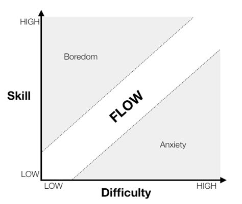

> _“What I 'discovered' was that happiness is not something that happens. It is not the result of good fortune or random chance. It is not something that money can buy or power command. It does not depend on outside events, but, rather, on how we interpret them. Happiness, in fact, is a condition that must be prepared for, cultivated, and defended privately by each person. People who learn to control inner experience will be able to determine the quality of their lives, which is as close as any of us come to being happy.” — Mihalyi Csikszentmihalyi_

---

You're in “the zone.” ( like _[one-buttock playing](https://sketchplanations.com/one-buttock-playing)_)

You feel fully immersed in your work.

---

Flow is [a state of optimal experience](https://www.flowresearchcollective.com/about). [^1] When you are in that state, life goes fast because time flies by without you realizing it.

* Make hours like seconds.
* Effortless effort, timeless time.

---

# The 3 Major Conditions Of Flow

[@csikszentmihalyiFlowPsychologyOptimal2009]

1. Clear proximal (nearby) goals
2. Clear and immediate feedback
	* Be able to see your progress
3. A balance between perceived challenge and skill
	* Challenge matched to skills

---

# The Challenge-skills Equation

---

# The 4 Stages Of The Flow Cycle By Herbert Benson

* 4 stages
	* [Struggle](Why%20it's%20so%20hard%20to%20just%20do%20the%20work.md)
	* Release
	* Flow
	* Recovery
* 4 components
	* **Selflessness** — loss of self-consciousness and ego
	* **Timelessness** — the feeling of losing tack of time / transformation of time
	* **Effortlessness**
	* **Richness** — sense of control
* Prerequisite
	* Calm mind — being immersed [in the present moment](Live%20in%20the%20present.md), getting into your body and out of your head
* Triggers
	* Complete Concentration — Flow follows focus
	* Clear Goals — Confusion creates chaos
		* Flow is about banishing all distractions, friction and resistance
	* Novelty — Inject something NEW in between tasks
* Remarks
	* Flow is not binary, i.e., neither “on” nor “off”
	* They work interdependently with each other

[^1]: Non-ordinary States of Consciousness (NOSC) / Altered States of Consciousness (ASC): any non-normal waking state [@dietrichFunctionalNeuroanatomyAltered2003]
