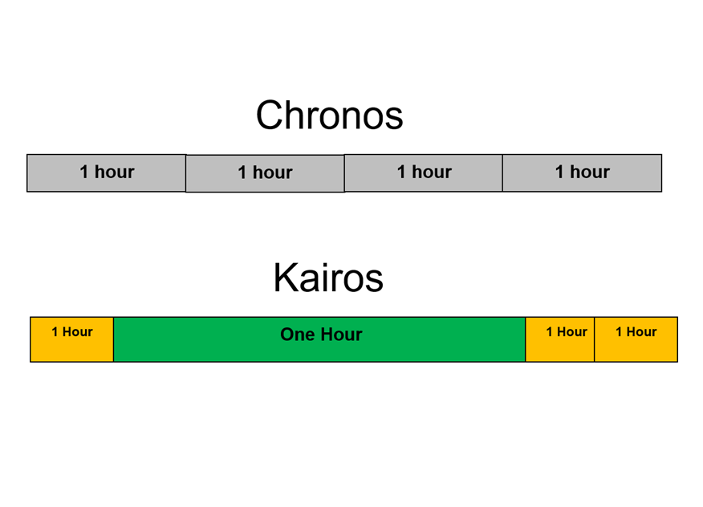

> _[Live life by design, not default.](https://fs.blog/david-foster-wallace-this-is-water/) Make each day your masterpiece. How you spend your days is how you spend your life._

> _“I cannot make my days longer so I strive to make them better.” — Henry David Thoreau_

---

* 自由裡的框架，框架裡的自由：Just as [“constraints” in mathematical optimization](https://en.wikipedia.org/wiki/Constrained_optimization) help find the best solution, design a lifestyle by defining a clear boundary for your ideal day and optimizing within it—_rather than the other way around._ If something pulls you outside that box, simply say, “No, thank you.”

	> _[“Look for a way of life, not goals. Identify how you want to live, not what you want to achieve. Within that lifestyle, see what you can do to make a living.” — Hunter S. Thompson](https://www.notion.so/beca85a66c624275b80ffb4faae2b44c)_

	> _“Instead of thinking about what you are going to do when you retire, think about how you can do that now and make a living from it.” — Celestine Chua_

	> _“Don’t let making a living prevent you from making a life.” — John Wooden_

* [Spend a handful of hours a day going fast. Crush a gym session. Do deep work on a project you care about. Spend the rest of the day going slow. Take walks. Read books. Get a long dinner with friends. Either way, avoid the anxious middle where you never truly relax or truly move forward.](https://x.com/charlesmiller_7/status/1897358851776610720)
	* See also: [Work in sprints, work with your biology](work-in-sprints-work-with-your-biology.md)
* Think of life as units of days. Think of a day as units of time.
	* [100 Blocks A Day by Tim Urban](https://waitbutwhy.com/2016/10/100-blocks-day.html)
		* Your awake time each day can be split into 100 × 10-minute blocks ≈ 16 hours
	* [The Power Half-Hour](the-power-half-hour.md)
		* Breaking your day into “_snackable_” 30-minute chunks/bites
	* Try thinking about your time in a day in terms of _Kairos_, not _Chronos_.
		
		* **Chronos** = sequential, quantitative time
			* Chronos belongs in the realm of clocks. Chronos marks linear time or duration. Chronos is years, months, days, hours.
		* **Kairos** = fluctuating, qualitative time
			* Kairos refers to those moments in time that are more impactful than others—those that stand out from the regular flow of time and become memories we treasured/cherished. It’s what makes time feel _slower or even paused._ (<u>Time Dilation</u>)
			* The Power of Excitement Engineering: When you plan excitement in advance, the return on that moment compounds. You don’t just enjoy it when it happens, you get the anticipation dividends too.
			* **Seek novelty in the mundane:** Combat the sense that time speeds up by finding newness in daily life, e.g., take different routes or observe your surroundings more closely.
			* **Story-worthy moments:** Each night, write down (journal) the most “story-worthy” thing that happened during the day. This is an easy way to plant those mental flagpoles and make each day feel a bit more special.
			* **Inject/Introduce planned spontaneity/memories into your days:**
				* Do not fall into The Retirement Trap

					> _“Remember the motto: ‘Work hard, play hard.’ Regard your personal time as just as important as your work time and give as much attention to planning it as you do to planning your work. What are you working for if you don’t have a personal life?” ― [@forsterItTomorrowOther2008]_
					* Always put non-work commitments in the calendar FIRST, knowing that work will always have a tendency to fill in the gaps.
					* Block in time for **holidays** and **trips** _first_, rather than letting the calendar fill up with work-stuff by default
				* Downtime deserves time management too. The time you PLAN to waste is not a waste of time. The time you ENJOY wasting is not a waste of time.
			* **Mini adventures:** Set aside a half or full day each month dedicated to exploring a new place or activity (e.g., an evening cooking class).
* The 8/8/8 Rule

	> _“Eight hours labor, eight hours recreation, eight hours rest.” — Robert Owen_

	* Divide each 24-hour day into three equal parts:
		* 8 hours for Work
		* 8 hours for Rest
		* 8 hours for Enjoying Life
			* 3 Fs
				* Family
				* Friends
				* Faith
			* 3 Hs
				* Health
				* Hygiene
				* Hobby
			* 3 Ss
				* Soul
				* Service
				* Smile
* The 4 Quarters Rule [^1]
	* Reframe each day as 4 quarters:
		* **Quarter 1 (Morning)**
			* Morning routine, deep creative work, etc.
		* **Quarter 2 (Midday)**
			* Exercise, healthy lunch, power nap, walk, etc.
		* **Quarter 3 (Afternoon)**
			* Meetings, admin tasks, etc.
		* **Quarter 4 (Evening)**
			* Quality time with family \& friends, self-care, evening routine, etc.
	* 💡 _Life happens. Sometimes we’re on top of the world, other times the world is on top of us. No day is perfect. If you screw up one quarter, just get back on track for / reset to execute the next one. Each quarter is a new opportunity to reset, take control, and refocus your energy. <u>Keep the mistake contained in that quarter, so that you don’t lose / write off the entire day, but only that quarter.</u> Lamenting over an interrupted routine won’t get you anything worth having. Be like the “bend but don’t break” willow tree—even when the storm comes, the willow is tough enough to bend with the blows and not break beneath them. Simple metaphor. Bend don’t break. Roll with life chaos/punches. Enjoy the ride. Be ready to [adapt](adaptability.md), often._
* Distribute brainpower in a _descending_ order across the day
* The formula to become a superhuman
	* 1 really good cup of coffee
	* 8 hours of sleep
	* 4 hours of deep work
	* 45 minutes of exercise
	* 30 minutes of reading
	* 30 minutes of sunlight
* [The 10-3-2-1-0 Formula by Craig Ballantyne](https://www.earlytorise.com/10-3-2-1-0-formula-to-get-more-done/)
	* 10 hours before bed – No more caffeine.
	* 3 hours before bed – No more food or alcohol.
	* 2 hours before bed – No more work.
	* 1 hour before bed – No more screen time (turn off all phones, TVs and computers).
	* 0 – The number of times you will hit the snooze button in the morning.
* 3Es
	* In the morning, **execute** your priorities
	* In the afternoon, **exercise** your body
	* In the evening, **educate** your brain
* 3Rs for unwind routine
	* Review
	* Read (Light/Pleasure Reading)
	* Relax
* 3Ds
	* 3 deep work sessions per day, with 90 mins each
* [The Daily Blueprint](https://www.hubermanlab.com/daily-blueprint)
	* Phase 1: Waking and Early Morning (Hours 1–4)
	* Phase 2: Midday Through Evening (Hours 5–13)
	* Phase 3: Bedtime and Sleeping (Hours 14–24)

---

[Always start and end the day right](always-start-and-end-the-day-right.md)

[^1]: _“Instead of feeling that you’ve blown the day and thinking, “I’ll get back on track tomorrow,” try thinking of each day as a set of four quarters: morning, midday, afternoon, evening. If you blow one quarter, you get back on track for the next quarter. Fail small, not big.” — Gretchen Rubin, Better Than Before_ [@rubinBetterMasteringHabits2015]
