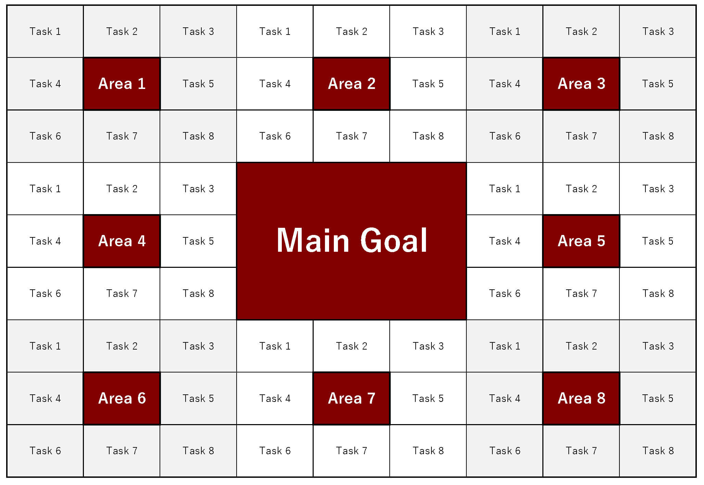
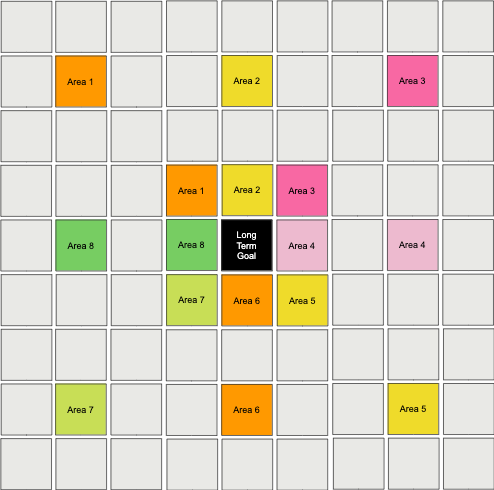
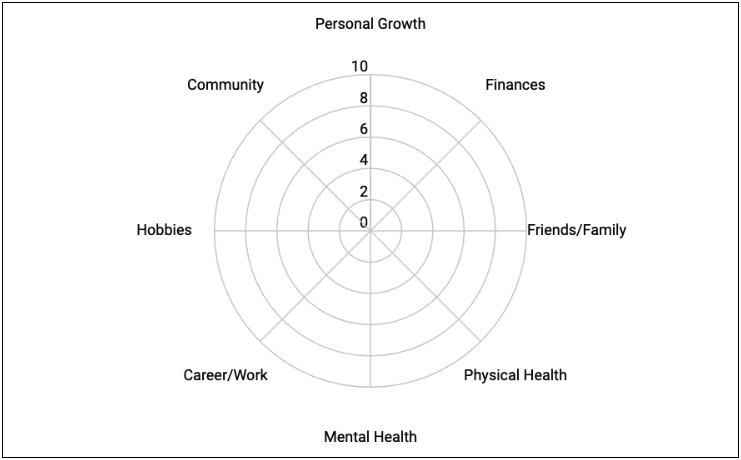
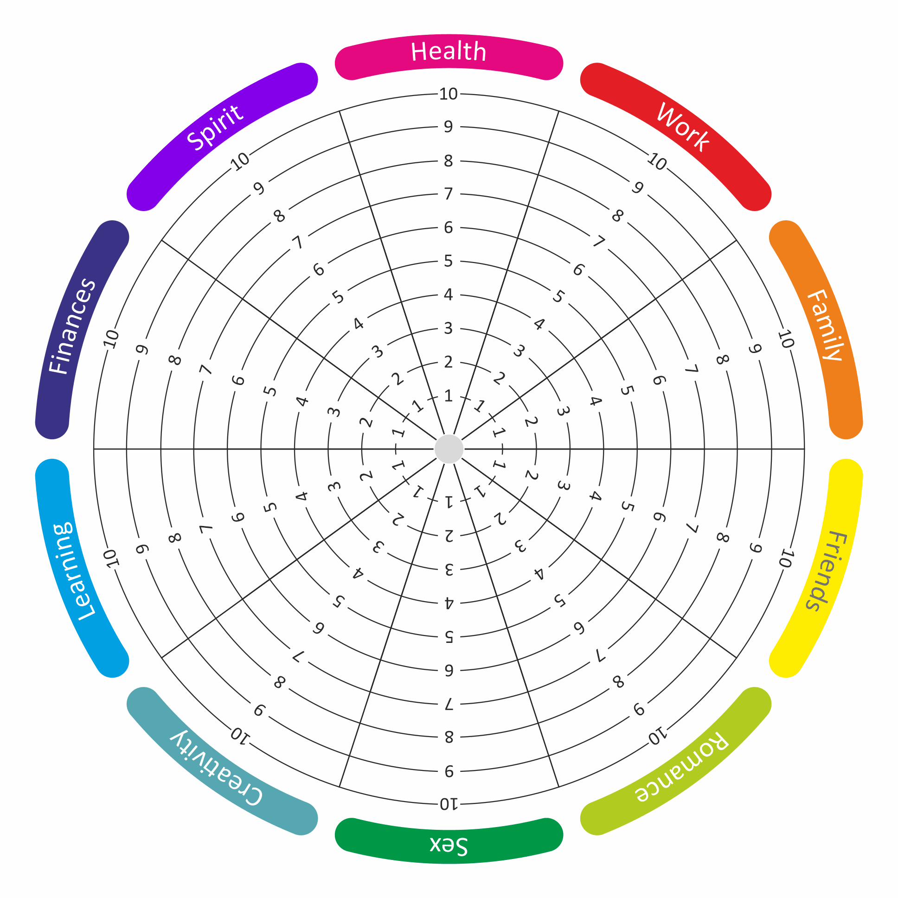

> _“Setting goals is the first step in turning the invisible into the visible.” — Tony Robbins_

> _“A goal is a dream with a deadline.” — Napoleon Hill_ [^1]

---

## S.M.A.R.T.E.R. Goals [^2]

* **S**pecific
* **M**easurable (= Trackable = Quantifiable)
* **A**chievable
* **R**elevant
* **T**ime-bound
* **E**asy (to start)
* **R**eflective

---

# Big Goal: The [Misogi](https://www.google.com/search?q=Misogi) (禊) Challenge

* Do something so hard for 1 day a year, that it profoundly impacts the next 364 days.

---

# Frameworks

## The Abc Goal System (by Sahil Bloom)

* A Goal
	* Most ambitious, perfect case.
	* E.g., Hit your aggressive, optimal marathon time goal.
* B Goal (most days!)
	* Middle ground, base case.
	* E.g., Hit your realistic, base case marathon time goal.
* C Goal
	* Minimum viable level, anything above zero compounds.
	* E.g., Finish the race.

## Annual Planning (by Sahil Bloom)

* Big Goal
* Checkpoint Goals
* Anti Goals
* Daily Systems

## [The Harada Method](https://theharadamethod.com/about-the-method) [^3]

The Open Window 64 Chart (曼陀羅九宮格)

## [The Wheel of Life](https://wheeloflife.noomii.com/)

Traditional wisdom treats life's key areas—work, relationships, health, hobbies, etc.—as _On-Off Switches._ It suggests you can only have one or two “on” at a time, leaving the rest “off.”

The problem with this mindset is that, if one stays off too long, it may never turn back on:

* If you don't invest in your relationships in your 20s and 30s, you won't have them in your 40s
* If you don't invest in your health in your 40s and 50s, you won't have it in your 60s
* If you don't take care of your mind in your 60s and 70s, you won't have it in your 80s

The new mindset: Each area of your life exists on a _Dimmer Switch_. [^4][@bloom5TypesWealth2025]

Rather than shutting areas down completely, you adjust them like “dials”. At different seasons of life, some get higher level of “brightness” while others dim, but nothing is left in total “darkness”.

The key in life is to find the balance, and balance isn't about perfection. Pour your energy into all spokes (areas) of your life wheel_, even if only a little._ Neglecting one for too long might give you a bumpy ride, but giving them all some love will help you to cruise smoothly toward your goals. This dynamic approach helps you maintain harmony, where all areas of your life work together.

---

# Don't Just Set Goals. Set These Things As Well.

* Intentions
	* Goals are specific _achievements you set for the future_. They have a natural endpoint. Intentions, on the other hand, are _attitudes for the present_. They guide your thoughts and actions in each moment. Intention creates reality.
* Sacrifices
	* Goals require sacrifice.What are you willing to pay? What will you give up?

---

See also:

* [The Arrival Fallacy](The%20Arrival%20Fallacy.md)
* [Journey over destination](Journey%20over%20destination.md)
* [Always start with end in mind](Always%20start%20with%20end%20in%20mind.md)
* [Avoid telling people your goals](Avoid%20telling%20people%20your%20goals.md)

[^1]: _“Dream in a pragmatic way.” — Aldous Huxley_
[^2]: v.s Stretch Goals
[^3]: [This is how Shohei Ohtani, the best baseball player in the world, used this approach for setting his goals for Baseball.](https://www.reddit.com/r/GetMotivated/comments/11yzglu/image_shohei_ohtani_created_this_chart_when_he/)
[^4]: Or: DJ 混音器 (DJ Mixer)
