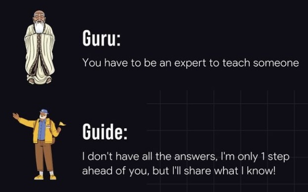

# You don’t need to be a _guru_. You can just be a _guide_.

If you’re worried that you’re not “qualified” to teach someone else, remember that we often learn best from those who are just a step ahead of us on the journey.

---

相反症狀: “[The Dunning-Kruger Effect](the-dunning-kruger-effect.md)” (overconfident/arrogant/complacent)

---

Growth happens when you do things you feel unqualified to.

---

> “Impostor syndrome says, “I don’t know what I’m doing. It’s only a matter of time until everyone finds out.’ [Growth mindset](the-growth-mindset.md) says, “I don’t know what I’m doing yet. It’s only a matter of time until I figure it out.” — Adam Grant, [Hidden Potential: The Science of Achieving Greater Things](https://www.goodreads.com/work/quotes/170223349)
