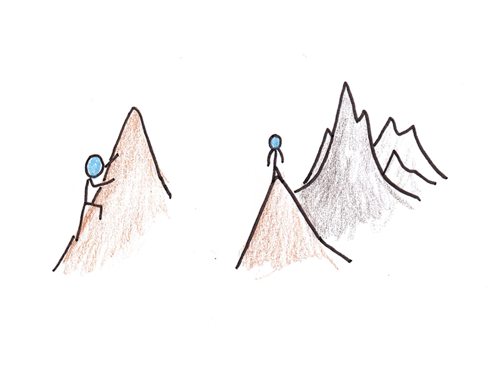

> _If you focus on results and finding shortcuts, you’ll get impatient. If you focus on the process and doing the right thing, you’ll be unstoppable.” — Maxime Lagace_

> _“Process saves us from the poverty of our intentions.” — Elizabeth King_

> _“Fall in love with the process and the results will follow.” — Bradley Whitford_

> _“God will not look you over for medals, degrees or diplomas but for scars.” — Elbert Hubbard_

> _[“The end of a melody is not its goal: but nonetheless, had the melody not reached its end it would not have reached its goal either. A parable.” ― Friedrich Nietzsche](https://www.goodreads.com/quotes/7368-the-end-of-a-melody-is-not-its-goal-but)_

> _“Progress is a natural result of staying focused on the process of doing anything. When you stay on purpose, focused in the present moment, the goal comes toward you with frictionless ease.” ― Thomas M. Sterner, [The Practicing Mind: Developing Focus and Discipline in Your Life Master Any Skill or Challenge by Learning to Love the Process](https://www.goodreads.com/work/quotes/326331)_

> _“When, instead, your goal is to focus on the process and stay in the present, then there are no mistakes and no judging. You are just learning and doing. You are executing the activity, observing the outcome, and adjusting yourself and your practice energy to produce the desired result. There are no bad emotions, because you are not judging anything.” ― Thomas M. Sterner, [The Practicing Mind: Developing Focus and Discipline in Your Life Master Any Skill or Challenge by Learning to Love the Process](https://www.goodreads.com/work/quotes/326331)_

---

You have to enjoy your journey, the journey is all that there is.

---

Enjoy the process. Love the effort. The journey itself is the reward.

---

So often people focus all their [energy](Energy%20Management.md) on the _summits_—but completely fail to recognize that 99% of life is spent on the _climb_.

The climb is the fun part.

The climb is always better than the view from the summit.

Real, durable satisfaction, happiness and contentment are found in the anticipation of the achievement, not the achievement itself. It’s the quest. It’s the hunt. It’s the process. It’s the journey.

---

[Since most of life is spent on the journey, it's crucial to find enjoyment in the process rather than solely focusing on the destination.](http://www.youtube.com/watch?v=KyfUysrNaco&t=453)

---

Focus on the [happiness](happiness.md) of pursuit, not the pursuit of happiness.

* Becoming is better than being.
* Having things isn’t fun. Getting things is fun.
* The pleasure of anticipation is often greater than the pleasure of acquisition.

---

Achieving [goals](Goal%20Setting.md) is overrated, striving toward them is underrated. The reward is not always in winning, but in striving.

* Remember: Successful and unsuccessful people share the same goal. [The person who has the most fun wins.](https://jamesclear.com/quotes/something-i-heard-recently-and-ive-tried-to-adopt-whenever-possible-whoever-has-the-most-fun-wins)

---

# Detach Inputs From Outputs

Attach to input/intention. Detach from output/outcomes. Focus on efforts (which generate [dopamine](__temp__dopamine.md)), not outcomes. Forget about outcomes, focus on growth/processes instead. Be [genuinely not care about](Not%20caring%20lets%20us%20perform%20better.md) the outcomes.

---

[The wedding is an event, love is a practice. The graduation is an event, education is a practice. The race is an event, fitness is a practice.](https://jamesclear.com/quotes/the-wedding-is-an-event-love-is-a-practice) [^1] The focus and energy we lavish on events can easily distract us from the journeys we care about.

---

[@hesseSiddharthaIndischeDichtung2021]

> _[“We are not going in circles, we are going upwards. The path is a spiral; we have already climbed many steps.” — Hermann Hesse, Siddhartha](https://www.instagram.com/mounika.studio/p/CmslMjcBEaI/)_ [^2]

* Trust the process \& Have faith in the process
* Every step happens for a reason, and something even better is on the way.
* Perceived Progress v.s Actual Progress
	* _At first, progress is slow_—so subtle it’s almost invisible. _Then, all at once_, everything changes.
		* Nothing happens—then everything does.
		* Slow. Steady. Sudden.

---

「放下執著，享受過程。」— 學會享受追求目標的過程，而不是把注意力放在最終結果。目標的實現只是旅程中的一個里程碑，而非目的地。

---

真正讓我們感到幸福的，不是登頂的成就，而是沿途的風景。別因急於趕路前行，而忽略了值得駐足的美好。

---

# Think Of Your Work As “Efforts”, Not “Projects.”

* A **project** is a sequence of tasks that must be completed within a defined timeline to attain a certain outcome. An **effort** is _an exertion of energy to do something_—where the steps, deadlines, and outcomes may or may not be clearly defined.
* **Projects** are rigid and narrowly defined (_top-down_) with a hard deadline. **Efforts** are freeing, fluid, expandable and loosely defined (_bottom-up_), allowing ideas to breath
* If you work in a corporate environment with clear deadlines, you’ll be fine with projects. If your work requires creativity, you’ll find this approach profound, liberating, and empowering.

---

# [The Quest Mentality](https://www.raptitude.com/2024/08/do-quests-not-goals/)

* Instead of treating your goals like [to-do list](Variants%20of%20to-do%20list.md) items, try turning them into quests (= a journey, an adventure toward a specific mission or a goal).
* Goals are practical attempts to change your circumstances/situations. A quest is personally transformative – the endeavor itself shapes _who you are (your identity)_ and _what you’re capable of (your potential)_.

---

# The Checkpoint Mentality

* “_It’s just a checkpoint, not the destination._”

---

# [“Here’s how to live: Master something.” by Derek Sivers](https://sive.rs/htl08)

> _How long will it take you to become a master?_
>
> _It doesn’t matter._
>
> _Imagine getting to a mountaintop after a long hike through a gorgeous forest._
>
> _Achieving your goal would feel like taking off your backpack._

---

# By [James Clear](https://jamesclear.com/quotes/when-you-choose-the-benefits-of-an-action-you-also-choose-the-drawbacks)

> _If you want to be an author, you can’t only choose the finished novel and book signings. You are also choosing months of lonely typing._
>
> _If you want to be a bodybuilder, you can’t only choose the fit body and attention. You are also choosing the boring meals and calorie counting._

---

# By [Sahil Bloom](https://www.instagram.com/sahilbloom/reel/C5azEXuAIGi/)

> _I no longer focus on the journey or the destination, I focus on the people (companionship)._
>
> _When you surround yourself with inspiring people, the journeys become more beautiful and the destinations become more brilliant._
>
> _[Focus on the company—the people you want to journey with](You%20are%20the%20average%20of%20the%20five%20people%20you%20associate%20with%20most.md)—and you’ll find that the journey reveals itself in due time._

Paradox: Although it’s being said that “you got to focus on the journey because there is no guarantee on the destination”, you need a destination to get into the journey. [Without a destination, there is no journey—just movement.](always-start-with-end-in-mind.md)

---

## See Also

* [The Arrival Fallacy](The%20Arrival%20Fallacy.md)

[^1]: Similar analogy: Climate v.s Weather
[^2]: [The Upward Spiral](https://sketchplanations.com/the-upward-spiral)
