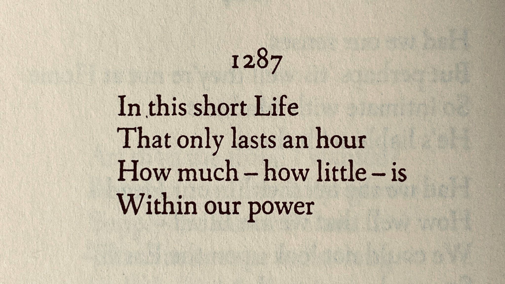

> “No matter how many times you do something, there will come a day when you do it for the last time.” — Sam Harris

> “The price of anything is the amount of life you exchange for it.” — Henry David

> “There are 100 billion planets in our galaxy and only one, as far as we know, with intelligent life. The fact that you are reading this book is the result of the longest tail you can imagine. That’s something to be happy about.” — [@houselPsychologyMoneyTimeless2020]

> “Every man has two lives, and the second starts when he realizes he has just one. (未知生，焉知死)” — Confucius

> [“A man who dares to waste one hour of time has not discovered the value of life.” — Charles Darwin, The Life \& Letters of Charles Darwin](https://www.goodreads.com/quotes/34852-a-man-who-dares-to-waste-one-hour-of-time)

---

---

Life is transitory.

---

# [_Life Is Short_ by Paul Graham](https://paulgraham.com/vb.html)

> Life is short and finite. Don’t take things for granted. Appreciate every day. When you take things for granted, they’re gone.—You think you can always write that book, or climb that mountain, or whatever, and then you realize the window has closed. The saddest windows close when other people die.—Their lives are short too.

> Relentlessly prune bullshit, don’t wait to do things that matter and important to you, and savor the time you have. That’s what you do when life is short.

---

We often hear “Life is short, enjoy it.”, but often forget: “Eternity is long, prepare for it.”

---

Accept the impermanence of everything in our lives.

---

[The Insignificance of Human Existence](https://www.youtube.com/watch?v=wupToqz1e2g)

> The universe is vast and humans are insignificant in comparison.
> Our existence is fleeting and our actions have limited impact.
> Ultimately, everything we do and create will fade away.

---

# [Live Like It’s The Last Time](https://www.sahilbloom.com/newsletter/live-like-its-the-last-time)

* You won’t know when it’s the last time. But you can live like it is.
* Live each day as it were your last, because someday you’ll certainly be right.
* Try to live each day as if you’ve come back from the future, as if it was the final full day of your extraordinary, ordinary life.

---

[Death](death.md)
