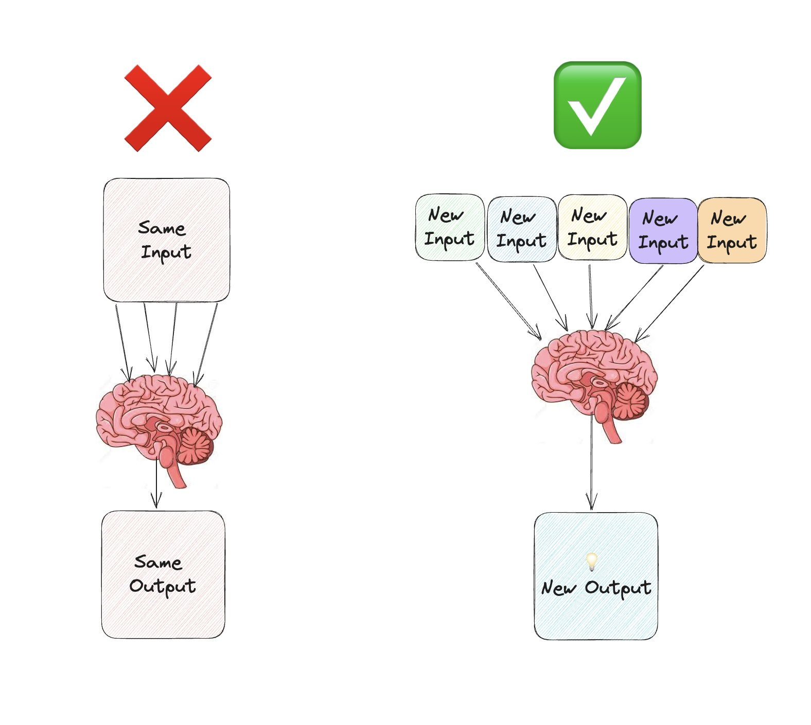

# Braintrust (Personal Advisory Board Of Mentors)

* Add a handful/group of individuals with different perspectives and lenses to your mental panel, allowing you to ask questions/advice/feedback.
	* When faced with a dilemma, ask one of them, “_What would you do?_”
* _You might not know them personally, and they might not know each other neither._
	* While a real panel of advisors is invaluable, an imaginary panel has advantages: _it's not limited to people you can call, and it requires no one else's time._
		* A great example: Podcasts
			* A unique opportunity to hear experts and thought leaders talk you through their experiences and decision-making processes.
			* You can choose to be “mentored” by industry leaders or inspiring professionals, _even if they have no idea who you are_.
			* Their insights are freely available/accessible, tailored to your schedule, and infinitely revisitable at anytime!
* A few key features of the group members:
	* Unbiased (ideally not family)
	* Diverse experiences, perspectives, lenses, mindsets [^1]
	* Willing to provide raw feedback and candor
	* Vested interest in your success (i.e., they want to see you win)
* Consider your Braintrust as your life giants—you will always see further by standing on their shoulders by adopting the views from them / tapping into the minds of them.

---

# Murder Board

* also known as a “scrub-down”
* is a committee of questioners set up to critically review a proposal and/or help someone prepare for a difficult oral examination.

---

## See Also

* [The Medici Effect](The%20Medici%20Effect.md)
* [Lateral Thinking](Lateral%20Thinking.md)
* [Systems Thinking](Systems%20Thinking.md)

[^1]: Diversity is key to your panel's success, as it brings a broader range of ideas.
