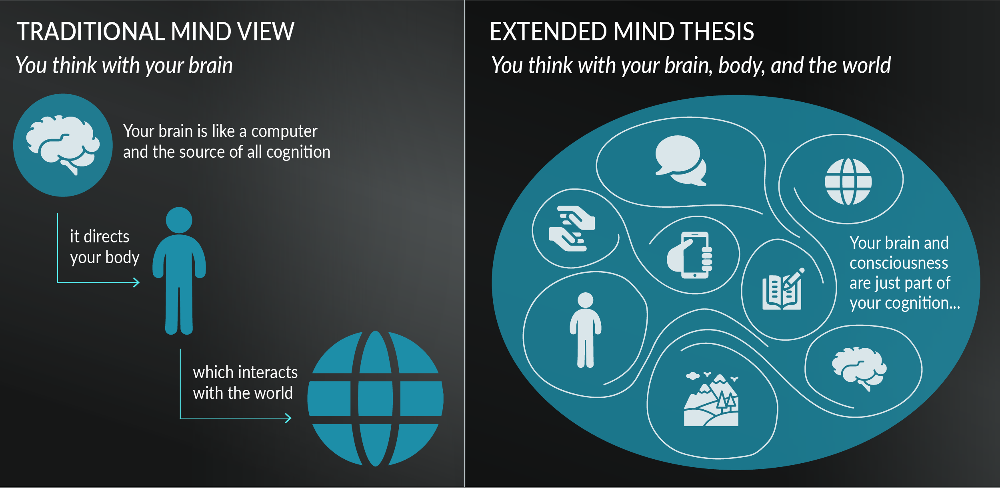
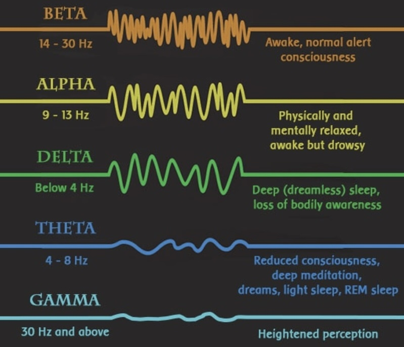

The brain is a monkey brain with a supercomputer on top.

---

* 前額葉皮 (Prefrontal Cortex, PFC) is critical for contextual processing
* 神經可塑性 ([Neuroplasticity](Neuroplasticity.md))
* Neurocircuit
* 迷走神經 (Vague nerve)
* 腺苷 (Adenosine): Drowsiness/Sleepiness
* [amygdala](amygdala.md)

---

# 自律神經系統（Autonomic Nervous System, ANS）

* 控制「非自主運作（無需意識控制）」的生理功能，例如心跳、呼吸、消化、血壓等。
* 進一步分為：
	1. 交感神經系統（Sympathetic NS）
	2. 副交感神經系統（Parasympathetic NS）
	3. 腸神經系統（Enteric NS）

## 「戰或逃」反應（Fight or Flight）

* 由「交感神經系統（Sympathetic Nervous System）」主導
* 發生在面對壓力或威脅時
* 身體進入警戒狀態：
	* 心跳加快
	* 瞳孔放大
	* 肌肉緊繃
	* 腎上腺素分泌上升

## 「休息與消化」反應（Rest and Digest）

* 由「副交感神經系統（Parasympathetic Nervous System）」主導
* 發生在安全、放鬆的環境中
* 身體進入恢復狀態：
	* 心跳減慢
	* 消化活躍
	* 肌肉放鬆
	* 能量儲存與修復進行中

| 生理反應                       | 主導神經系統 | 身體狀態  | 主要功能      |
| -------------------------- | ------ | ----- | --------- |
| **戰或逃（Fight or Flight）**   | 交感神經   | 緊張、警覺 | 應對危機、逃生   |
| **休息與消化（Rest and Digest）** | 副交感神經  | 放鬆、修復 | 恢復體力、維持平衡 |

# 體性神經系統（Somatic Nervous System, SNS）＝Voluntary Nervous System

* 控制「自主運動（需要意識控制）」，例如移動手腳、寫字、說話等。
* 傳遞訊號到「骨骼肌」，協調身體動作。

---

人類的腦部其實是三位一體的腦，由三個重要的腦組合連結在一起，共同合作而形成。

* 首先是腦幹，位於大腦中最深處的部分，主要負責人的維生功能，如呼吸、心跳、戰逃反應、生存本能，這部分的腦是最古老的腦，在演化上，從古至今沒有太大的改變。因此有時也被形容為爬蟲類腦 (reptilian brain)。
* 第二部分的腦稱為緣腦 (Limbic Brain)，包括[杏仁核](amygdala.md)、海馬迴、下視丘等，為處理情緒、記憶的中樞，因此也被稱為情緒腦或哺乳動物的腦。由於位在腦幹邊緣，有時也被稱為邊緣系統 (limbic system)
* 第三個部分的腦稱為皮質 (Cortex)，皮質是人類最後演化出來的部分，它像樹皮一樣層層疊疊包覆在大腦外面。皮質層負責高等的腦部功能，例如、計畫、思考、語言功能都在這裡發生。

---

[Limbic Friction](limbic-friction.md)

---

大腦主要由神經元和膠質細胞組成，兩者的數量約為 1 : 1

* 神經元執行神經訊號的傳遞和整合功能
* 膠質細胞則扮演重要的支撐和營養作用

---

# 大腦掌管記憶的區域

* 短期記憶：海馬迴 (Hippocampi) / 海馬體 (Hippocampus)
	* 阿茲海默症 (Alzheimer’s Disease): 海馬體萎縮，屬於「退化性 (Degenerative Dementias) 失智症」的一種
* 長期記憶：皮質層 (Cortex)

---

# 潛/下意識 ([Subconsciousness](https://www.psychologytoday.com/us/basics/unconscious)) ↔ 主/表/顯意識 (Consciousness)

> _“Psychologists tell us that by the time we’re in our mid-30s, our identity or personality will be completely formed. This means that for those of us over 35, we have memorized a select set of behaviors, attitudes, beliefs, emotional reactions, habits, skills, associative memories, conditioned responses, and perceptions that are now subconsciously programmed within us. Those programs are running us, because the body has become the mind. This means that we will think the same thoughts, feel the same feelings, react in identical ways, behave in the same manner, believe the same dogmas, and perceive reality the same ways. About 95 percent of who we are by midlife1 is a series of subconscious programs that have become automatic—driving a car, brushing our teeth, overeating when we’re stressed, worrying about our future, judging our friends, complaining about our lives, blaming our parents, not believing in ourselves, and insisting on being chronically unhappy, just to name a few.” ― Joe Dispenza, [Breaking the Habit of Being Yourself: How to Lose Your Mind and Create a New One](https://www.goodreads.com/work/quotes/18108532)_

* The subconscious mind is always active, continuously operating whether you’re awake or asleep—like background processing.
* You can’t access your subconscious mind while you’re conscious.
* Your subconscious mind is like a vast cloud-based memory bank, effortlessly multitasking in the background, while your conscious mind holds no long-term memory and can focus on only one thought at a time.
* The Iceberg of Conscious Mind [^1]
	* Our consciousness (i.e., voice in your head) is just the iceberg tip of our cognition. Only about 10% of our brain activity is conscious, while 90% operates unconsciously.
	* Much like an iceberg, your mind has two parts: the _visible_ portion above the surface, and the _hidden_ depths beneath it.
	* **What That Means**
		* **Conscious Mind (≈10%)**
			* This is the part you’re actively aware of—your thoughts, decisions, focus, willpower, etc. It includes logical reasoning, short-term memory, and deliberate action.
		* **Unconscious or Subconscious Mind (≈90%)**
			* This massive part handles things automatically: habits, emotions, instincts, beliefs, body functions (like breathing or heartbeat), and even deeply stored memories or reactions.
	* **Examples**
		* When you **drive a car**, your conscious mind might focus on traffic, but your subconscious handles shifting gears or reacting to familiar routes.
		* When you **meet someone**, your conscious mind processes what they’re saying, but your subconscious is picking up on body language, tone, and micro-expressions.It does most of the work of our daily activities without us even realizing it.
	* Ninety-five percent of our brain activity is unconscious, meaning that most of our decisions, actions, emotions, and behaviors are driven by processes outside of our conscious awareness. [Ninety-five percent of who you are is a subconscious or even an unconscious state of being. And that means your conscious mind’s five percent is working against the ninety-five percent of what you’ve memorized subconsciously.](https://www.instagram.com/drjoedispenza/p/CVA50vgg-Ui/)
	* ⭐️ The unconscious really influences our [decision-making](decision-making.md) or [habits](be-a-habit-and-routine-machine.md)
		* The subconscious mind tends to take everything literally, without distinguishing between positive and negative input. It doesn’t analyze or reason on its own—it simply follows the directions it receives from your conscious thoughts. So, if you constantly tell yourself that you’ll never succeed at something, chances are, that belief will shape your reality. As Henry Ford famously said, _“Whether you think you can, or you think you can’t—you’re right.”_
		* Your subconscious is designed to store and retrieve data—nothing more, nothing less. It doesn’t judge or analyze; it simply records and replays. It also ensures you react to that stored data—your “programming”—exactly as it was originally logged. So, if you formed a belief early on, like “I’m not good enough,” that program will continue running quietly in the background, influencing every decision you make. It shapes your behavior, locks you into familiar patterns, and reinforces a self-concept that feels “safe,” [even if it's limiting](push-your-limits.md)—until you consciously choose to [upgrade that programming](a-true-transformation-begins-with-a-mental-shift.md).
	* [Extended Mind Thesis by Andy Clark and David Chalmers](https://en.wikipedia.org/wiki/Extended_mind_thesis)
		
* If the unconscious mind runs the show most of the time, the key is to **become more conscious of the unconscious**.
	* **Mindfulness & meditation** help you observe habits and emotional patterns as they arise.
	* **Journaling** uncovers beliefs, fears, and patterns you might not be aware of.
	* **Therapy**, especially types like CBT or psychoanalysis, help you identify unconscious thought patterns that may be influencing your behavior.
	* **Visualization & affirmations** are ways to feed positive scripts into the subconscious over time.

---

[Reticular Activating System](reticular-activating-system.md)

---

# Brain Waves (腦波)

* 感覺動作節律 (Sensorimotor Rhythm, SMR)

---

# 腦中的神經傳導物質 (Neurochemicals)

* 快樂賀爾蒙
	* 多巴胺 (Dopamine) — The Reward Chemical
	* 血清素 (Serotonin) — The Mood Stabilizer
	* 催產素 (Oxytocin) — The Love Hormone
	* 腦內啡 (Endorphin) — The Pain Reliever
* 壓力賀爾蒙
	* 皮脂醇 (Cortisol) — Alertness
	* 正腎上腺素 (Norepinephrine)
	* 腎上腺素 (Adrenaline/Epinephrine)
* 褪黑激素 (Melatonin) — The Hormone of Darkness

---

[Working Memory](Working%20Memory.md)

---

[Fluid Intelligence versus Crystallized Intelligence](Fluid%20Intelligence%20versus%20Crystallized%20Intelligence.md)

---

# aMCC（Anterior Mid-Cingulate Cortex，前扣帶皮層中部）

它和人類的意志力、求生本能有很大的關聯。

科學家發現，aMCC 的大小會隨著個人狀態改變。例如，肥胖者的 aMCC 較小，但節食後會變大；運動員的 aMCC 通常較大，而那些經常挑戰自我、克服困難的人，aMCC 甚至可以「持續變大」。

那麼，如何讓 aMCC 變大？[從事讓你感到厭惡、但具挑戰性的事情。](do-hard-things.md) 當你投入精力去做那些困難、讓你抗拒的事時，aMCC 就會增長。反之，當你過於安於現狀時，aMCC 會逐漸縮小。

[^1]: See also: [Satir Transformational Systemic Therapy (STST)](Satir%20Transformational%20Systemic%20Therapy%20(STST).md)
