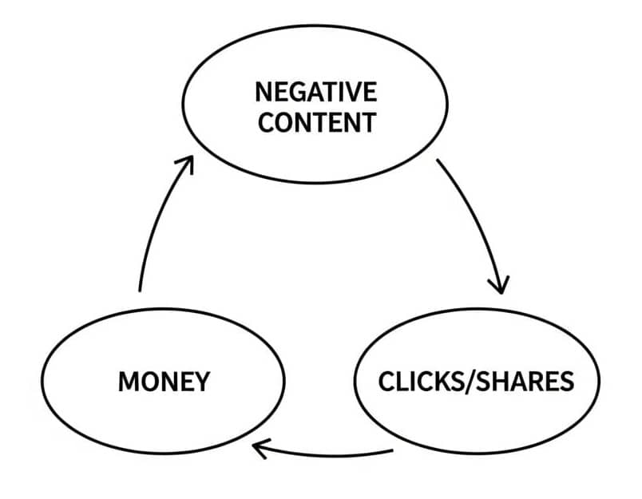

> “If you don’t read the newspaper, you’re uninformed. If you read the newspaper, you’re misinformed.” — Mark Twain

> [“People everywhere confuse what they read in newspapers with news.” — A. J. Liebling](https://www.goodreads.com/quotes/77035-people-everywhere-confuse-what-they-read-in-newspapers-with-news)

---

[Stop Reading News](https://fs.blog/stop-reading-news/)

---

24 hours each day isn’t enough to consume 0.0001% of the world’s events.

---

The Paradox of News: The more news you consume, the less informed you are about the world.

---

Want to know more about the world? Turn off the news and go spend time in it.

---

# Nassim Taleb’s “Noise Bottleneck”

* More data leads to a higher ratio of noise-to-signal
* By consuming more, you end up knowing less about what’s actually going on.

---

# Gell-Mann Razor

* Assume every media article contains a certain percent of false information.
* Sandbox the article from your worldview until you’ve:
	* Seen primary sources
	* Spoken to 3 domain experts

---

[@robertsonNegativityDrivesOnline2023]

> For a headline of average length, each additional negative word increased the click-through rate by 2.3%.

# The Negativity Doom Loop

