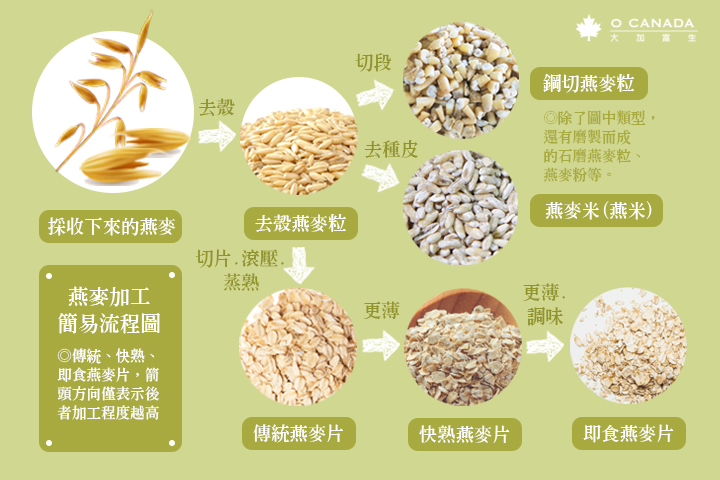
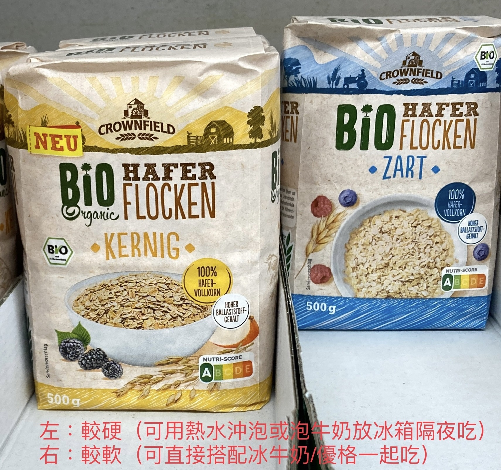

Oats are a powerhouse of nutrition, full of soluble fiber (可溶性纖維) [^1], quality protein (11–17%), and essential minerals.

---

# 種類

> 顆粒越完整，需沖煮的時間越長，營養價值也越高。

1. **鋼鐵切燕麥粒（Steel-cut oats）**：最接近原始形態，保留最多營養，口感較有嚼勁，烹煮時間最長。
2. **傳統燕麥片（Rolled/Old-fashioned oats）**：將燕麥粒蒸熟後壓扁，營養保留較多，烹煮時間適中。
3. **快熟燕麥片（Quick cooking oats）**：比傳統燕麥片更薄，易於快速烹煮，適合忙碌時食用。
4. **即食燕麥片（Instant oats）**：經過更多加工，營養大量流失，但最方便。

---

|  |
| :-: |
| 德語中，kernig 表示「硬的、有嚼勁的」，zart 則是「柔軟的」。 |

* **早餐粥**：鋼鐵切燕麥適合慢煮成粥，搭配堅果、水果，營養豐富。
* **即食沖泡**：即食燕麥片可直接用熱水沖泡，適合快速補充能量。
* **烘焙材料**：傳統燕麥片常用於製作燕麥餅乾、能量棒等健康零食。

---

[Daily Oat Meal Bowl](daily-oat-meal-bowl.md)

[^1]: specifically **beta-glucan （β- 葡聚醣）**, which forms a thick, gel-like solution in the gut, helping to reduce LDL (“bad”) cholesterol, lower blood sugar, and provide a lasting sense of fullness.
