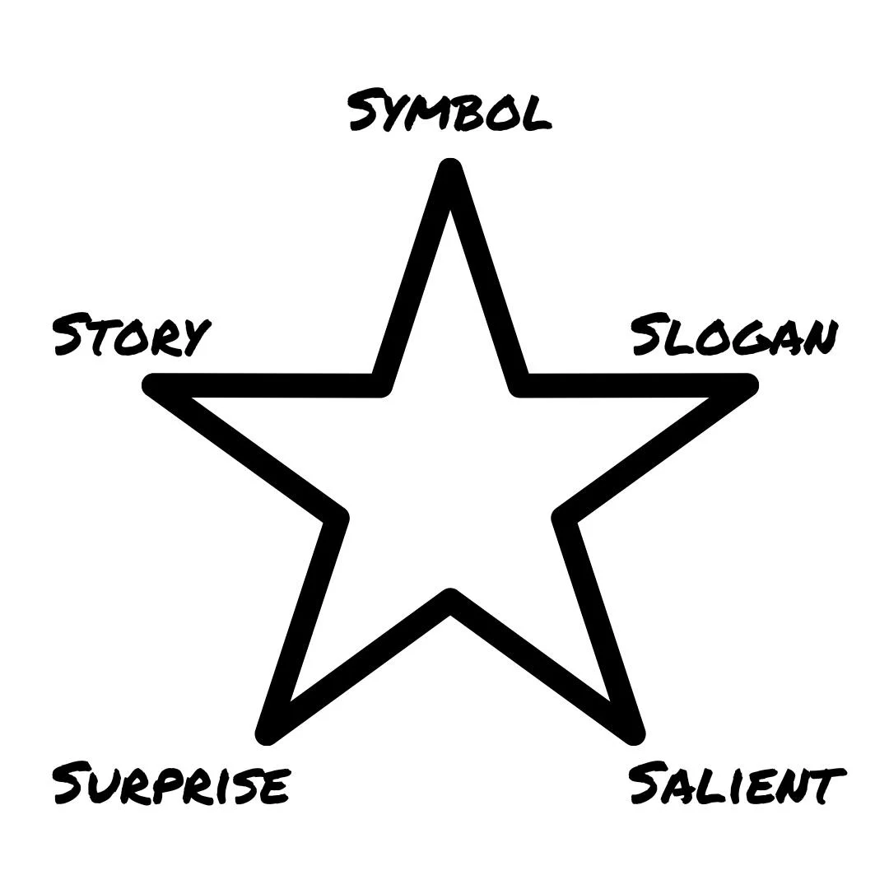

---

[“Suggestions For Giving Talks” by Robert Geroch](https://arxiv.org/pdf/gr-qc/9703019)

---

[Think Fast. Talk Smart. | Matt Abrahams | TEDxMontaVistaHighSchool](https://youtu.be/o3K_HbpWNpg)

[Think Fast, Talk Smart: Communication Techniques | Matt Abrahams | Stanford Graduate School of Business,](https://youtu.be/HAnw168huqA)

1. Having anxiety under control
	* : When anxiety symptoms kick in few minutes before public speaking (as in gurgling stomach, shaking limbs, etc.), just be mindful about them, acknowledge them and don’t resist them. “We simply greet our anxiety and say hallo to it.” It’s normal and natural, take a deep breath, and don’t let anxiety spiral out of control.
2. Reframing public speaking as a conversation with audience
	* Presenting isn’t performing: There is no “right” or “wrong” way of presenting (although there are certainly “better” or “worse” ways).
	* Start with questions: They are dialogic in nature. They could be rhetorical, polling, or simply asking for information.
	* Using conversational language. Using an inclusive language and not distance the audience from ourselves and the speech, in addition to having a relaxed body language.
	* Be in the present moment. Don’t think about the far future. This in turn will clear your mind and make you less nervous. There are some ways of becoming present in the moment such as doing pushups, walking, listening to music, tongue twisters (they can help in warming up the voice as an added benefit) or it could be anything that brings the attention and use some cognitive resources.
		* Walk out of the building before the talk
		* Count number by back
3. Ground rules for being comfortable in speaking in spontaneous situations
	* Get out of your own way. Dare to be dull. Don’t worry about being perfect or doing stuff flawlessly. Improvise, don’t stockpile information, let your brain act spontaneously. Aiming to be perfect could be in your way due to over-evaluation, and over-analyzation which leads to freezing up.
	* See things as opportunities and not as challenges or threats. Say “Yes, and…” instead of “No, but…”.
	* “You need to understand the demands of the requirement you find yourself in, in order to respond appropriately.” You should be in service of audience. Don’t jump to conclusions without gathering enough information. So, slow down and listen to understand and be in touch with the receiver to fulfill your obligation as a communicator. “Don’t just do something, stand there.”
	* Tell a story. Respond in a structured way. Having a structure is key to having a successful spontaneous and planned speaking. It increases processing fluency which is how effective we process information. We process and retain structured information 40% more reliably and accurately than non-structured ones. Structure helps us to memorize.
		1. The “Problem → Solution → Benefits” Structure. You firstly start talking about what is the problem, then talk about a way/ways to solve the problem, and finally, talk about the benefit of solving it. Never lose your audience. Set expectations and provide a structure to keep the listener on track, and this structure helps with that. Could be re-framed as “Opportunity → Solution [steps to achieve it] → Benefits”.
		2. The “What? So what? Now what?” Structure. Start firstly by talking about what the problem/idea is, why is it important, and then what the next steps are. This is a good formula for answering questions, and introducing people: Who they are? Why are they important? And what to do next with them?. In a spontaneous speaking situation, we have to think about two things simultaneously: what to say and how to say it. Practicing these structures is a key skill for effective spontaneous thinking. “Structure sets you free.”

---

[Toastmasters International](https://www.toastmasters.org/)

---

Feeling nervous before giving a talk on stage?

_[Just sit with it, stay still, and realize that the feeling is valid.](Acceptance%20and%20Commitment%20Therapy.md)_ It’s an indicator that you really care about the thing you are about to do. That’s a privileged place to be.

---

# [Zone 2 Practice Session by Sahil Bloom](https://www.sahilbloom.com/newsletter/public-speaking-hacks-life-saving-ai-more)

Before a public speaking appearance, practice your delivery while engaged in a light cardio activity—a slow jog, brisk walk, hike, stationary bike—that brings your heart rate into a Zone 2 range (60-70% of your max, or a level at which it feels elevated but you can still maintain a conversation).

When you get nervous during a talk, your heart rate starts to rise. The problem for most people (my younger self included!) is that we aren’t prepared to deliver our talk in an elevated heart rate condition.

In other words, our practice was not aligned with the conditions of the real game.

The Zone 2 Practice Session fixes that: You prepare while in the elevated heart rate state that will characterize the real game, so when the moment comes, you know what it feels like. You’re ready for it.

Next time you have a big talk or presentation to prepare for, give it a shot:

Do a few rounds of prep while out on a jog or brisk walk. It’s a weird trick, and it may feel uncomfortable at first, but it just plain works.

---

Stage Fright

---

Pregnant Pause/Silence = A pause that…

* gives the impression that it will be followed by something significant
* feels like something important is happening

---

The goal of any pitches/presentations: understandable/easy-to-understand for others

---

# [If you're public speaking for the 1st time:](https://x.com/AlexHormozi/status/1768476853394956325)

* No more than 1 big idea
* 1 visual aid per slide
* 1 main idea per slide
* Use multiple stories per idea
* Use 3rd grade vocab or lower
* Be okay with silence
* Record yourself 30x out loud
* Rewatch each
* Then do it for real
* And you’ll crush

---

# Winston’s Star

* **Symbol:** Use a visual symbol to make your idea stick.
* **Slogan:** Find and deliver a simple, catchy slogan for the central idea.
* **Surprise:** The human brain loves novelty. Make sure to highlight the contrarian, counterintuitive, or surprising details of the idea.
* **Salient:** Focus, [less is more.](Simple%20is%20beautiful.md)Determine the most salient pieces and deliver those succinctly. Avoid unnecessary fluff.
* **Story:** People love stories. Use human storytelling to simplify, spark emotion, and make a presentation more relatable and memorable.

---

Before starting, take a moment to look around / scan the room and smile at the audience. Find someone who seems particularly engaged and keep going back to them throughout your speech.
