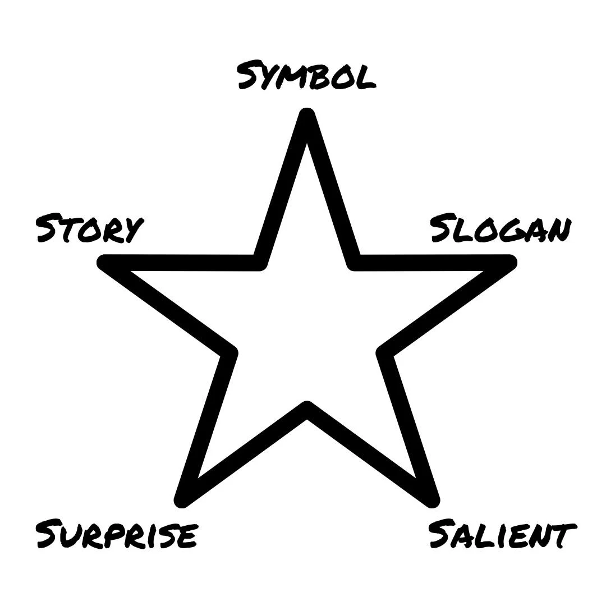

---

[“Suggestions For Giving Talks” by Robert Geroch](https://arxiv.org/pdf/gr-qc/9703019)

---

[Toastmasters International](https://www.toastmasters.org/)

---

Feeling nervous before giving a talk on stage?

_[Just sit with it, stay still, and realize that the feeling is valid.](Acceptance%20and%20Commitment%20Therapy.md)_ It's an indicator that you really care about the thing you are about to do. That's a privileged place to be.

---

# [Zone 2 Practice Session by Sahil Bloom](https://www.sahilbloom.com/newsletter/public-speaking-hacks-life-saving-ai-more)

Before a public speaking appearance, practice your delivery while engaged in a light cardio activity—a slow jog, brisk walk, hike, stationary bike—that brings your heart rate into a Zone 2 range (60-70% of your max, or a level at which it feels elevated but you can still maintain a conversation).

When you get nervous during a talk, your heart rate starts to rise. The problem for most people (my younger self included!) is that we aren't prepared to deliver our talk in an elevated heart rate condition.

In other words, our practice was not aligned with the conditions of the real game.

The Zone 2 Practice Session fixes that: You prepare while in the elevated heart rate state that will characterize the real game, so when the moment comes, you know what it feels like. You're ready for it.

Next time you have a big talk or presentation to prepare for, give it a shot:

Do a few rounds of prep while out on a jog or brisk walk. It's a weird trick, and it may feel uncomfortable at first, but it just plain works.

---

Stage Fright

---

Pregnant Pause/Silence = A pause that…

* gives the impression that it will be followed by something significant
* feels like something important is happening

---

The goal of any pitches/presentations: understandable/easy-to-understand for others

---

# [If you're public speaking for the 1st time:](https://x.com/AlexHormozi/status/1768476853394956325)

* No more than 1 big idea
* 1 visual aid per slide
* 1 main idea per slide
* Use multiple stories per idea
* Use 3rd grade vocab or lower
* Be okay with silence
* Record yourself 30x out loud
* Rewatch each
* Then do it for real
* And you'll crush

---

# Winston's Star

* **Symbol:** Use a visual symbol to make your idea stick.
* **Slogan:** Find and deliver a simple, catchy slogan for the central idea.
* **Surprise:** The human brain loves novelty. Make sure to highlight the contrarian, counterintuitive, or surprising details of the idea.
* **Salient:** Focus, [less is more.](Simple%20is%20beautiful.md)Determine the most salient pieces and deliver those succinctly. Avoid unnecessary fluff.
* **Story:** People love stories. Use human storytelling to simplify, spark emotion, and make a presentation more relatable and memorable.

---

Before starting, take a moment to look around / scan the room and smile at the audience. Find someone who seems particularly engaged and keep going back to them throughout your speech.
