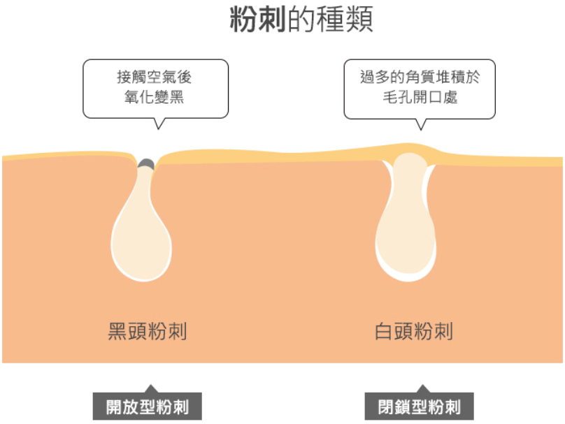
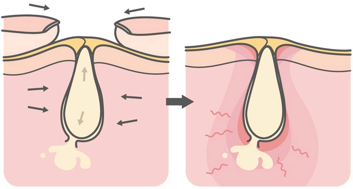
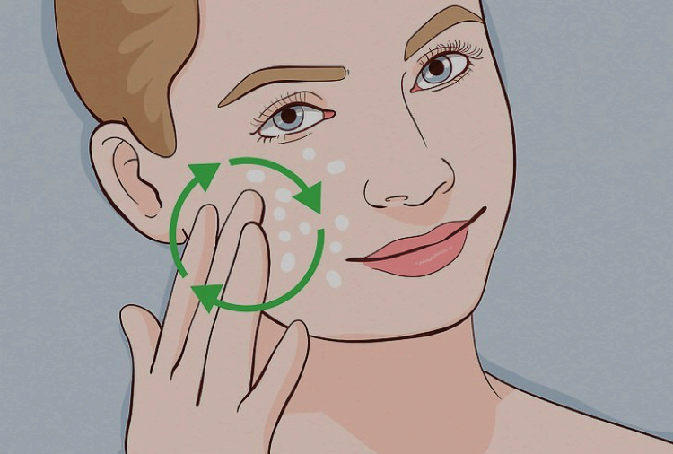

# 如何擁有「水煮蛋肌」?

1. Sleep: 充足的睡眠
2. Nutrition: 均衡的飲食 (& 大量白開水) → 蛋奶類是大忌！
3. Exercise: 規律的運動

# Background Knowledge

* 臉部黃金酸鹼值 (pH 值) = 5.5
	* 所以絕對不能用鹼性的「肥皂」洗臉，會造成「過度清潔」而破壞皮脂膜
* 「粉刺」和「痘痘」都是從「皮脂腺分泌的皮層油脂堵塞毛囊」發展而來的
	
* 關於「閉鎖性 (內包) 粉刺」
	 
	 * 因為它沒有開口，必須比平常更用力才能擠出來，這時通常已經擠到「發炎」了，後續還有可能因為細菌「感染」而轉變成痘痘，進而形成痘疤，非常得不償失!
	* 清除關鍵：「**去除表面的角質堆積**」
		 * 當毛孔有了開口後，粉刺就有自體/動浮出來的機會 (粉刺是一種代謝廢物，身體也不會再把它們吸收回去)
* 酸類
	* 「治痘&抗痘」取向 (適合膚況不佳時擦)
		* 水楊酸 (BHA, Salicylic Acid)
	* 「抗老」取向 (適合膚況佳時擦)
		* 果酸 (AHA)
			* 乙醇酸/甘醇酸 (Glycolic Acid)
		* A 酸
	* #TODO 杏仁酸
	* #TODO 杜鵑花酸
	* #TODO 玻尿酸不是酸
		* 「玻尿酸」和「膠原蛋白」是肌膚最自然的保濕屏障。
* [比較] 視黃醇 / 維 A 醇 / A 醇
	* Retinol
		* _lower_ concentration of the active retinoic acid ingredient
		* available over the counter (OTC)
	* Retinoid
		* _higher_ concentration of the active retinoic acid ingredient
		* often only available with a medical prescription
* 「<mark>刷酸煥膚</mark>」: 調理痘痘粉刺肌膚最好的辦法是「長期持續地」使用「弱酸性」產品，去除毛孔內堆積的老廢角質
	* 大原則:「酸類保養品」不宜每天使用 (早 C 晚 A)，會過度清潔，易致痘，每周 2-3 次就好，可以跟「保濕類保養品」交互論替使用

# Terminology

* Pimple 面皰/粉刺
* Acne 痘痘
* Dermatologists 皮膚科醫生
* Fragrance 芳香劑
* Exfoliate (v.) 去角質
* Exfoliant (n.) 脫落的死皮
* PA (= Protection Grade of UVA) → UVA 的防護能力
* SP (= Sun Protection Factor) 防曬係數 → UVB 的防護能力
* Cleanser 洗面乳
* Toner 化妝水
* Lotion/Misturizer 面霜/乳液/乳霜
* Essence (較稀 の) / Serum (較濃稠 の) 精華液

# Brand

* CeraVe
* Eucerin
* La Roche-Posay (理膚寶水)
* Neutrogena (露得清)

# Principles

> 步驟越簡單、保養品越少越好！

# Goes (擦任何護膚品/保養品都要把握以下原則)

* Use natural products with simple ingredients like tallow, coconut oils, etc.

	> Your skin is your largest organ. Why put things on your skin that you’d never put in your body?

* Carefully and gently pat your face dry using finger tips until the skin is left slightly damp
	* It takes only a minute or two more
	* It avoids friction and hygiene issues
* 噴/擦完 Face Mist 或 Toner 後，務必要做「鎖水」的動作 (上面霜)
* Apply the cream into your skin using _small_, _upward_, _circular_ motions
	* Never drag _downward_ on your skin!
	* Why? As you age, gravity pulls your skin downward, causing sagging and wrinkles
		

# No-goes (NG 動作)

* 過度清潔 (洗臉) /保養 (尤其是酸類)、頻繁醫美雷射、經常去角質 or 敷面膜
* Towel Drying: After washing your face, avoid using a towel to dry it. Instead, let it air dry naturally (or use your hands to fan it) to prevent bacteria growth and reduce the risk of acne.
* 用手摸臉 (尤其是沒有洗手的時候)
	* Touch face or mouth with dirty hands
* 用手擠壓或妙鼻貼拔除「閉鎖型 (內包)」粉刺
* 皺眉 (frown)
* Getting hair products on the face

# 正確的洗臉方式

* 洗臉時要用和人體體溫相近的「溫水」(約攝氏 25 度上下)
	* ❗️避免使用熱水：會導致皮膚乾燥和加速皮膚老化
* 從容易出油的 T 字部位開始塗抹泡沫
* 動作要輕柔：潑溼 + 潑洗，以指腹在臉上畫圈按摩、輕輕按壓

# 「缺水 + 過乾」也會讓皮膚變得更容易長痘！

皮膚科醫生常說一句話：

> 乾燥型痘痘 = 屏障壞掉 + 過度補償出油

## 很多人不知道的盲點：

很多長痘的人為了「抗油」會：

* 不擦乳液
* 只用控油產品
* 卸妝過度
* 用太強的洗臉產品

結果：**皮脂分泌更旺盛，長更多痘痘。**

## 你應該做的是：

* ✔ 用溫和不緊繃的洗面乳
* ✔ 一定要使用保濕乳液或凝霜
* ✔ 若有擦酸類或痘痘藥 → 更要保濕！否則乾燥會讓刺激加倍、痘況更糟…

# Routine

## 🌞 早

1. Cleanser
	* 輕度清潔，把臉上的油光洗掉即可
	* 用量約晚上的一半
2. Anti-blackhead/points toner (粉刺調理水)
3. Vitamin C
4. Moisturizer
	* 要在臉濕潤的狀態下使用，才能達到保濕的效果
	* Don’t neglect your neck!
5. ⭐ Sunscreen
	* You should wear sunscreen every single day of the year, no matter what the weather is like, because when you are outside, you are constantly exposed to UV radiation
		* Even when it’s cloudy/overcast days, UV rays can still penetrate through the clouds
		* 防止 Photoaging \& Skin cancer
		* “Truck Driver Face”: the result of sun damage after years and massive hours behind the wheel driving a truck
		* The easiest way is to sneak our sunscreen into the products we already wear every day (SPF moisturizers)
	* Apply sunscreen when going out for long time. Do reapply every 3-4 hours or depending on the level of sun exposure.
	* 選用有以下標示的防曬乳
		* SPF 30–50
		* PA++++
		* Broad spectrum: UVA + UVB
	* What about vitamin D? Many studies have shown that **oral** vitamin D supplementation leads to more improvement in blood levels than sun exposure

## 🌙 晚

1. Cleanser
	* Silicone Facial Cleasing Brush
		* Gently move the brush over your face in circular movements
		* The optimal application time per cleaning is 1 min, 20 sec per application area
	* 徹底清潔重點部位
		* 鼻翼 + 鼻頭
		* T-zone
		* U-zone (下巴)
	* 臉頰部分輕柔地帶過就好
2. Peeling/Exfoliating Gel
	* 每周一到兩次
3. Retinol/Retinoid (Vitamin A)[^1] or 酸類 [^2] 之精華液
	* 擦之前要確保臉是乾的
	* 用量抓豌豆大小即可
	* Excellent daily addition to a skincare regimen for anyone who is not pregnant/breastfeeding
4. Moisturizer
	* 可以減少精華液對皮膚的刺激
	* Don’t neglect your neck!

---

# 凡士林晚安面膜

* 利用凡士林極佳的「鎖水保濕」效果，在完成基本的「補水」保養後，「局部性」塗抹薄薄一層，形成保護膜（保鮮膜）鎖住水分，使肌膚滋潤。
* 避免大面積、全臉、無死角地塗抹凡士林，否則容易造成毛孔阻塞、粉刺滋生，特別是油性肌膚或本身已有痘痘困擾的人。

[^1]: 初期建議先三天塗抹一次，使用一段時間後，若無乾燥脫皮現象，再慢慢增加使用頻率 (視膚況而定)
[^2]: 剛開始使用時會有所謂的「爆痘期」，這是因為酸類正在發揮作用，將毛孔內已經成型的粉刺慢慢代謝出來。在這段期間，可能會引起發炎/感染，最後變成痘痘
