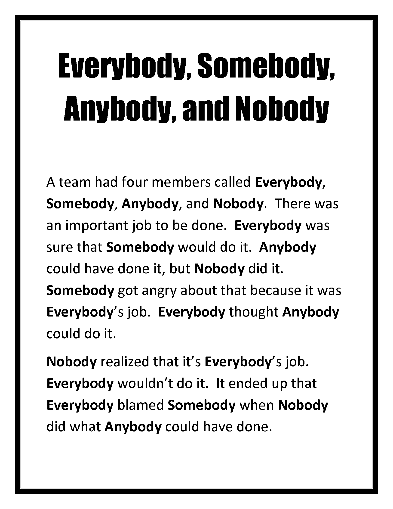

= Bystander Apathy

**“Let someone help, not me.”** [@philpotWouldBeHelped2020]
* [People are less likely to help someone in need when other people are present.](https://sketchplanations.com/the-bystander-effect)

Poem: «Everybody Somebody Anybody and Nobody»

> This is a story about four people named _Everybody_, _Somebody_, _Anybody and Nobody_.
>
> There was an important job to be done and Everybody was sure that Somebody would do it.
>
> Anybody could have done it, but Nobody did it.
>
> Somebody got angry about that because it was Everybody’s job.
>
> Everybody thought that Anybody could do it, but Nobody realized that Everybody wouldn’t do it.
>
> It ended up that Everybody blamed Somebody when Nobody did what Anybody could have done.
>
> — Charles R. Swindoll

