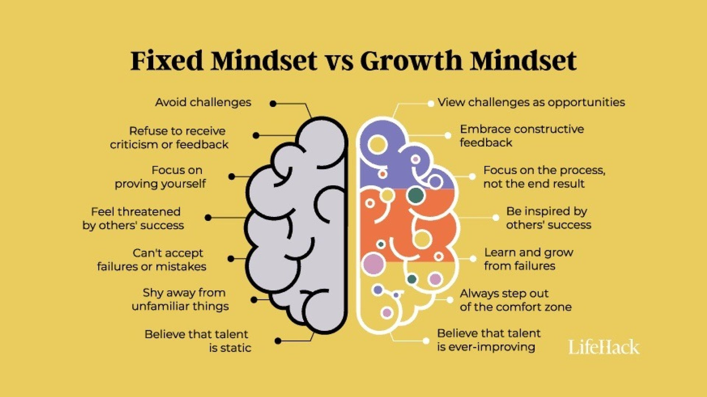

[@dweckMindsetNewPsychology2008]

> _“True self-confidence is “the courage to be open—to welcome change and new ideas regardless of their source.” Real self-confidence is not reflected in a title, an expensive suit, a fancy car, or a series of acquisitions. It is reflected in your mindset: your readiness to grow.” ― Carol S. Dweck, Mindset: The New Psychology of Success_

---

= Infinite Mindset = Grow-the-pie Mindset

---

---

持續修正，不斷嘗試、試錯，重點是 [積少成多、聚沙成塔](The%20Compounding%20Effect.md)、一次比一次更好的迭代/堆疊 [過程](Journey%20over%20destination.md) (like interval workouts)。

---

駭客精神: 好還要更好!

---

Kaizen (改善)

---

> _“Talent is a pursued interest. Anything that you're willing to practice, you can do.” — Bob Ross_

Approach everything in life as a _skill_ at which you can increase your competency through [practices](Deliberate%20Practice.md). You get better at what you practice. [What you like to practice is what’s worth pursuing. Getting to perform is just a bonus.](https://www.workingtheorys.com/p/about-practice) Everything is practice. [Practice makes perfect.](Deliberate%20Practice.md) [^1]

# [How to Make Anything a Skill](https://avthar.com/blog/growth-mindset)

1. Clearly define success and failure
2. Make it _practice-able_
3. Create feedback loops
4. Track your progress over time

---

# 先求有，再求好

[Get going.](Just%20getting%20started.md) Get good. Get smart.

* The moment to move from “Get good” to “Get smart”: You never cringe yourself. You are confident with the quality of your work.
* Strategies only come to the picture at the “Get smart” stage.

---

# [The Power of Yet](https://youtu.be/J-swZaKN2Ic)

> _“Not the 'not,' but the 'not yet.' — [@markaurelMeditations2006]_

* “I'm not good enough” → “I'm not good enough…_yet_.”
* “I don't know how to do it” → “I don't know how to do it…_yet_.”
* “I'm not capable of that” → “I'm not capable of that…_yet_.”

---

# The “have been” Mindset

* I am strong because I've been weak.
* I am fearless because I've been afraid.
* I am wise because I've been foolish.

---

當你要完成一個龐大而複雜的專案，例如撰寫一份長篇研究報告，可以先快速地從頭到尾寫一遍，不必擔心錯誤或資料不足，甚至可以略過某些細節，重點是先把內容大致架構起來。

即使初稿再怎麼粗糙或充滿錯誤，它至少讓你從零開始向前邁進了一步，讓報告有了雛形，壓力也會隨之減輕。接下來，你可以在沒有過度焦慮的情況下，逐步修改、精煉，就像雕刻作品一樣，先調整大方向，再逐步打磨細節，從 30 分提升到 60 分、90 分。沒有人能夠一次做到完美，因此，重點在於持續改進，而不是一開始就要求「一步到位」或「[盡善盡美](perfectionism.md)」。

---

# Locus of Control

Locus of Control is a psychological concept first introduced by Julian Rotter in 1954 that describes how people perceive the causes of events in their lives.

* Those with an External Locus of Control believe that their outcomes are determined by forces outside their control.
* Those with an Internal Locus of Control believe they have control over their outcomes through effort, focus, and attitude.

---

## References

* _[“How to Enhance Performance & Learning by Applying a Growth Mindset” by Huberman Lab](https://youtu.be/aQDOU3hPci0)_

---

## See Also

* [Gall's Law](Gall's%20Law.md)

[^1]: 熟能生巧
