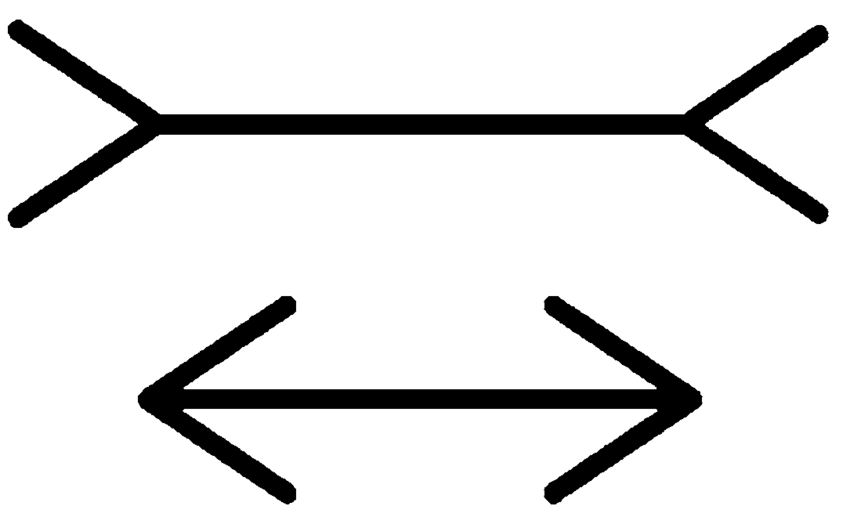

= Cognitive Illusion by Daniel Kahneman

System 1 is instinctive and emotional.

System 2 is conscious and logical.

System 1 says that the bottom line is longer than the top line. After measuring them, you are convinced by your System 2 understanding that they are, in fact, of equal length. But System 1 sticks to the illusion and continues to “see” that the bottom line is longer.

