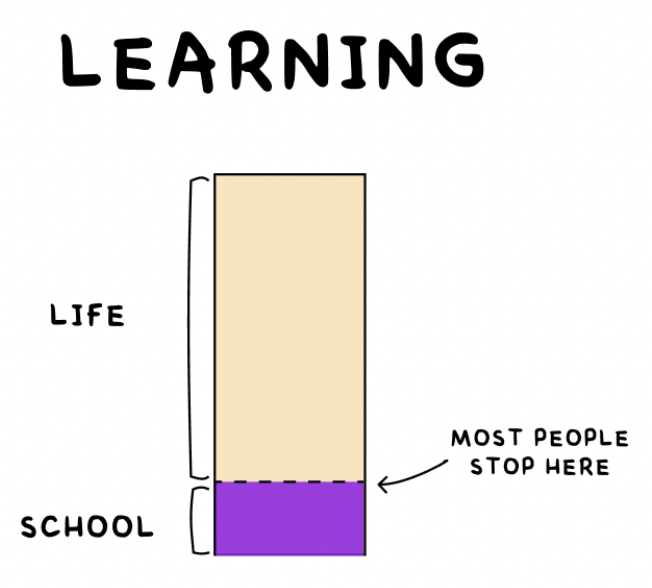

> _“School is one thing. Education is another. The two don't always overlap. Whether you're in school or not, it's always your job to get yourself an education.” — Austin Kleon_

> _“Education is what remains after one has forgotten everything he learned in school.” — Albert Einstein_

> _“When you stop learning you start dying.” — Albert Einstein_

> _「畢業是站在制度性學習的終點，自主性學習的起點」— 龍應台_

---

---

School lays the foundation, but true education starts when you step beyond the classroom.

---

 [Learning is a lifelong process.](https://hbr.org/2017/02/lifelong-learning-is-good-for-your-health-your-wallet-and-your-social-life)

---

當你知道的越多，就會發現不知道的也越多

> _["The only true wisdom is in knowing you know nothing." — Socrates](https://www.goodreads.com/quotes/9431-the-only-true-wisdom-is-in-knowing-you-know-nothing)_

> _“Real knowledge is to know the extent of one's ignorance.” — Confucius_ [^1] [^2]

* _“The more you know, the more you realize you don't know.”_
* The more I learn, the less I feel I know.
* Experts are only aware of what they don't know.

---

學海無涯

---

永續學習可以帶來知識再生的力量，讓我們一生保持源源不絕的學習動力。

---

### See Also

* [Stay curious](Stay%20curious.md)

[^1]: 知其不知，斯為知也。
[^2]: 真知者，知其所不知也。
