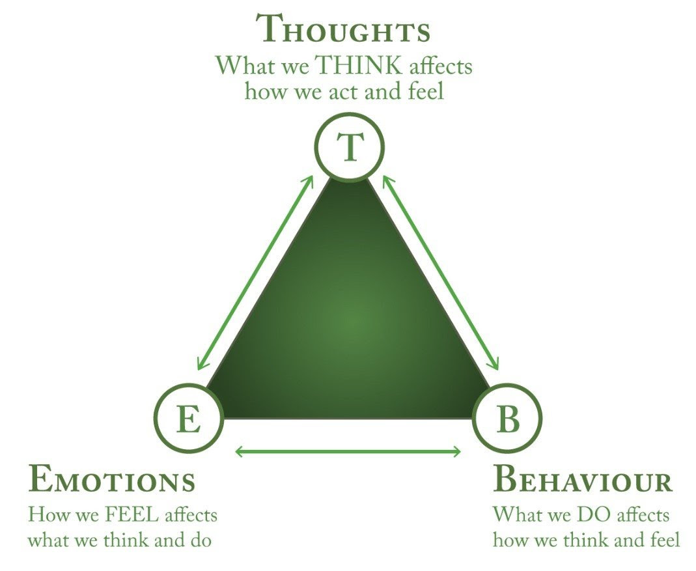

**TL; DR** Perspective is everything. [Curiosity](stay-curious.md) is key.

---

> _“My destination is no longer a place, rather a new way of seeing.” — Marcel Proust_

> _“We don’t see things as they are, we see them as we are.” — Anaïs Nin_

> _“We see what we believe rather than what we see.” — Alan Watts_

> _“It isn’t what you have or who you are or where you are or what you are doing that makes you happy or unhappy. It is what you think about it.” — Dale Carnegie_

> _“The real voyage of discovery consists not in seeking out new landscapes but in having new eyes.” — Marcel Proust_

> _“Everything can be taken from a man but one thing: the last of the human freedoms—to choose one’s attitude in any given set of circumstances, to choose one’s own way.” ― Viktor E. Frankl_

> _“Your living is determined not so much by what life brings to you as by the attitude you bring to life; not so much by what happens to you as by the way your mind looks at what happens.” — Khalil Gibran_

> _“I am not what happened to me, I am what I choose to become.” — Carl Jung_

> _“Our thinking can create liberation or it can create imprisonment. It depends on how we use our mind.” — Tenzin Palmo_

> _“The energy of the mind is the essence of life.” – Aristotle_

> _“The things I carry are my thoughts. That’s it. They are the only weight. My thoughts determine whether I am free and light or burdened.” — Kamal Ravikant_

> _“The things you think about determine the quality of your mind. Your soul takes on the color of your thoughts.” — Marcus Aurelius_

> _“The happiness of your life depends upon the quality of your thoughts.” — Marcus Aurelius_

> _“A man who acquires the ability to take full possession of his own mind may take possession of anything else to which he is justly entitled.” — Andrew Carnegie_

[@gogginsCantHurtMe2018]

> _“It won’t always go your way, so you can’t get trapped in this idea that just because you’ve imagined a possibility for yourself that you somehow deserve it. Your entitled mind is dead weight. Cut it loose. Don’t focus on what you think you deserve. Take aim on what you are willing to earn!”_

> _“Children are wonderfully confident in their own imaginations. Most of us lose this confidence as we grow up.” — Sir Ken Robinson_

> _[“Beliefs are choices. First you choose your beliefs. Then your beliefs affect your choices.” — Roy T. Bennett](https://www.goodreads.com/quotes/7718116-beliefs-are-choices-first-you-choose-your-beliefs-then-your)_

> _“By itself, conscious positive thinking cannot overcome subconscious negative feelings.” ― Joe Dispenza, [Breaking the Habit of Being Yourself: How to Lose Your Mind and Create a New One](https://www.goodreads.com/work/quotes/18108532)_

> _“We may not be responsible for the world that created our minds, but we can take responsibility for the mind with which we create our world.” — Gabor Mate_

> _“People are not disturbed by things, but by the views they take of them.” — Epictetus_ [^1]

> _“There are no [mistakes](mistake.md). They are happy accidents.” — Bob Ross_

---

---

Rewire your brain

= Reframe your thinking

= Reprogram your mindset

= Reshape your perspective

---

山不轉路轉，路不轉人轉，人不轉心轉。

---

It’s not the load that breaks you down, it’s the way you carry it.

---

You can figure out how to configure your **default state** to be _slightly amused_ rather than _slightly annoyed_ you pretty much enter God Mode.

---

The ability to choose one thought over another is superpower—one shift in our thoughts can completely change how we feel.

---

A change in worldview will change the world viewed. We see the world not as it is, but as we are.

---

[You can reorient your life in a new direction quickly but the underlying rewriting of scripts and rewiring of your nervous system takes much longer than you would ever expect.](https://newsletter.pathlesspath.com/p/40-thoughts-on-turning-40-287)

---

No one can break iron, but its own rust can. Likewise, no one can break a person, but his own mindset can.

---

[The Law of Attraction](the-law-of-attraction.md)

---

# [Think Yourself Thin](https://www.yourtango.com/health-wellness/ways-think-yourself-thin-harvard-study-shock-you)

Believing effort leads to [improvement](the-growth-mindset.md), which increases motivation and drives more effort.

---

You can’t change your past, but you can reframe it. Find the lesson in it. Find the opportunity in it. _You can’t choose your history, but you can always choose the story you tell about it._ [Rewrite the story you tell yourself](be-careful-how-you-are-talking-to-yourself.md).

---

It’s not what you _look at_ that matters. It’s what you _see_ that matters.

---

Often when you think you’re at the end of something, you’re at the beginning of something else.

---

Go laugh in the places you have cried—[change the narrative.](be-careful-how-you-are-talking-to-yourself.md)

---

* “I am really anxious.” → “I am experiencing anxiety.”
	* You are not your feelings. Just because you’re experiencing anxious feelings doesn’t mean it’s an inherent part of who you are.
	* We are not our emotions. We are not sad or anxious (_feeling emotions_). We have sadness or anxiety on us (_being emotions_).
		* I am sad. → There is sadness on me.
		* I am anxious. → There is anxiety on me.
* “How hard it is? (這有多難？)” → “How hard can it be? (這能有多難？)”
* “以後不知道該怎麼辦…” → 不知道以後會怎樣耶!
* “[I am afraid to fail.](fear-of-failure-and-success.md)” → “I am excited to try.”
* “Life happens to me.” → “I have agency. I can influence my outcomes.”
	* Reactive Living → [Proactive Living](intentional-living.md)
	* This is the essence of habit one in Stephen R. Covey’s renowned book [@covey7HabitsHighly2013]: **Be Proactive.** Everything starts there.

		> _“But until a person can say deeply and honestly, “I am what I am today because of the choices I made yesterday,” that person cannot say, “I choose otherwise.” ― Stephen R. Covey, The 7 Habits of Highly Effective People: Powerful Lessons in Personal Change_

* Decision → Experiment
* Problem → Puzzle
* [Relax](the-most-productive-people-prioritize-intentional-rest.md) → Energize
* Should → Could
* [Failure](failing-forward-turns-setbacks-into-stepping-stones.md) → Data point
* “I can’t do that.”​ → [High agency](cultivate-a-strong-bias-towards-action.md) people ask: “How could I make this possible?”

---

See failure as opportunity; See rejection as redirection; See frustration as fascination

---

Rejection is the Universe’s protection.

---

# Failures are only failures if you see them that way. No failure is ever just a failure—it’s an invitation to try something new.

[@abdaalFeelGoodProductivityHow2024]

* If your goal is to find a fulfilling career and your hypothesis is that a corporate role might be fulfilling, then your data collection process might be to sample careers through internships and job placements. With an experimental mindset, an internship that you end up hating wouldn’t be a ‘failure’ or a ‘waste of time’; it’d just be another data point to help you realize that that’s not what you want.
* If your goal is to build a successful business, then your data collection process might involve testing different business ideas, products or services. With an experimental mindset, a product launch that doesn’t meet expectations wouldn’t be a failure or a disaster; it’d just be another data point to help you refine your strategy and better understand your target market.
* If your goal is to develop meaningful relationships, then your data collection process might involve going on dates, attending social events and engaging with new people. With an experimental mindset, a date that doesn’t lead to a second one or a friendship that doesn’t blossom wouldn’t be a failure; it’d just be another data point to help you understand your compatibility.

---

# The “Be-Do-Have” Model

The traditional line of thinking is Have, Do, Be:

* I need to have X.
* Then I can do Y.
* Then I will be Z.

A classic example: _I need to have more money and fancy things, then I can do the things I want, then I’ll be fulfilled._

The reality: The conditional approach—if I have X, then I’ll be Y—never works.

Be, Do, Have flips this traditional thinking on its head:

* I will be Z.
* Then I can do Y.
* Then I will have X.

In the context of our example: _I will embody the state of being of a fulfilled person, then I can do the actions of a fulfilled person, then I will have the things I desire._

> _“Modern society is based on the mode of having (佔有), not on the mode of being (存在).” — Erich From, To Have or To Be?_

---

[@nguyenDontBelieveEverything2024]

> Once we become aware of the fact that we are only feeling what we’re thinking and that thinking is the root cause of our unpleasant experience, we see it for what it truly is. Then we allow it to settle by giving it space, and slowly we will see how we begin to have a clear mind again.

---

If you’re 37, don’t regret not waking up at 18 again. Instead, imagine you’re 90 and have just woken up at 37—gifted with another 50 years to live.

---

“[Mens sana in corpore sano](https://www.google.com/search?q=Mens+sana+in+corpore+sano)” is a Latin phrase that translates to “a healthy mind in a healthy body.”
