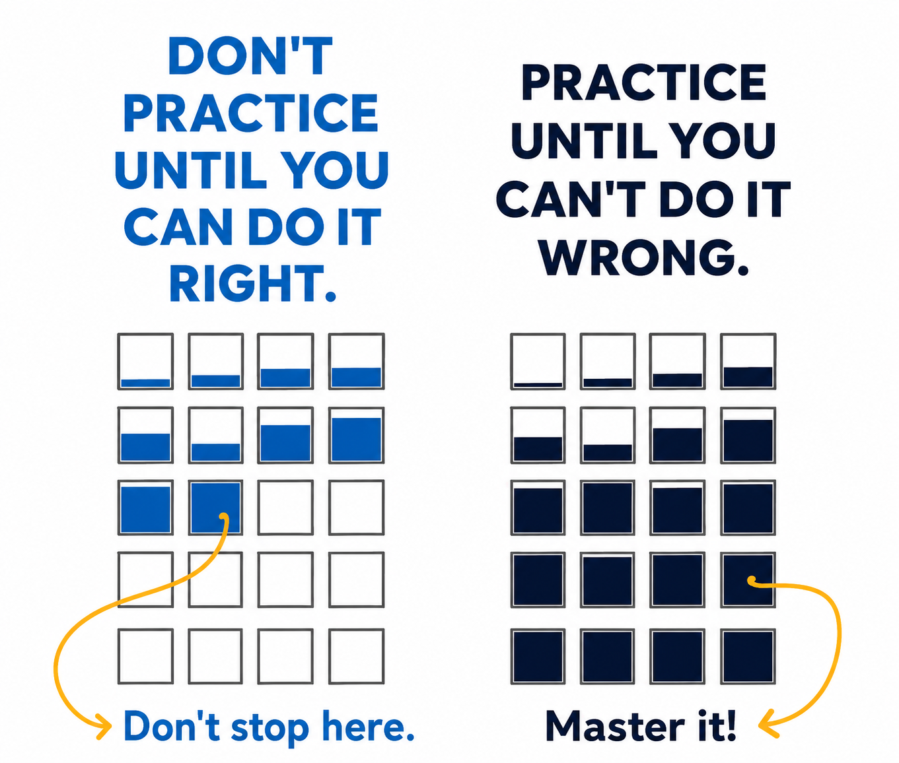

> “The professional does not wait for inspiration; he acts in anticipation of it.” — Steven Pressfield

---

|                 Amateurs                  |                 Professionals                 |
|:-----------------------------------------:|:---------------------------------------------:|
| practice until they can play it correctly | practice until they can’t play it incorrectly |
|          make it look effortful           |            make it look effortless            |
|              love the prize (只贏一次)               |               love the process (贏了又贏)               |

Amateurs practice until they get it right. Professionals practice until they can’t get it wrong.

---

[The Growth Mindset](the-growth-mindset.md)

---

[Deliberate Practice](deliberate-practice.md)
