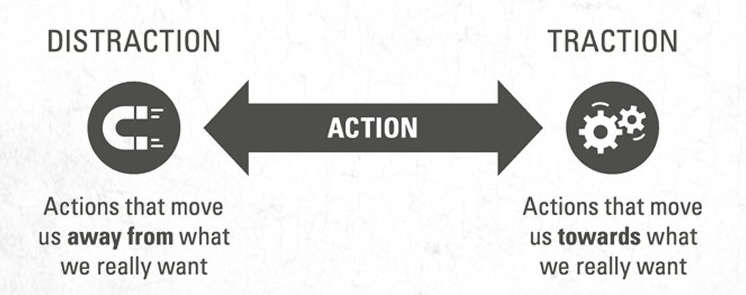

Being indistractable is about doing what you say you’re going to do.

---

The state of our attention determines the state of our life. Poor [attention management](attention.md) decreases the quality of almost every area of your life. It’s important to learn to navigate distractions [in the age of abundance](information-overwhelm.md).

---

# Distraction Fuels [Depression And Anxiety](stress-and-anxiety.md)

Depression is often the result of trying to change what we can’t and dwelling on the past. Anxiety is the result of trying to control what we can’t and [worrying](train-yourself-not-to-worry.md) about the future. Both are amplified by constant distractions.

---

The opposite of distraction is not _[focus (專注力/聚焦力)](focus-is-about-saying-no.md)_, but _traction_. The difference between traction and distraction is “intent”. Don’t confuse distraction with diversion. [^1]

---

The key difference between being distractible and indistractable lies not in [willpower](do-not-use-your-willpower-unless-you-absolutely-have-to.md), but in [preparation](planning-and-preparation-help-maximize-your-productivity.md).

---

Distraction isn’t a character flaw—it’s an [impulse control](Emotion%20Control.md) challenge we can overcome. Studies show that _external triggers_ (e.g., phone notifications) only account for about 10% of our distractions, and 90% of our distractions begin from within. These are called _internal triggers_. Internal triggers are uncomfortable emotional states/sensations (boredom, loneliness, fatigue, uncertainty, etc.) that we seek to escape with distraction. [@eyalIndistractableHowControl2019]

---

# How To Manage Distractions From External Triggers?

* Abstinence: Simply remove external triggers from your environment

# How To Manage Distractions From Internal Triggers?

* **[The 10-Minute Rule](https://www.youtube.com/watch?v=aumdC20YI4s)**
	* The 10-minute rule says that we can give into any temptation or distraction for 10 minutes.
	* When I feel the urge to check my phone, I tell myself it’s okay—but not right now. Instead, I wait for just ten minutes. This approach is known as **_“surfing the urge”_** in behavioral psychology. The idea is not to immediately give in to the impulse, but also not to outright deny it. By [delaying](delayed-gratification.md) the action (and 轉移/分散注意力!), you’ll often find that after those ten minutes, the urge has significantly diminished or disappeared entirely.
	* Why it works?
		* When you tell yourself, don’t check the phone, you might inadvertently make the urge stronger due to **Psychological Reactance**. [^2]
		* Instead of disarming psychological reactance, a much better approach is to say, “Hey, I can check my phone if I want, but I choose to wait 10 minutes.”
		* By [reframing](a-true-transformation-begins-with-a-mental-shift.md) the urge as a choice rather than a restriction, you engage with the internal trigger with _curiosity_ rather than _contempt_.
		* Rather than being a _blamer_ who points to external factors or [a shamer who internalizes guilt](be-careful-how-you-are-talking-to-yourself.md), aim to be a _claimer_—someone who takes responsibility for managing discomfort by _having a clear plan_ for responding to urges, rather than trying to suppress them.
		* This approach shows that you have _agency_—you can actually do what you say you’re going to do, and helps to [reinforce your identity to follow through on your intentions, proving you’re not controlled by distractions.](your-identity-dictates-your-actions.md)
		* Another way of reasoning is that, you don’t immediately sneeze when you feel the urge to sneeze—you take a moment, grab a handkerchief, and cover your face to prevent getting everyone sick. Similarly, when you feel an urge, like checking your phone, instead of giving in impulsively, you pause, acknowledge it, and wait.
		* Surfing the urge recognizes that internal triggers are like waves—you feel the emotions in the moment, and you allow them to crest and naturally subside, like a surfer riding on a surfboard until the wave is gone.

---

# Pro Tip: Distract The Distraction

Use subtle cues to let people know when they shouldn’t interrupt your focus. These cues communicate, without confrontation, that you’re engaged in [deep work](deep-work.md) and shouldn’t be disturbed.

For example:

* Wearing a “[concentration crown](https://x.com/nireyal/status/1161261118133719041)” or headphones (even if you’re not listening to anything) sends a clear signal that you’re occupied.
* Placing a visible “Do Not Disturb” sign at your workstation.
* Using a color-coded system (like a red desk light or a busy indicator) to let people know you’re in focus mode.

By redirecting potential distractions before they reach you, you preserve your workflow and maintain concentration without having to explain yourself repeatedly.

---

# 擁抱分心：如何善用大腦的漫遊特性提升專注力

[@davisTwoAwesomeHours2015]

[我們經常浪費時間和精力對抗大腦天生的漫遊傾向，責怪自己無法更專注，甚至視之為需要改進的缺點。再加上社會長期灌輸我們「白日夢是壞事」的觀念，使我們在發現自己走神時，往往會自責，甚至認為是懶惰的表現。](acceptance-and-commitment-therapy.md)

事實上，心思漫遊其實是正常且有益的 — 當談及長時間保持專注時，我們的秘密武器並非自律或意志力，而是學會寬待自己。絕對的專注過於不自然，強迫自己專心往往適得其反。許多人因無法持續專注而感到挫折，試圖用意志力對抗分心，然而，科學研究顯示 [@wegnerParadoxicalEffectsThought1987]，這種做法反而會讓分心加劇。例如，當我告訴你：「不要想北極熊」，你的大腦是否立刻浮現北極熊的畫面？

這是因為大腦由神經元網絡構成，當一個神經元受到刺激時，它會激發或抑制與之連結的其他神經元。當你聽到「北極熊」這個詞，相關的神經元網絡便被激活，可能喚起你對熊的印象、可口可樂的廣告、孩提時參觀動物園的回憶，甚至對北極熊數量減少的擔憂。即使你的理性大腦接收到「不要想」的指令，但一旦神經元網絡啟動，各種聯想便無可避免地湧現。

這正是我們面臨的矛盾 — 工作需要專注，但大腦天生擅長分心。因此，提升效率的關鍵之一不是壓抑走神，而是「<mark>主動移除所有不必要的外在干擾</mark>」，讓注意力自然地回歸當下。

---

# 練習察覺當下的想法，並且不加批判 [@davisTwoAwesomeHours2015]

**「覺知注意（Mindfulness）」** 指的是讓思緒自然游移，[當我們發現心思飄遠時，不帶評價地察覺，然後溫和地將注意力帶回當下的感受](meditation.md)。你可以在閱讀時試試看 — 當發現自己分心，只需留意這個有趣的現象，然後輕柔地將注意力拉回到眼前的內容。

這是一種「[活在當下](live-in-the-present.md)」的練習 — [覺察自己](mastering-yourself-is-superpower.md)、他人以及周遭環境。[當我們意識到心思飄移，可以成為一個中立的觀察者，單純觀看思緒的流動，而不是責備自己分心。當我們不再因無法專注而感到沮喪或焦慮，就能更有效地將注意力帶回手邊的事務。](acceptance-and-commitment-therapy.md)

想像衝浪的情境：衝浪者划出海面後，會坐在衝浪板上，隨波浮沉，耐心等待最合適的浪潮。雖然他們可以追逐每一道浪，但為了最精彩的一刻，他們選擇放棄多數浪潮，只為捕捉那最「正點」的一波，帶來最刺激、最值得的一次衝浪。

[我們的思緒就像浪潮，當我們試圖專注時，無數念頭會自動湧現。「覺知注意」就是學會觀看這些思緒，如同觀察波浪 — 留意它們是否引發焦慮，或誘使我們分心。重點不是壓抑或驅逐這些念頭，而是像衝浪者一樣，放掉那些無助於專注的思緒，等待真正重要的念頭浮現。學會當個「心思衝浪者」，讓雜念來去自如，而不必對每個念頭做出反應。當我們學會放手，注意力自然會回到手邊的事務。根據經驗，這通常需要幾分鐘，偶爾可能長達十五分鐘，但相比沉迷於社群媒體、瀏覽新聞或網購，這樣的「浪費」其實微不足道。](https://www.sahilbloom.com/newsletter/the-surfer-mentality)

如果你希望長時間專注於一件事，不必與分心對抗，也不必完全屈服於它。當 [心思漫遊](wander.md) 時，信任它的存在 — 或許它只是想短暫喘口氣、更新資訊。讓它去吧，但別轉而投入其他事情。如此一來，你的專注力將更穩定，也更持久。

---

[Why is it so hard to just do the work?](why-is-it-so-hard-to-just-do-the-work.md)

[^1]: E.g., using a video game to calm children before surgery is a diversion shown in studies to help kids reduce fear and anxiety.
[^2]: is the resistance when people are told what to do/say (or not do/say), they perceive it as threatening their behavioral freedom, often leading them to do the opposite of what they are told (the natural human response is to rebel), especially when it involves prescribed language.
