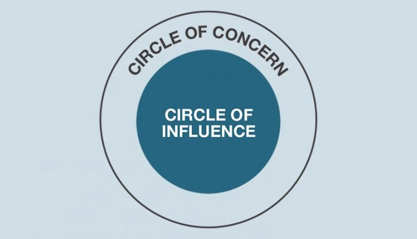

> _“Yesterday I was clever, so I wanted to change the world. Today I am wise, so I am changing myself.” — Rubi_

> _“Doctors won’t make you healthy. Nutritionists won’t make you slim. Teachers won’t make you smart. Gurus won’t make you calm. Mentors won’t make you rich. Trainers won’t make you fit. Ultimately, you have to take responsibility. Save yourself.” — Naval Ravikant_ [^1]

> _“Nothing helps; I must help myself, or I am finished.” — Friedrich Nietzsche_

> _“You have brains in your head. You have feet in your shoes. You can steer yourself any direction you choose. You’re on your own. And you know what you know. And YOU are the one who’ll decide where to go.” ― Dr. Seuss, [Oh, the Places You’ll Go!](https://www.goodreads.com/work/quotes/2125304)_

---

Self-[leadership](leadership.md): Be an agent in your own rescue.

---

Before changing yourself, you need to [knowing yourself](mastering-yourself-is-superpower.md) first.

---

欲勝人者，先自勝。欲卑人者，先自卑。

---

[@gogginsCantHurtMe2018]

> _“No one is going to come help you. No one’s coming to save you.”_

> _“You take your life in your own hands, and what happens? A terrible thing, no one to blame.” — Erica Jong_

[Your entire life will change the day you realize that everything is on you. No one is coming to save you. No one will fix your problems. No one can act on your behalf. No one will change your mindsets. No one will hand you the things you want in life. It’s the acceptance that you have to hunt if you want to eat. It's all on you.](https://x.com/SahilBloom/status/1855607589578453496)

Self-reliance is the ultimate source of strength. Self-help is the best help.

# See Also

* [Never ever complain about anything](never-ever-complain-about-anything.md)

---

[All great things start from within.](be-primarily-internally-driven-with-intrinsic-motivation.md) What lies behind us and what lies before us are tiny matters compared to what lies within us.

---

# It’s A Lot Easier To Change Yourself Than To Change The World. Be The Change You Want To See In The World.

* Water your own grass
* Mow your own lawn

Tend your garden. Sow your seeds. Water your grass. The grass is greener where you water it.

---

Personal development/growth/improvement is a lifelong endeavor. Every single day, you have to [act in favor of the person you want to become](your-identity-dictates-your-actions.md). [The work never stops.](every-single-day-chop-wood-carry-waters.md) [Be a habit and routine machine](be-a-habit-and-routine-machine.md).

> _[“Existence is a series of footnotes to a vast, obscure, unfinished masterpiece.” — Vladimir Nabokov](https://www.goodreads.com/quotes/93494-existence-is-a-series-of-footnotes-to-a-vast-obscure)_

---

# Set Your House In Perfect Order Before You Criticize The World. (在批評世界之前，先把房間整理乾淨)

[@peterson12RulesLife2018]

* Your house is a metaphor for YOU. Unless you are perfect, 99% of the time the solution to your problem is not “out there” but “in here.”

---

[@covey7HabitsHighly2013]

# You Should Spend More Time In Your _Circle Of Influence_ And Less Time In Your _Circle Of Concern_.

* Based on these two circles, **reactive** people will think more about the **circle of concern** while **proactive** people focus more on the **circle of influence**.
* Your Circle of Concern is all the things you worry about and that influence you but that you have no control over: Federal Government, climate change, etc.
* Your Circle of Influence is all the things you can control: your actions, your habits, your attitudes, your attention etc.
* **The more you focus on your Circle of Influence, the bigger your Circle of Influence will get, and the more you can accomplish to help fix things in your Circle of Concern.**

## See Also

* [Have the courage to do the right things](have-the-courage-to-do-the-right-things.md)

---

# [The Ever-Changing “You” by Sahil Bloom](https://www.sahilbloom.com/newsletter/the-ever-changing-you)

> _There is no Past You to cling to, there is no Future You to worry about. There is just the Present You to take action. You simply exist. You never become, you are in a constant state of becoming. There is just you—The Ever-Changing You._

---

## See Also

* [Control the controllable](control-the-controllable.md)

[^1]: The only person who’s going to magically show up to save you— is you.
