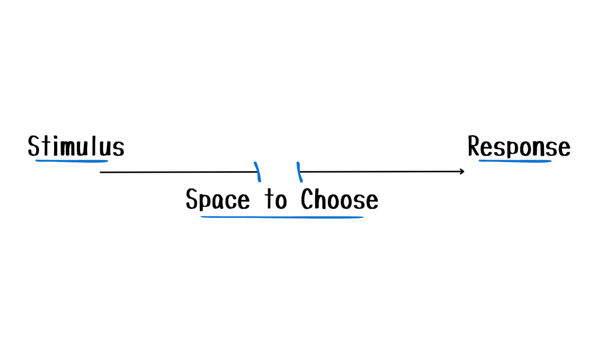
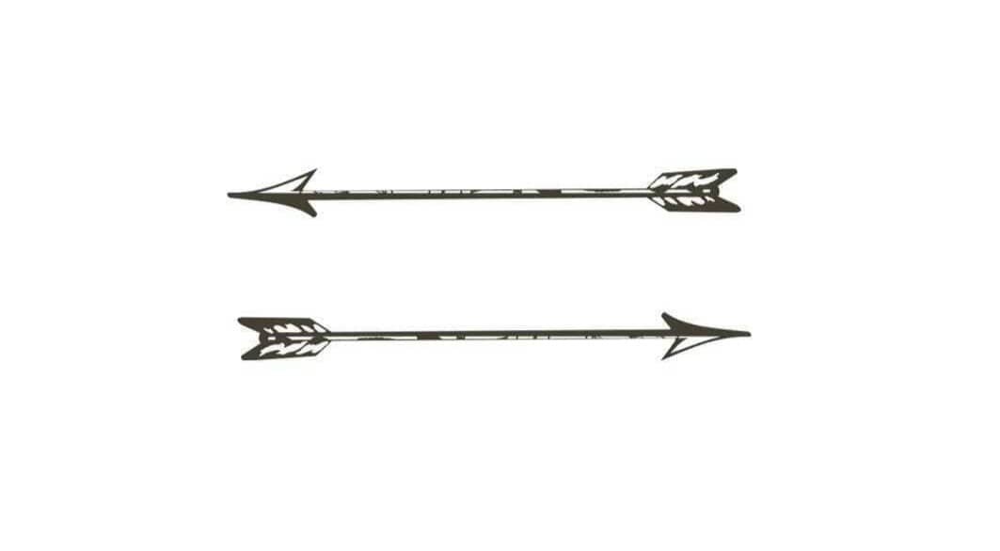

> _“How we decide to respond to our fears, that is the person we become.” ― Will Smith, [Will](https://www.goodreads.com/work/quotes/91549698)_

> _“It is the set of the sails, not the direction of the wind that determines which way we will go.” — Jim Rohn_

> _“Between (triggering) stimulus and (emotional) response there is a space (gap). In that space is our power to choose our response. In our response lies our growth and our freedom.” — Viktor E. Frankl_

> _“When things go wrong, don’t go with them.” — Elvis Presley_

> _“How people treat you is their [karma](life-is-cyclic.md); how you react is yours.” — Dr. Wayne Dyer_

> _“If we are all going to be destroyed by an atomic bomb, let that bomb when it comes find us doing sensible and human things-praying, working, teaching, reading, listening to music, bathing the children, playing tennis, chatting to our friends over a pint and a game of darts—not huddled together like frightened sheep and thinking about bombs. They may break our bodies (a microbe can do that) but they need not dominate our minds.” — C.S. Lewis_ [^1]

---

---

---

It’s not what happens to us that shapes our lives, but how we _choose to_ respond.

---

You can’t control what others choose to do, but you can always control how you choose to respond.

---

Knowing when to stop is a superpower. You don’t need to attend every argument you’re invited to, nor should you [waste your energy](energy-management.md) every time.

---

You are not the cause of everything that happens to you, but you are responsible for how you respond to everything that happens to you.

---

Most of life’s conflicts come from people _reacting_ to situation rather than _responding_ to it. <u>Man who cannot control his words cannot control himself.</u>

✱ Example:

* REACTING
	* Person 1: “Why did you do it like that?”
	* Person 2: “_What do you mean? What’s wrong with how l’ve done it?_”
* RESPONDING
	* Person 1: “Why did you do it like that?”
	* Person 2: “_I did it like that because I’ve done it in a similar way before - it’s the most efficient method._”

---

既狹隘又封閉 の「熱」情緒處理（Hot Emotional Processing）

---

Pause before insulting or attacking others instead of reacting in the heat of the moment.

---

**Progressive Aggression:** By reacting to aggression with aggression we lose the opportunity to spiritually benefit from the experience.

---

You cannot control the behavior of others, but you can always choose how you respond to it.

---

# The Two Arrows

In life, we cannot always control the first arrow. However, the second arrow is our REACTION to the first. The second arrow is always optional.

Most people don’t stop at the first arrow. They fire a second one at themselves.

* The rejection wasn’t enough—they add self-doubt.
* The mistake wasn’t enough—they add self-criticism.
* The failure wasn’t enough—they add shame.

The second arrow is our reaction to the first. It’s the emotional wound we inflict on ourselves.

But here’s the thing: the second arrow is optional.

Regret, guilt, and over-analysis don’t change the past. They only deepen the wound.

The real skill in life _isn’t avoiding pain—it’s refusing to shoot yourself twice_.

**To follow up an error with a foolish reaction is to lose twice.**

---

# The Empty Boat Mindset

> A monk goes out on a boat in a small lake to meditate. After a few hours of uninterrupted silence, he suddenly feels the jarring impact of another boat bumping into his.
> ​
> While he does not open his eyes, he feels the irritation and anger building within him.
> ​
> “Why would someone do that? Can’t they see me here? How dare they disturb my meditation?”
> ​
> He opens his eyes, ready to shout at the person in the other boat, only to realize that it is empty. It had come untied from the dock and was floating in the middle of the lake.
> ​
> In that moment, his anger and frustration disappears. After all, you cannot be angry at an empty boat.

The Empty Boat Mindset is the reminder that most of these collisions you experience in life are with an empty boat. There is no negative intent. There is no desire to harm. They are simply the random collisions of objects floating along on the lake of life.

---

[A true transformation begins with a mental shift](a-true-transformation-begins-with-a-mental-shift.md)

---

[Peace from mind](peace-from-mind.md)

---

[Two Wolves: Dark Wolf & Light Wolf](two-wolves-dark-wolf-vs-light-wolf.md)

---

[Cognitive Defusion](cognitive-defusion.md)

[^1]: _“It’s like singing on a boat during a terrible storm at sea. You can’t stop the raging storm, but singing can change the hearts and spirits of the people who are together on that ship.” — Anne Lamott_
