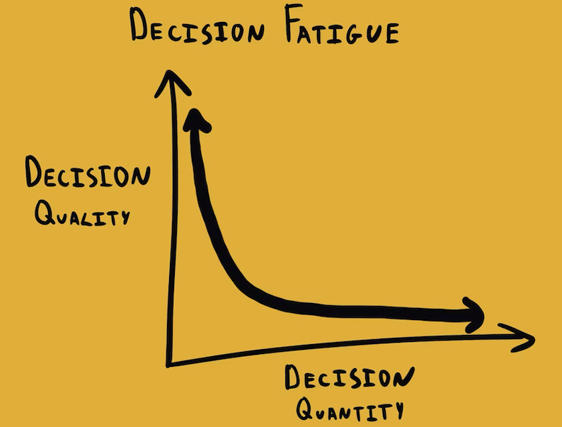

Paradox of Choice

決策疲勞 (Decision Fatigue)

決策癱瘓 (Decision/Analysis/Choice Paralysis)

一個人做的決定數量 (Quantity) 越多，消耗的意志力、自控力和自律能力也就越多，決策品質 (Quality) 將會越低

每個人在一天的 [精力](Energy%20Management.md) [^1] 都非常地有限，減少大腦要做日常抉擇/選擇的次數，把一些瑣碎不重要的事情變成「日常慣例 (Daily Routine)」

* 例如:
	* 今天出門要穿的衣服 (Clothes)
		 * Wear the same outfit every day
		 * Capsule Wardrobe
	 * 下一餐要吃什麼 (Meals)
		* Eating the same meals every day
		* Grocery delivery
		* Bulk cooking on Sunday
		* Meal replacement shakes

Embrace a choice-minimal lifestyle.

[^1]: ≈ stamina, willpower, cognitive budget/resources/bandwidth, brain/mental space, mental capacity, mental energy, body battery, etc.
