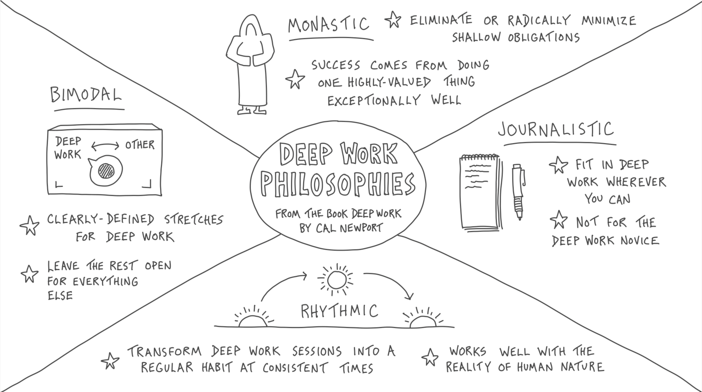

[@newportDeepWorkRules2016]

Deep work generates deeper satisfaction (aka., “passion”) for your work.

A working life dedicated to deep work is a working life well-lived.

---

# The Four Philosophies Of Deep Work

---

# Collaborative Deep Work

* Prioritizing deep work often means working alone. However, working with others can unleash the power of “serendipitous creativity” that we often can't generate by ourselves
* Time spent learning from others can be explored in more depth once we're alone in deep work mode
