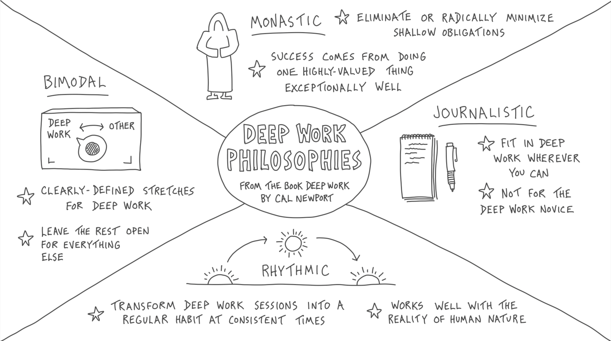

> _“If a large diamond is cut up into pieces, it immediately loses its value as a whole; or if an army is scattered or divided into small bodies, it loses all its power; and in the same way a great intellect has no more power than an ordinary one as soon as it is interrupted, disturbed, distracted, or diverted.” — Arthur Schopenhauer_

> _“The difference between the greats and the legends is their ability to focus for longer periods of time.” — Jordan Burroughs_

---

[@newportDeepWorkRules2016]

Deep work generates deeper satisfaction (aka., “passion”) for your work.

[A working life dedicated to deep work is a working life well-lived.](https://calnewport.com/knowledge-workers-are-bad-at-working-and-heres-what-to-do-about-it/)

---

# The Four Philosophies of Deep Work

---

# Collaborative Deep Work

* Prioritizing deep work often means working alone. However, working with others can unleash the power of “serendipitous creativity” that we often can’t generate by ourselves
* Time spent learning from others can be explored in more depth once we’re alone in deep work mode

---

# The 4-Hour Work Day

In their 1993 paper [@ericssonRoleDeliberatePractice1993] The Role of Deliberate Practice in the Acquisition of Expert Performance, Ericsson, Krampe, and Tesch-Römer noted that **“essentially no benefit [is gained] from durations exceeding 4 hr per day and reduced benefits from practice exceeding 2 hr … the effective duration of deliberate practice may be closer to 1 hr per day”** (p. 370), highlighting the cognitive and physiological limits on sustaining high-quality practice. More than two decades later, in his 2019 review [@ericssonDeliberatePracticeProposed2019], Ericsson reaffirmed this principle, emphasizing that even among top performers across diverse fields, deliberate practice **typically peaks at 3–4 hours per day**, with additional effort beyond this threshold yielding diminishing or even negative returns unless balanced with adequate [recovery (“deep breaks”)](the-most-productive-people-prioritize-intentional-rest.md).

From Oliver Burkeman’s article _[Let’s hear it for the four-hour working day](https://www.theguardian.com/lifeandstyle/2017/aug/11/oliver-burkeman-four-hour-working-day)_

> Ranging across history and creative fields, he keeps encountering the same thing. [Charles Darwin worked](http://dailyroutines.typepad.com/daily_routines/2008/12/charles-darwin.html) for two 90-minute periods in the morning, then an hour later on; the mathematician Henri Poincaré from 10am till noon then 5pm till 7pm; the same approximate stretch features in the daily routines of Thomas Jefferson, Alice Munro, John le Carré and many more. To avoid charges of confirmation bias (what if he’s only mentioning those who prove his point?) Pang draws on the research of the Swedish psychologist Anders Ericsson, whose studies of violinists — also the basis for [the much-debated “10,000-hour rule”](http://www.bbc.co.uk/news/magazine-26384712) — support the same finding. We’re rhythmic creatures, and the part of the cycle that involves not taxing the mind is no less essential to the result.
