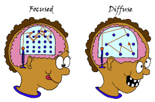

Two modes of thinking:

1. **focused mode** (concentrated, analytical, goal-directed)
2. **diffuse mode** (relaxed, associative, big-picture)

|                    |
| :-------------------------------------------------------------------------: |
| [Source](https://barbaraoakley.com/books/learning-how-to-learn) |

---

After observing that highly creative individuals like Einstein, Mozart, and da Vinci valued “free-floating periods of thought,” [@andreasenJourneyChaosCreativity2011] studied brain activity during idle moments.

Surprisingly, the brain wasn’t idle at all but rather engaged in active processes. This state, called **Random Episodic Silent Thinking (R.E.S.T.)** or the **Default Mode Network (DMN) 預設模式網路** [@raichleDefaultModeBrain2001], is when the brain actively seeks connections and forms associations, making sense of experiences. The brain continues to work on the problem unconsciously while your conscious mind [roams](wander.md).

DMN is best known for being active when a person is not focused on the outside world, engaged with doing mindless activities (such as _walking_, _running_, _bike riding_, _taking shower_ [^1], _driving_, _idle daydreaming_, _house cleaning_, _washing the dishes_, _hanging up the laundry_, _going to the grocery store_, _sitting on the beach/couch/sofa_, etc.), and the brain is at wakeful rest (such as during daydreaming and mind-wandering [^2]).

[^1]: Shower Thoughts: Shower is an idea incubator. Keep [Aqua Notes](https://www.myaquanotes.com/) ready.
[^2]: = mindless [recharging](the-most-productive-people-prioritize-intentional-rest.md)
