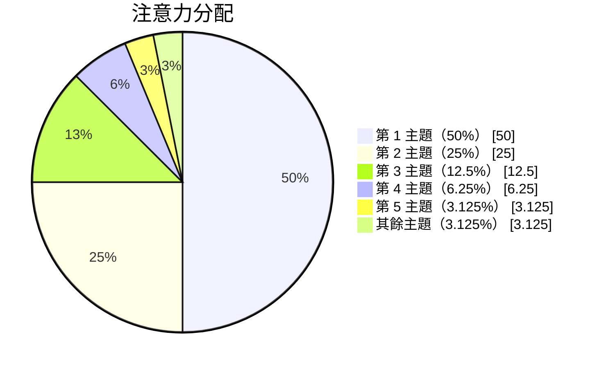

> “Energy is eternal delight.” — William Blake

> [“Your energy is currency. Spend it well. Invest it wisely. Use it Intentionally, consistently, and by your own design.” — Adrienne Bosh](https://x.com/MrsAdrienneBosh/status/988908563232796672)

---

＝能量管理＝精力管理

---

# Don’t manage your time, manage your energy

> 能量/精力管理 > [時間管理](time-management.md)

> “Energy, not time, is the fundamental currency of high performance.” — Jim Loehr [^1]

Time is the same for everyone — 24 hours a day, no more, no less. [^2] Energy, by contrast, is highly variable: it fluctuates with sleep, nutrition, stress, environment, and mindset. Time management optimizes _when_ you do things; energy management optimizes _how well_ you do them. Time is a container; energy is the fuel that fills it.

* 時間是有限的，但能量或精力可以無限。
* 時間以不變的速度流逝，但能量或精力不斷地在變。

> There are undeniably bad bosses, toxic work environments, difficult relationships and real-life crises. Nonetheless, we have far more control over our energy than we ordinarily realize. The number of hours in a day is fixed, but the quantity and quality of energy available to us is not. **It is our most precious resource. The more we take responsibility for the energy we bring to the world, the more empowered and productive we become. The more we blame others or external circumstances, the more negative and compromised our energy is likely to be**.

---

# David Hawkins’ Levels of Consciousness

> 情緒能量表

Hawkins’ map (scaled 0–1000) is one lens for seeing why _state_ dominates productivity. At low levels — shame, guilt, apathy, fear — the same task feels exhausting, and self-defeating thoughts quietly drain energy. At higher levels — courage, acceptance, reason, love — the same task becomes intrinsically motivating. From this view, energy management is partly _state management_: raise the level from which you operate, rather than merely squeezing more output from a low state.

---

# Willpower is not a limited resource & Ego-depletion is a myth

* After a particularly grueling day, I’d sit on the couch and veg for hours, doing my version of “[Netflix and chill](https://en.wikipedia.org/wiki/Netflix_and_chill),” which meant keeping company with a pint of ice cream. Even though I knew that eating ice cream and sitting for a long time were probably bad ideas, I told myself that relaxation was my well-deserved reward for working so hard.
* Psychological researchers have a name for this phenomenon: it’s called “[Ego Depletion](https://www.nirandfar.com/ego-depletion/).” The theory is that ~~willpower is connected to a limited reserve of mental energy, and once you run out of that energy, you’re more likely to lose self-control.~~
* _However, recent studies suggest we’ve misunderstood [willpower](do-not-use-your-willpower-unless-you-absolutely-have-to.md), debunking the theory of [ego depletion](https://en.wikipedia.org/wiki/Ego_depletion)._
	* [@jobEgoDepletionIt2010]
		* People who viewed the capacity for self-control as not limited did not show diminished self-control after a depleting experience.
		* …reduced self-control after a depleting task or during demanding periods may reflect people’s beliefs about the availability of willpower rather than true resource depletion.
	* [@jobBeliefsWillpowerDetermine2013]
		* …following a demanding task, only people who view willpower as limited and easily depleted (a limited resource theory) exhibited improved self-control after sugar consumption.
		* In contrast, people who view willpower as plentiful (unlimited) showed no benefits from glucose—they exhibited high levels of self-control performance with or without sugar boosts.
* Here’s the key point: **Simply believing that we’re “spent” or mentally drained can create a sense of fatigue, a phenomenon linked to [the nocebo effect](https://en.wikipedia.org/wiki/Nocebo). Clinging to / Holding onto the idea that willpower is a finite resource can be harmful/detrimental, making us more likely to lose self-control and make poor decisions. In reality, ego depletion is driven by [self-defeating thoughts](negative-thoughts-and-emotions.md), rather than any biological limitation. It’s not the sugar in the lemonade that sustains mental stamina—it’s [the placebo effect](https://en.wikipedia.org/wiki/Placebo) in action.** [^3]
* Moreover, **willpower functions like an emotion.** Just as we don’t “run out” of joy or anger, willpower rises and falls depending on what’s happening to us and how we feel. ⭐️ If mental energy behaves like an emotion rather than fuel in a tank, it can be managed and harnessed accordingly: **When faced with a difficult task, it’s more productive and healthy to view a lack of motivation as temporary, rather than assuming we’re spent/drained and need a break.**

---

# Energy Production vs Energy Expenditure

A common failure mode is to treat energy as a fixed budget to be spent conservatively — to “pace yourself” and hoard what remains. The more useful frame: **energy is a capacity you can grow, not a reserve you merely draw down.** Just as an athlete, a knowledge worker improves performance through two loops:

* **Train the capacity** — build physical fitness, emotional resilience, and deep-work stamina through progressive, deliberate practice. Capacity grows only under _load_, and load is sustainable only with _recovery_.
* **Recover intentionally** — treat [rest](the-most-productive-people-prioritize-intentional-rest.md) as a _productive activity_ rather than the absence of work. Sleep, walks, and unstructured time are not wasted hours; they are the production side of the energy equation ([recharging activities](the-most-productive-people-prioritize-intentional-rest.md)).

There’s no such thing as working too hard. There’s just being under rested. — Don’t focus on energy output. Focus on energy production.

---

# The Energy Razor

* If you don’t schedule actions that produce energy, assume they’ll never happen.
* If you don’t monitor actions that drain energy, assume they’ll keep expanding.

Energy-producing actions (exercise, rest, deep work, meaningful connection) rarely feel urgent, so they silently lose out to urgent-but-draining tasks (email, meetings, notifications). Scheduling them converts vague intentions into explicit commitments.

Conversely, energy-draining actions expand to fill any unmonitored space — what you don’t track, you don’t notice, and what you don’t notice grows.

---

# The 3-Question Daily Check

> “Whatever excites you, go do it. Whatever drains you, stop doing it.” — Derek Sivers

1. What produced energy today?
2. What drained it?
3. What will I schedule or cut tomorrow?

**Schedule the energy-producing action before the energy-consuming one, letting the calendar enforce the default rule instead of your willpower.**

---

# The Four Dimensions of Energy

> To be fully engaged, we need to [be fully present](live-in-the-present.md). To be fully present we must be physically energized, emotionally connected, mentally focused and spiritually aligned with a purpose beyond our own immediate self-interest.

In _The Power of Full Engagement_, Jim Loehr and Tony Schwartz argue that energy has four dimensions, each of which must be managed separately:

* **Physical energy 身體能量** — the _foundation_ of energy. Sleep, nutrition, and movement are the cheapest, highest-leverage energy upgrades available; everything else is built on this base.
* **Emotional energy 情感能量** — the _quality_ of energy. Positive emotions (curiosity, gratitude, connection) widen capacity; negative emotions (fear, frustration, resentment) leak it.
* **Mental energy 心智能量** — the _focus_ of energy. Trained through concentration and mental challenge; best refreshed by novelty and a change of task. [^4]
* **Spiritual energy 心靈能量** — the _meaning_ of energy. Purpose and values act as a force multiplier: work aligned with meaning energizes, while misaligned work depletes no matter how much time it consumes.

---

# The Four Energy Management Principles that Drive Performance

1. Full engagement requires drawing on four separate but related sources of energy: physical, emotional, mental and spiritual.
2. Because energy capacity diminishes both with overuse and with underuse, we must balance _energy expenditure_ with intermittent _energy renewal_.
3. To build capacity, we must push beyond our normal limits, training in the same systematic way that elite athletes do. [^5]
4. Positive energy rituals—highly specific routines for managing energy—are the key to full engagement and sustained high performance.

---

# The Power Law for Energy Management

≈ 冪律

第 n 重要的主題，分到 $(m-1)/m^n$ 的注意力，m > 1。

而 m 就是專注的「銳利度」：m 越大，越聚焦少數關鍵任務；m 越小，越傾向在多個任務之間平均投入。

當然，你不可能這麼精確地分配你的注意力，但這個公式至少提醒你：資源有限，必須取捨。

舉例來說，m = 2 時，第 1 主題就拿走一半，其餘快速衰減：

---

# Match task difficulty to current capacity

➞ a practice sometimes called _working with your energy, not against it_

> [My ability to do any serious mathematics fluctuates greatly from day to day; sometimes I can think hard on a problem for an hour, other times I feel ready to type up the full details of a sketch that I or my coauthors already wrote, and other times I only feel qualified to respond to email and do errands, or just to take a walk or even a nap. I find it very helpful to organise my time to match this fluctuation: for instance, if I have a free afternoon, and feel inspired to do so, I might close my office door, shut off the internet, and begin typing on a languishing paper; or if not, I go and work on a week’s worth of email, referee a paper, write a blog article, or whatever else seems suited to my current levels of energy and enthusiasm.](https://terrytao.wordpress.com/2008/08/07/on-time-management/)

[Work in sprints, work with your biology](work-in-sprints-work-with-your-biology.md)

---

# [“The Energy Investment Portfolio” by Ali Abdaal](https://aliabdaal.com/newsletter/the-energy-investment-portfolio/)

* **Dream Investments**: Things that you want to do at some point, but probably not right now; can be as long as you like.
* **Active Investments**: Things that you want to work on right now (e.g., this week); should be limited (~5) based on how much time and energy you’ve got to invest in them.

[^1]: The ultimate measure of our lives is not how much time we spend on the planet, but rather how much energy we invest in the time that we have.
[^2]: 每個人每天都是固定 24 小時
[^3]: [Studies show that our brain does not consume more blood sugar when working on difficult tasks. The brain is an organ, not a muscle. It does not burn extra calories but maintains a steady energy consumption with increased effort. Whether you’re solving calculus problems or watching cat videos, your brain burns roughly the same number of calories per waking minute.](https://www.scientificamerican.com/article/thinking-hard-calories/)
[^4]: 靠專注練出來，靠新鮮事補回來。
[^5]: Stress is not the enemy in our lives. Paradoxically, it is the key to growth. In order to build strength in a muscle we must systematically stress it, expending energy beyond normal levels. We build emotional, mental and spiritual capacity in precisely the same way that we build physical capacity.
