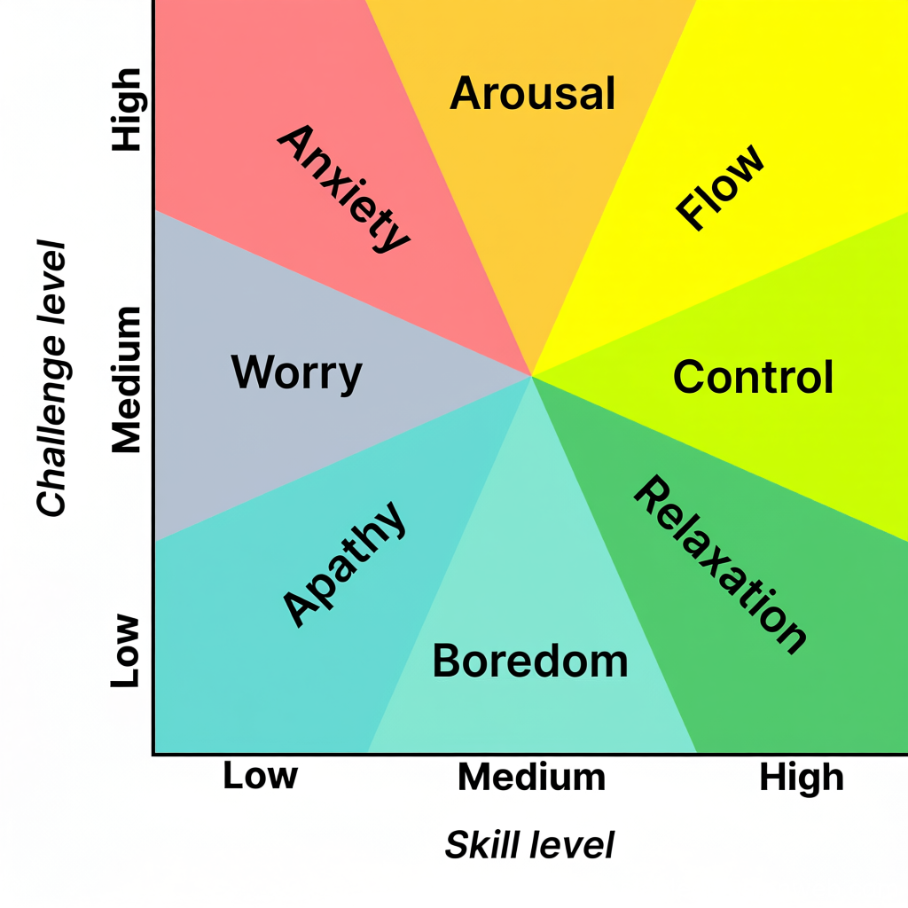

You’re in “the zone.” ( like _[one-buttock playing](https://sketchplanations.com/one-buttock-playing)_)

You feel fully immersed in your work.

---

Flow is [a state of optimal experience](https://www.flowresearchcollective.com/about). [^1] When you are in that state, life goes fast because time flies by without you realizing it.

* Make hours like seconds.
* Effortless effort, timeless time.

---

# The 3 Major Conditions Of Flow

[@csikszentmihalyiFlowPsychologyOptimal2009]

1. Clear proximal (nearby) goals
2. Clear and immediate feedback
	* Be able to see your progress
3. A balance between perceived challenge and skill
	* Challenge matched to skills

---

# The Challenge-skills Equation

---

# The 4 Stages of The Flow Cycle By Herbert Benson

* 4 stages
	1. [Struggle](why-is-it-so-hard-to-just-do-the-work.md)
	2. Release
	3. Flow
	4. Recovery
* 4 components
	* **Selflessness** — loss of self-consciousness and ego
	* **Timelessness** — the feeling of losing tack of time / transformation of time
	* **Effortlessness**
	* **Richness** — sense of control
* Prerequisite
	* Calm mind — being immersed [in the present moment](live-in-the-present.md), getting into your body and out of your head
* Triggers
	* Complete Concentration — Flow follows [focus](focus-is-about-saying-no.md)
	* Clear Goals — Confusion creates chaos
		* Flow is about banishing all distractions, friction and resistance
	* Novelty — Inject something NEW in between tasks
* Remarks
	* Flow is not binary, i.e., neither “on” nor “off”
	* They work interdependently with each other

[^1]: Non-ordinary States of Consciousness (NOSC) / Altered States of Consciousness (ASC): any non-normal waking state [@dietrichFunctionalNeuroanatomyAltered2003]
