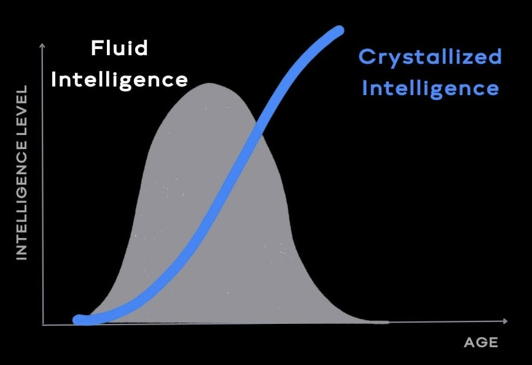

In his book _Abilities: Their Structure, Growth, and Action_, psychologist [Raymond Cattell](https://www.google.com/search?q=Raymond+Cattell) first proposed the distinction between fluid and crystallized intelligence. This framework later evolved into the [Cattell—Horn—Carroll (CHC) theory](https://www.google.com/search?q=Cattell+Horn+Carroll+theory).

Intelligence is not a monolithic trait but a collection of _distinct but interrelated_ abilities that follow different developmental trajectories across the lifespan.

> 年輕時依賴流體智力，隨著年齡增長，晶體智力逐漸發揮。

# 流體智力 (Fluid Intelligence, Gf)

* 流體智力指邏輯推理、靈活思考以及解決新問題的能力，通常在成年早期達到高峰，30 至 40 歲後開始下滑。
* It is characterized by the ability to think creatively and abstractly, learn new concepts, draw flexible connections, and reason across different domains.
* Fluid Intelligence represents the intelligence of _youth_. It peaks during the early stages of one’s career—generally in the 20s and 30s—and begins to decline thereafter. Many groundbreaking innovations stem from Fluid Intelligence, which explains why a significant proportion of such achievements come from individuals in the early stages of their careers.

# 晶體智力 (Crystallized Intelligence, Gc)

* 晶體智力指運用累積知識、經驗、技能與洞見的能力。隨著年齡增長，晶體智力在 40 至 60 歲期間持續提升，直到晚年才逐漸下降。這也是為什麼許多年長者彷彿成為智慧的寶庫。
* It is characterized by the ability to leverage accumulated knowledge, experience, skills, and insights.
* Crystallized Intelligence represents the intelligence of _experience_. It begins to rise as Fluid Intelligence declines, with the compounding accumulation of knowledge accelerating during later career years.

# Examples

| Domain | Fluid Intelligence (Gf) | Crystallized Intelligence (Gc) |
|--------|------------------------|-------------------------------|
| Mathematics | Proving novel theorems | Applying established formulas and heuristics |
| Medicine | Diagnosing a rare or atypical case | Recalling treatment protocols from years of practice |
| Chess | Spotting a novel tactical combination | Recognizing familiar positional patterns |
| Software | Designing a new architecture | Debugging based on past experience with similar bugs |
| Writing | Generating original metaphors | Command of vocabulary, grammar, and literary forms |
