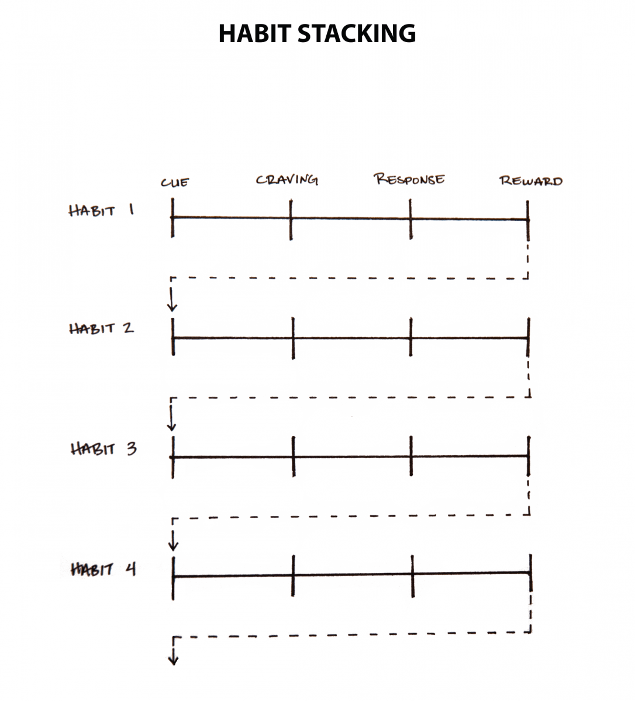

is a special form of [Implementation Intentions](implementation-intentions.md). Rather than pairing a new habit with a particular time and location, you pair it with an old, current habit (the “anchor” [@foggTinyHabitsSmall2020]).

Unlike an implementation intention, which specifically states the time and location for a given behavior, habit stacking **implicitly** has the time and location built into it.

The habit stacking formula is:

> After/Before [CURRENT HABIT], I will [NEW HABIT].

You can even combine [temptation bundling](temptation-bundling.md) with habit stacking to create a set of rules to guide your behavior. The habit stacking + temptation bundling formula is:

> 1. After [CURRENT HABIT], I will [HABIT I NEED].
> 
> 2. After [HABIT I NEED], I will [HABIT I WANT].

Habit stacking increases the likelihood that you’ll stick with a habit by stacking your new behavior on top of an old one. This process can be repeated to chain numerous habits together, each one acting as the _cue_ for the next.

Finding the right trigger is the key. Habit stacking works best when the cue is highly _specific_ and immediately _actionable_.
