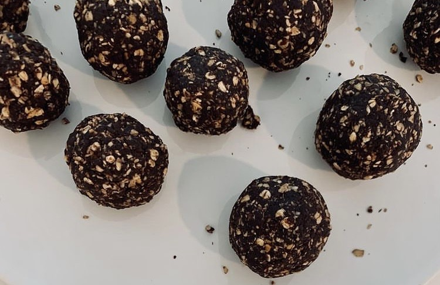
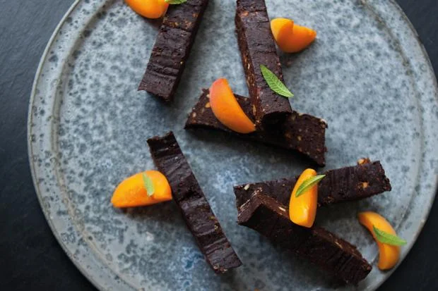

≈ Energy/Power Balls

---

# 米糕 (Rice Cake) → Variant: Fruit Cake

## 器具

* Rice Cooker or Microwave
* 容器 (玻璃保鮮盒 or 烘焙模具)
	* 可在底層鋪「烘焙紙（Parchment Paper）」以防止沾黏
* 錫/鋁箔紙

## Ingredients

> This recipe yields approximately 20 cakes

* 500 g Milchreis (short grain) or Risotto Rice
* 800 ml Water (米量的兩倍)
	* 可在煮米的過程中視情況再加水
* 4 tbsp Coconut Oil
* 3 tbsp Brown/Coconut Sugar
* 2 tbsp [肉桂粉 Cinammon](cinammon.md) (防抽筋)
* 100 ml 蜂蜜 Honey or 龍舌蘭糖漿 (Agave Nectar/Syrup)
* (Optional) 增加黏性用
	* Peanut Butter (花生醬/奶油)
	* 300 g Philadelphia Cream Cheese
* (Optional) 提味用
	* 果醬
	* 葡萄乾 Raisins

## Steps

1. Use a rice cooker if you have one. Boil the rice, water, coconut oil, cinnamon, and coconut sugar. Let it boil until all of the water has been absorbed.
2. Fold the cream cheese into the rice while it’s still warm.
3. Mix in the agave nectar and blend thoroughly.
4. Pour into a three-liter plastic bag with a zip lock. Flatten the bag and leave in the fridge overnight to let it cool.
5. Take the bag out of the fridge and cut/slice the rice mix into 5 cm × 5 cm squares. Wrap the squares in aluminum foil.
6. Add pistachios or other nuts to add variety.

## References

* [Team recipe: On-the-bike rice cakes | EF Pro Cycling](https://efprocycling.com/tips-recipes/team-recipe-on-the-bike-rice-cakes/)
* [How to make: British Cycling’s rice cakes | British Cycling](https://youtu.be/J5OBsf_JLHk)
* [Famous Cyclist’s Recipes — Rice Cakes | We Love Cycling](https://www.welovecycling.com/wide/2017/08/17/famous-cyclists-recipes-rice-cakes/)

---

# Date Brownies

## Ingredients

* Soft pitted dates (椰棗), soaked in hot water for 10 minutes
	* 高糖分、能快速補充能量，是天然的甜味來源
	* 富含纖維與「鉀」，有助腸道與心血管健康
* Kidney beans
* Cacao powder
* Peanut butter (or coconut/avocado oil)
* Oats
* Orange juice
* Pinch of salt
* Balsamic vinegar

---

# Cereal/Oat/Porridge Bar

## Ingredients

---

[How to Make Your Own Energy Gels](how-to-make-your-own-energy-gels.md)
