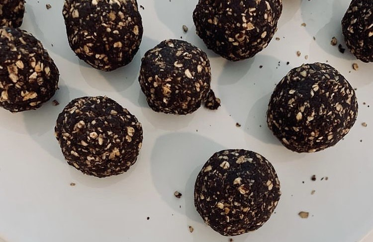
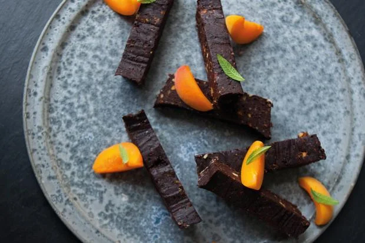

# Flapjacks

= 燕麥甜餅 ≈ Pocket Porridge ≈ Granola [^1]/Oat Bar

## Brief History

Flapjacks are a classic British treat, popular since the 17th century. They are a staple in UK lunchboxes and cafés.

## Ingredients

* [Rolled oats](oat.md)
* Salt
* Brown sugar
* Golden syrup

### Variations & Add-ins

* Dried fruits (raisins, cranberries)
* Nuts or seeds
* Chocolate powder/chips
* Coconut flakes

## Steps

1. Preheat the oven to 180°C. Line a baking tin with parchment paper.
2. Mix the ingredients together, press into the tin, and bake for about 15-
20 minutes for softer and chewy flavors. Add 5 more minutes for crunch flavors.
3. Leave in the tin until almost cold, then cut into bars/pieces.

## Tips

* Store in an airtight container for up to a week. Freeze for longer storage.
* 先劃線再烤：送進烤箱前，先用刀在表面輕輕劃線，這樣出爐後比較好切、不容易碎。
	
* 翻面或攪拌後再烤：中途可以翻面或攪拌一下，再放回烤箱繼續烘烤，確保整體均勻熟透。

## References

1. [How To Make Energy Bars | GCN’s Food For Cycling](https://youtu.be/jMJEIiWV3VQ)
2. [The GREATEST (& Easiest) Cycling Energy Bars!](https://youtu.be/8mjv-_HfgZI)
3. [Recipes: Snacks | British Cycling](https://www.britishcycling.org.uk/knowledge/nutrition/recipes/snack)

---

# Rice Cake

= 米糕

## 器具

* Rice Cooker or Microwave
* 容器 (玻璃保鮮盒 or 烘焙模具)

	> 可在底層鋪「烘焙紙（Parchment Paper）」以防止沾黏

* 錫/鋁箔紙

## Ingredients

> This recipe yields approximately 20 cakes

* 500 g Milchreis (short grain) or Risotto Rice
* 800 ml Water (**米量的兩倍**)

	> 可在煮米的過程中視情況再加水

* 4 tbsp Coconut Oil
* 3 tbsp Brown/Coconut Sugar
* 2 tbsp [肉桂粉 Cinammon](cinammon.md) (防抽筋)
* 100 ml 蜂蜜 Honey or 龍舌蘭糖漿 (Agave Nectar/Syrup)
* (Optional) 增加黏性用
	* Peanut Butter
	* 300 g Philadelphia Cream Cheese
* (Optional) 提味用
	* 果醬
	* 葡萄乾 Raisins

## Steps

1. Use a rice cooker if you have one. Boil the rice, water, coconut oil, cinnamon, and coconut sugar. Let it boil until all of the water has been absorbed.
2. Fold the cream cheese into the rice while it’s still warm.
3. Mix in the agave nectar and blend thoroughly.
4. Pour into a three-liter plastic bag with a zip lock. Flatten the bag and leave in the fridge overnight to let it cool.
5. Take the bag out of the fridge and cut/slice the rice mix into 5 cm × 5 cm squares. Wrap the squares in aluminum foil.
6. Add pistachios or other nuts to add variety.

## References

* [On-the-bike rice cakes | EF Pro Cycling](https://efprocycling.com/tips-recipes/team-recipe-on-the-bike-rice-cakes/)
* [How to make: British Cycling’s rice cakes](https://youtu.be/J5OBsf_JLHk)
* [Famous Cyclist’s Recipes — Rice Cakes | We Love Cycling](https://www.welovecycling.com/wide/2017/08/17/famous-cyclists-recipes-rice-cakes/)

---

# Date Brownies

≈ Energy/Power Balls

## Ingredients

* Soft pitted dates (椰棗), _soaked in hot water for 10 minutes_
	* 甜味來源、能快速補充能量
	* 富含纖維與「鉀」
* [Rolled oats](oat.md)
* Cacao powder
* Pinch of salt
* Balsamic vinegar

### Variations & Add-ins

* Kidney beans
* Peanut butter
* Coconut/avocado oil
* Orange juice

---

[How to Make Your Own Energy Gels](how-to-make-your-own-energy-gels.md)

[^1]: 由烤穀粒、堅果和水果乾製成的麥片。
