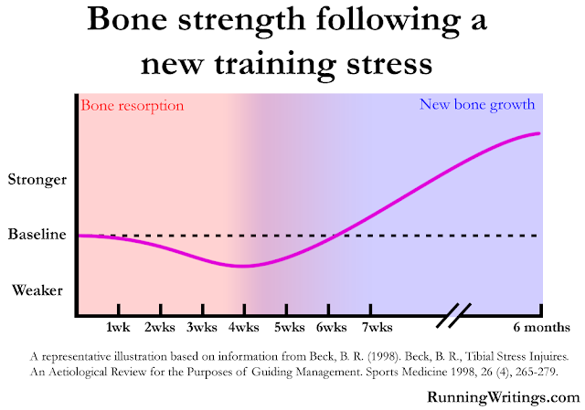
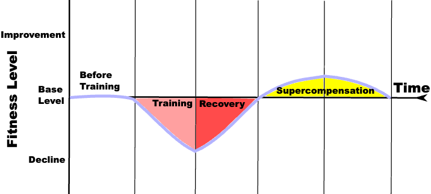
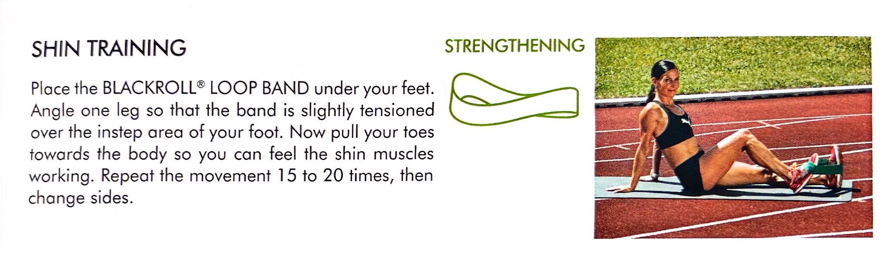

> [“The work is behind the scene. Competition is the easy part.” — Usain Bolt](https://youtu.be/LEIxpcYukqc?t=113s) [^1]

---

# Principles

* Train smarter, not harder. Start cautiously, finish strong.
* 專心訓練、放心比賽、用心生活
* 練習時斤斤計較，比賽時忘掉所有
* Take easy days easy. Take hard days hard. Don’t race your workouts.
	* If you want to run faster, run slower.

		> Rather than “run slow to run fast,” the better principle is: if you want to get faster, run more [^2] — and to run more without overdoing it, you have to run slower.

	* Most people run their easy days too hard and their hard days too easy.
	* Run your easy runs easier so you can run your hard runs harder. If you find yourself wanting to run your easy runs harder, you probably aren’t doing your hard runs hard enough. And easy days are rest days if you do them easy enough.
	* See: [Be Aware of the Gray Zone Where Junk Miles Live](beware-of-the-gray-zone-where-junk-miles-live.md)

---

* If you run your recovery/easy days properly, you can continue training without any full rest days. However, it’s important to build up gradually, and I recommend including a **de-load week** every third or fourth week, depending on how you feel at the end of a week.
	1. Reduce Weekly Mileage: Cut your total running distance by 20–40% compared to your peak training weeks.
	2. Lower Intensity: Avoid hard workouts (e.g., intervals, tempo runs). Focus on easy-paced runs.
	3. Maintain Frequency: Keep your usual number of running days, but make each run shorter and easier.
	4. Prioritize Recovery: Get extra sleep, hydrate well, and pay attention to nutrition.
	5. Listen to Your Body: If you still feel fatigued, don’t hesitate to reduce volume further or add cross-training/an extra rest day.
 * There’s a biomechanical reason to schedule a de-load week every 3–4 weeks: **bone healing**. After you increase your training load, your bones temporarily become weaker as old, damaged tissue is broken down to make space for new growth. It takes a few weeks for new bone cells to rebuild and strengthen the tissue. Around the 3–4 week mark, there’s a window where your bones are actually weaker than when you started—resorption has occurred, but new bone formation isn’t complete yet. A de-load week helps reduce injury risk during this vulnerable period.
	
* Think of your body like a **sponge**. Every session and every week adds a bit of water to the sponge—that’s your training load. Eventually, the sponge becomes saturated and can’t take on any more water. A de-load week is like squeezing out some water so the sponge can absorb more again. This reset allows you to continue making progress without risking burnout or injury.
* The fitness level of a human body in training can be broken down into four periods: initial fitness, training, recovery, and supercompensation. During the initial fitness period, the target of the training has a base level of fitness. Upon entering the training period, the target’s level of fitness decreases. After the training period, the body enters the recovery period, during which the level of fitness increases back to the initial fitness level.

	Because the human body is an adaptable organism, it will feel the need to adapt itself to a higher level of fitness in anticipation of the next training session. Accordingly, the increase in fitness following a training session does not stop at the initial fitness level. Instead, the body enters a period of supercompensation during which fitness surpasses the initial fitness level. If there are no further workouts, this fitness level will slowly decline back towards the initial fitness level (shown by the last time sector in the graph).

	If the next workout takes place during the recovery period, overtraining may occur. If the next workout takes place during the supercompensation period, the body will advance to a higher level of fitness. If the next workout takes place after the supercompensation period, the body will remain at its base level.

	

* [Wrap up your keys for running](https://sketchplanations.com/wrap-up-your-keys-for-running)
* 跑步前確實做好熱身動作 (彈性練習): (1) 墊腳尖 (2) 原地踮腳跳 (3) 原地單腳跳 (三下為一拍)
* 跑步前做「登階跳」: (1) 跳的時候，下面那隻腳不發力 (2) 雙手幫忙擺臂，帶動身體的重心轉換 → 抓準發力的時間點，讓跑步動作更有效率、更協調
* Shin Training

	

* [跑步該如何呼吸？（波爾效應）](https://www.garmin.com/zh-TW/blog/running/breath-qa/)
* 跑步經濟性（Running Economy）
* 跑步動態數據（Running Dynamics）
	* 觸地時間
	* 垂直振幅
		* [Patrick Smyth 平均 8.1cm](https://uiantraininglog.blogspot.com/2018/06/blog-post.html)
		* I think vertical ratio is the better metric. It’s vertical oscillation normalized with the stride length. Basically, a low vertical ratio number indicates a small cost for a large benefit. The lower the vertical ratio, the more efficient your running. Meaning that you’re not bouncing excessively and the additional energy is going into forward motion.
* 「跑量」才是馬拉松訓練中最關鍵的元素！

	> Any training technique is second order to the weekly volume.

* Marathon Training Methods
	* Hansons
	* Pfitz’s 18/55
	* Jack Daniels 2Q

	> Pfitz tends to utilize a more ‘classic’ periodization protocol (extending duration, then running faster) while Hansons are a closer to a ‘reverse’ periodization protocol (starting with faster running and extending duration). Either way is good, it’s mostly about what you can tolerate and what will lead to the most consistent running.

* <https://www.reddit.com/r/AdvancedRunning/wiki/workoutoftheweek/>
* The Fartlek Workout
	* In Swedish, “fartlek” means “speed play.”
	* The core idea is to incorporate interval training in a flexible, unstructured way.
	* As you run, pick random **landmarks** and vary your speed between them—run faster when you feel strong, slow down when you need to recover. Repeat this process throughout your run. This creates a workout with varying paces and distances.
	* 【比較】
		* In interval training, the brain tells the body what to do. You consciously manage your pace, rest, and effort, following a structured plan.
		* In fartlek sessions, the body tells the brain what to do. Instead of sticking to a rigid structure, you let your body guide the workout. You speed up or slow down based on your energy, the terrain, or even your mood.
		* In short: interval training is about mental discipline and control, while fartlek running is about body awareness and responsiveness. Both approaches develop different aspects of the runner’s mind-body connection.
* [亞索 800（Yasso 800s）](https://www.google.com/search?q=Yasso+800) 是一種經典的馬拉松訓練與預測方法，由 Bart Yasso 發明。核心內容是進行 10 趟 800 公尺的快速間歇跑，休息時間與快跑時間相同（例如：800m 跑 3 分 30 秒，休息 3 分 30 秒）。其理論認為，若能順利完成 10 趟，800 公尺的時間（分：秒）便對應馬拉松的完賽時間（時：分），如 3 分 30 秒對應 3 小時 30 分的潛力。
	* 前 50 公尺刻意放慢，後 200 公尺加速。
* [Pose（關鍵姿勢）、Fall（收腿, 向前落下）、Pull（推蹬, 向上拉提）](https://posemethod.com/running/)
	* 專注於上拉「腳掌」（而非「大腿」或「膝蓋」），拉起後立即放鬆，讓它自然上拋、自然落下。
	* 不需刻意跨大步：重心落在臀部「正下方」，而非「前方」。
	* 無為而無不為：像原地跑一樣向前跑！
	* Avoid bouncing up & down (Minimize vertical oscillation)
	* Increase steps per minute (cadence)

	

	

	

* [完美跑姿](https://www.google.com/search?q=%E5%AE%8C%E7%BE%8E%E8%B7%91%E5%A7%BF)（[Running Form](https://www.youtube.com/shorts/rd63EN0juAI)）
	* 目視前方
	* 抬起胸膛，避免聳肩
	* 身體微微前傾
	* ⭐️ 前不露肘、後不露手
	* 雙手輕握
	* 腹式呼吸
	* [臀部、大腿出力，保持小腿、腳踝與膝蓋放鬆](https://www.facebook.com/reel/782777457834647)
	* 中足、前腳掌外側/前緣著地
	* 想像在身體前方處，把腳趾頭插進地裡
	* 腳掌落地時與地面平行，腳背不向下施壓
* 送髖奧義/技術
* 意象訓練：在準備過程中，不斷地想像自己衝過終點線的那一刻。
* 心無旁鶩，專注在自己身上：
	* 起跑後，如果因為別的對手追上自己就急著加速，自己的力量就會急遽減少。基本上我只會專注在自己的節奏上，不去思考其他事情。
	* 馬拉松的關鍵在於不被周遭的人影響，專注在自己的節奏上，並且耐心等待。
* 最高強的跑法是讓身體「下意識自然地律動」，要練習跑步時不思考跑步，從而達至最省力的情況。
* 能夠毫不妥協完成練習並站在起跑線上，本身就已經是一種勝利、很有成就感的事了。
* Kipchoge trains in the Kenyan Highlands of Kaptagat, at an altitude of 2,500 meters above sea level. Training at high altitude makes every workout more demanding—your heart rate and breathing quicken as your body adapts to the thinner air. Over time, you produce more red blood cells, which boosts your body’s ability to carry oxygen. This adaptation gives your muscles a natural advantage when you race at lower altitudes.
* 兩大原則：
	* 訓練不足 > 訓練過度
	* 如果表現越來越差，肯定是過度訓練。
* RPE (= Rate of Perceived Exertion) should be the primary measure—everything produced by your watch is secondary feedback.
* Pacing Strategies
	* 緩緩加速（負分段）是最理想的，或至少全程保持一樣的配速。

		> 前面有多囂張，後面就有多落魄。

		> Marathons are 10ks with a 20 mile warm up.

	* 最後 12 公里，拆成 5/4/3
	* 最後 10 公里
		* Break it into familiar workouts: After miles of hard training, you have a mental library of difficult efforts you’ve already completed. When the last 10K feels enormous, break it into something familiar. “I’ve done a 2 × 3 mile tempo run. I just need to run this the same way.” Framing the remaining distance as a workout you’ve already finished is far more manageable than thinking “I still have 6 miles left.”
		* Use confident self-talk: Your brain responds to what you tell it. Every time you feel the pace slip or your focus drift, repeat a short affirmation: “I am strong. I’m running great. I prepared for this.” It sounds simple because it is simple. Research on athletic performance consistently shows that positive self-talk improves endurance performance at the end of hard efforts. Use it.
		* Check your form, not your watch: When your pace starts to slip in the final miles, don’t fixate on the number. Instead, run a quick mental form check: head up and level, shoulders relaxed, arms swinging forward and back (not crossing the body), powerful knee drive, controlled foot strike. Correcting your form when tired is often enough to bring your pace back without trying to consciously force a faster speed.
		* Count down in minutes, not miles: At mile 24, a mile feels like a long way. Two minutes feels like almost nothing. If you’re running 9-minute pace, mile 25 is 9 minutes away. Mile 26 is 18 minutes away. The finish is roughly 21 minutes away. Breaking the remaining distance into time rather than distance makes an enormous psychological difference in the final stretch. You’ve done hundreds of 9-minute runs in training. You can do three more.
	* Half marathon checkpoint: At 13.1 miles, check your elapsed time against your calculator’s target. If you’re more than 30 seconds ahead, you’ve been running too fast and need to pull back immediately. If you’re within 30 seconds either way, you’re executing perfectly.
	* The proper strategy is to target a pace 5 to 10 seconds per mile slower than your goal pace for the first three or four miles. It will feel painfully/absurdly slow. It’s the right call. Just trust your splits.
	* The payoff: Runners who execute a negative split race pass people in the final miles. They don’t get passed. That sensation — moving through a field of people who went out too fast — is one of the best feelings in marathon running.
* 賽前約一週安排 Big/Hero Day 作為模擬考，然後全休 6 天。
* 賽前三天開始做肝醣超補，要吃到體重公斤數的「八倍」公克數。

# How to Measure Your Max HR

> is almost unaffected by training, but primarily determined by genetics and age.

> Use a high-quality chest strap or [armband](https://coros.com/heart-rate-monitor) heart rate monitor (HRM) for best results. Wrist-based optical sensors are not reliable for rapid heart rate changes.

## 1. Field Test (Most Accurate)

* **Warm Up:** 15–20 minutes, including some higher paces and strides, on a flat surface.
* **Hill Sprints:**
	* Find a steep hill (15–25 seconds to climb).
	* Do 4–5 reps: start at a moderate pace, accelerate in the second half, and sprint hard in the last third.
	* On your final rep, sprint all out until exhaustion. The highest heart rate you reach is close to your max HR.

## 2. Calculation Methods (Less Accurate)

* **Traditional Formula:** Max HR = 220 — age
* **More Accurate Formula:** Max HR = 211 — (0.64 × age)

# Joe Friel’s Lactate Threshold Heart Rate (LTHR) Field Test

> is affected by training.

is a 30-minute solo time trial designed to accurately determine training zones without lab equipment.

* **Preparation:** Best done during Base or Build training periods. Use a chest-strap heart rate monitor for accuracy.
* **Location:** A flat, consistent, uninterrupted course (no stoplights).
* **Warm-up:** 15–20 minutes easy, including some high-intensity strides to prepare the body.
* **The Test:** Start your watch. Run/cycle at the highest consistent pace you can sustain for 30 minutes (not a sprint, but a hard, steady effort).
* **The Lapper:** **At exactly 10 minutes into the test, press the lap button** on your device.
* **Cool-down:** 10–15 minutes easy riding or jogging.
* **Result:** Look at the average heart rate for the **last 20-minute lap**. This is your estimated LTHR.

# The Cooper Test

is a 12-minute cardiovascular endurance test designed by Dr. Kenneth H. Cooper in 1968 to measure maximal oxygen uptake.

Participants run or walk as far as possible in 12 minutes, typically on a 400m track. It is used to assess fitness levels based on age and gender.

1. **Preparation:** Warm up with 15–20 minutes of light jogging and stretching.
2. **Procedure:** Run or walk at a steady, maximum pace for 12 minutes.
3. **Measurement:** Measure the total distance covered (in meters or miles).
4. **Requirements:** A stopwatch and a measured, flat surface.

# The 4x4 Norwegian Method for VO2max session

is a highly effective, time-efficient workout designed to maximize aerobic capacity.

* **Structure:** 4-minute work interval, followed by 3-minute active recovery (light jogging/pedaling). Repeat 4 times.
* **Intensity:** Aim for 85–95% of maximum heart rate (effort 8/10 or “comfortably hard”).
* **Goal:** The goal is to maximize the time spent at or near your VO2max (maximum oxygen consumption).
* **Application:** Ideal for running, cycling, rowing, or [ski erg](https://www.google.com/search?q=ski+erg), and is often used to boost fitness in just 30–40 minutes.
* **Progression:** It is crucial to perform a proper warm-up (e.g., 10 minutes) before starting the first 4-minute interval.

# Long Run Workouts

* **Optimal Duration:** The greatest aerobic benefits from long runs occur between 60 and 120 minutes. Beyond 2 hours, the additional gains decrease, and after 2.5 to 3 hours, the risk of injury and excessive fatigue rises significantly.
* **Risk Management:** Running longer than 2.5 hours increases your risk of overuse injuries, poor recovery, and diminishing returns in fitness. For most runners, capping the long run at 3 hours is a smart, sustainable approach.
* **Progress Over Time:** As you gain experience and build fitness over months and years, you’ll be able to cover more distance within the same time cap, while keeping your effort below critical thresholds. This long-term consistency is more valuable than pushing for extra mileage in a single session.
* **Practical Advice:** Focus on quality and consistency. Prioritize staying healthy and finishing your long runs feeling strong, rather than exhausted. This sets you up for better training and race performance in the long run.

# References

[Runners Connect](https://runnersconnect.net/blog/)

[^1]: Medals are won in training. Tournaments are where you pick them up.
