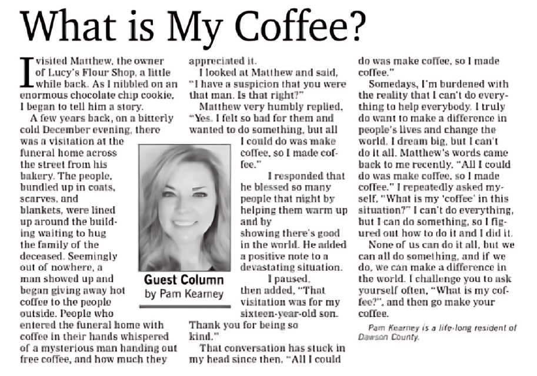

[Just Make the Coffee \| The Curiosity Chronicle](https://www.sahilbloom.com/newsletter/the-most-important-decision-of-your-life)

> I visited Matthew, the owner of Lucy’s Flour Shop a little while back. As I nibbled on an enormous chocolate chip cookie I began to tell him a story.
> ​
> A few years back on a bitterly cold December evening, there was a visitation at the funeral home across the street from his bakery.
> ​
> The people, bundled up in coats, scarves, and blankets were lined up around the building waiting to hug the family of the deceased.
> ​
> Seemingly out of nowhere, a man showed up and began giving away hot coffee to the people outside. People who entered the funeral home with coffee in their hands whispered of a mysterious man handing out free coffee, and how much they appreciated it.
> ​
> I looked at Matthew and said, “I have a suspicion that you were that man. Is that right?”
> ​
> Matthew very humbly replied, <mark>“Yes, I felt so bad for them and wanted to do something, but all I could do was make coffee, so I made coffee.”</mark>
> ​
> I responded that he blessed so many people that night by helping them warm up and by showing there’s good in the world. He added a positive note to a devastating situation.
> ​
> I paused, then added, “That visitation was for my sixteen-year-old son. Thank you for being so kind.”
> ​
> That conversation has stuck in my head since then:​
> ​
> <mark>“All I could do was make coffee, so I made coffee.”</mark>

