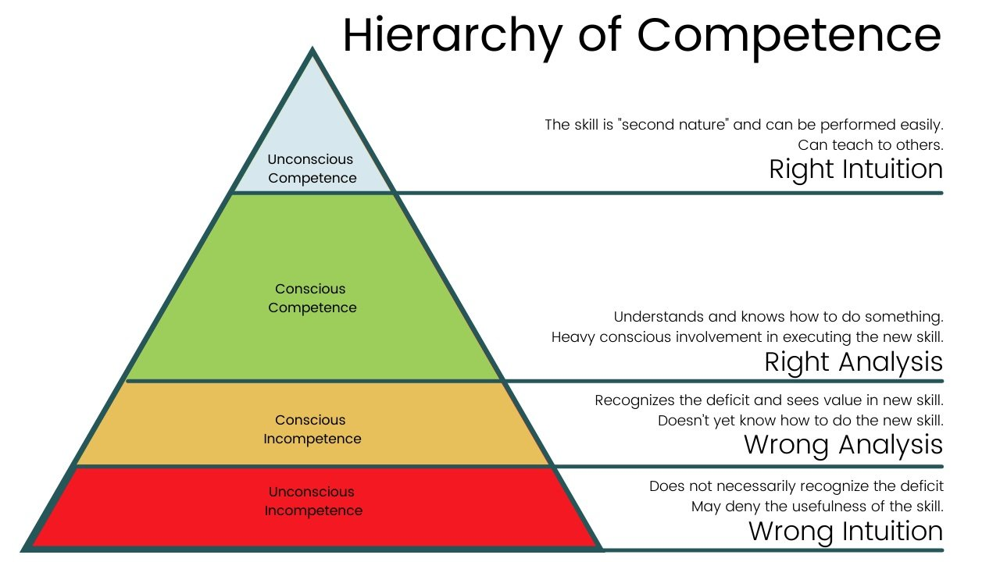
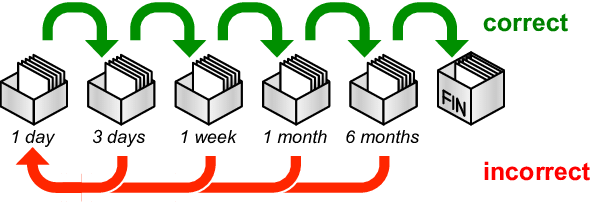

Financial [Compounding](the-compounding-effect.md) → Intellectual Compounding

---

# [Learn How To Learn](https://www.coursera.org/learn/learning-how-to-learn)

= Meta-Learning = 後設學習

---

# DiSSS

* Deconstruction
	* Breaking down a skill into several minimal learnable components
* Selection
	* Looking for 20% of components that gives 80% of the value
* Sequence
	* Deciding which order to practice in
* Stakes
	* Consequences you take on if you do not follow through

---

# CaFE

* Compression
* Frequency
* Encoding

---

# Three Ways To Learn Something New

1. Reflect on what you have already tried.
2. Attempt something you have not tried.
3. Read about what someone else has tried.

---

# Three Levels of Learning

## Variant 1

1. Level 1 is _consumption_. This is the shallowest of all.
2. Level 2 is _application_. This turns knowledge into experience.
3. Level 3 is _teaching_. This turns experience into wisdom.

## [Variant 2](https://lampmaa22.medium.com/minerva-%E7%9A%84%E7%AC%AC%E5%9B%9B%E8%AA%B2-%E4%BD%95%E8%AC%82%E8%A6%96%E9%87%8E-7f384899a269#:~:text=%E5%B0%8D%E6%88%91%E8%80%8C%E8%A8%80%EF%BC%8C%E8%A6%96%E9%87%8E,%E7%94%A8%EF%BC%8C%E6%88%90%E7%82%BA%E8%87%AA%E5%B7%B1%E7%9A%84%E4%B8%80%E9%83%A8%E5%88%86%E3%80%82)

1. 知識
	* 紙上談兵
2. 知識＋體驗
	* 讀萬卷書不如行萬里路
3. 知識＋體驗＋自我成長
	* 成為一個更好的人

## Variant 3

1. Ashes
	* Knowledge
2. Firewood
	* Experience
3. Tinder
	* Your sense of value, which triggers your behaviors

---

# [Four Stages of Competence](https://sketchplanations.com/stages-of-competence-framework)

---

# 學習有兩個面向

1. 精通深度 (Depth of Mastery)
2. 應用廣度 (Breadth of Application)

---

# Learning by Doing

> _[“Acquiring knowledge is easy, the hard part is knowing what to apply and when. That’s why all true learning is “on the job.” Life is lived in the arena.” — Naval Ravikant](https://x.com/naval/status/1930058059172458665)_

* One learns best through hands-on practice (through projects)
* [No one learns new things faster than someone who needs to apply the knowledge right now; so if you want to learn fast, commit to something ASAP that requires it.](https://x.com/anuatluru/status/1741281104953278748)
* 專題式學習 [Project-Based Learning (PBL)](https://www.google.com/search?q=Project-Based+Learning+(PBL))
* Book Smart (實務派) > Street Smart (理論派)

---

Stick to the [**basics/fundamentals**](first-principle%20thinking.md) and **big picture**, then you can learn anything you want.

* Don’t overlook the basics. Don’t ignore the foundation.
* Learning is a condensing and incremental process.

Always starting from the most basic and simplest level, then adding more complexities gradually

* Because it takes a lot more time going backward.
* It’s very important to _crawl_ before you can _walk_, and _walk_ before your can _run_.

---

# Learning And Knowing Are Two Completely Different Things!

* 如果要把一個知識點運用到生活當中，就要把它給記錄下來，然後不斷地練習和自我提醒，加強對那個知識點的印象，才能慢慢變成自己的東西
* 記憶 = 連結 Association [^1] \& 意義 Meaning
* Recognizing or being familiar with something is not the same as having agility/mastery/virtuosity of that thing.
* Chunking – [Break down complex/abstract ideas into tangible/digestible chunks](https://youtu.be/TQMbvJNRpLE), and link those chunks to vivid [mental representations/images](visualization.md). By creating such visual associations, _you’re not just memorizing - you’re understanding._ Your mind is a storage system. Learn to catalog efficiently.
* If you found yourself need to memorize something, it’s an indication that you don’t understand that stuff well enough.
	* Don’t try to memorize/cram what you can look up.
	* True learning is solid, deep understanding. [Change](adaptability.md) is the end result of all true learning.

---

# [How to learn anything?](https://www.youtube.com/watch?v=5MgBikgcWnY)

1. Deconstruct the skill—decide exactly what you want to be able to do when you’re done (i.e., with the end in mind), and then look into the skill and break it down into smaller pieces.
2. Learn enough to self-correct—[learn just enough that you can actually practice and self-correct](cultivate-a-strong-bias-towards-action.md) or self-edit as you practice. Use only 3-5 resources rather than something like 20 → It’s just a form of procrastination.
	* The Learning Habit Loop
		1. Only read and consume content until you know what you need to do.
		2. Then, stop reading and consuming content until what you know you need to do is done.
	* _“Do the best you can until you know better. Then when you know better, do better.” — Maya Angelou_
3. Remove barriers to practice—remove the distractions that are keeping you from practicing.
4. Practice for at least 20 hours—by pre-committing to practicing whatever it is that you want to do for at least 20 hours, you will be able to overcome initial frustration barrier and stick with the practice long enough to actually reap the rewards.
5. The major barrier’s not intellectual, it’s emotional.

---

# How To Learn Faster? [Deliberate Practice](Deliberate%20Practice.md)

**Embrace the challenge: The best learning outcome happens when it’s the hardest.**

[@abdaalFeelGoodProductivityHow2024]

> _[“Next time you're feeling like a task or project is particularly difficult, ask yourself, 'What would it look like if I were really confident at this?' Just by asking yourself the question, you'll visualize yourself confidently approaching the task at hand. The switch has been flipped.” ― Ali Abdaal, Feel-Good Productivity: How to Do More of What Matters to You](https://www.goodreads.com/work/quotes/100097284-feel-good-productivity-how-to-do-more-of-what-matters-to-you)_

* Studying should be difficult—if you’re not worrying that you won’t be able to understand something you’re learning, it isn’t hard enough. [^2]
* [Agitation (焦慮，躁動，緊張不安)](https://dictionary.cambridge.org/zhs/%E8%AF%8D%E5%85%B8/%E8%8B%B1%E8%AF%AD-%E6%B1%89%E8%AF%AD-%E7%B9%81%E4%BD%93/agitation) is good, helping to release norepinephrine and adrenaline
* [When you tackle a chunk of work, push for a result that is beyond — _but not too far beyond_ — what's comfortable for your current skill level. Design this chunk to feature enough difficulty that you _quickly get stuck_. At this point, you should slow down, and advance deliberately, in a state of real _mental strain_. This **stretch** is important to: (a) extract the most out of your current abilities; and (b) ensure that your abilities continue to improve. Finding chunks that require stretch, but are not so hard that you get permanently blocked, is non-trivival (very important).](https://calnewport.com/knowledge-workers-are-bad-at-working-and-heres-what-to-do-about-it/)
* See also: [Do hard things](do-hard-things.md)

---

> _“Although listening is often more fun, reading improves comprehension and recall. Whereas listening promotes intuitive thinking, reading activates more analytical processing. It’s true in English and Chinese—people display better logical reasoning when the same trivia questions, riddles, and puzzles are written rather than spoken. With print, you naturally slow down at the start of a paragraph to process the core idea and use paragraph breaks and headers to chunk information.” ― Adam M. Grant, [Hidden Potential: The Science of Achieving Greater Things](https://www.goodreads.com/work/quotes/170223349)_

[閱讀文字對於批判性思考和記憶更好，而聆聽則更適合沉浸式的體驗和情感的連結。因此，如果你想理解並記住資訊，最好用眼睛閱讀；另一方面，如果你想進入故事情節並與主角產生共鳴，可以用耳朵聆聽。](https://okapi.books.com.tw/article/18086)

---

# Methods \& Tools

> Principle: Instead of focusing solely on acquiring knowledge, prioritize strategies that help _retain information_ and _offset the natural tendencies of forgetting_ that occur with any new material we just learned.

* The Feynman Technique
	* Prioritizes simplicity to build depth of understanding
	* Teaching is the most powerful form of learning
		* Watch it. Do it. Teach it.
		* The person who learns the most in any classroom is the teacher. When you teach someone you get to learn it twice. (教學相長)

			> _“When one teaches, two learn.” — Robert Half_

		* _“Those who know, do. Those that understand, teach.” — Aristotle_
			* You don’t fully understand a thing until you try to explain/speak for it
			* [Explain It To Me Like I'm 5 (ELI5)](https://www.reddit.com/r/explainlikeimfive/)
		* The Protégé [^3] Effect [@chaseTeachableAgentsProtege2009]
			* The people who had to teach others about a subject would learn the material better themselves.
			* **Teachable Agents**
		* “_Qui docet, discit_”—He who teaches, learns.
		* Foundation for:
			* Peer Learning/Teaching
			* Study Groups
	* [Learn In Public](https://www.swyx.io/learn-in-public)
	* “The Feynman Razor”
		* If someone uses a lot of complexity and jargon to explain something to you, they probably don’t understand it.
		* Use simple and elegant language.
* [刻意練習 (Deliberate Practice)](Deliberate%20Practice.md)
* 交錯練習 (Interleaving Practice / Interleaved Learning)

	> _“I always work on different manuscripts at the same time. With this method, to work on different things simultaneously, I never encounter any blockages.” — Niklas Luhmann_
	* Mixing up different, unrelated topics or types of problems during a single study session helps the brain to seek/make necessary connections
	* See also: [The Zeigarnik Effect](the-zeigarnik-effect.md)
* 主動回憶 (Active Recall)
	* More effective than passive memorization
		1. Taking a topic you wish to learn
		2. Creating questions based on that topic
		3. **Repeatedly (not just once, ideally 2-3 times)** testing yourself on those questions
			* Interval Quizzes
	* _**[Active (self-)testing is far better than passive re-reading or re-exposure to the material.](https://en.wikipedia.org/wiki/Forward_testing_effect) Test yourself ASAP with open-ended, short-answer, minimal-prompt questions after the FIRST exposure, to prevent forgetting and consolidate information.**_
		* “[When you take a test on the material you just learned, you potentially improve the amount of retention by about 50%.](https://www.youtube.com/watch?v=ddq8JIMhz7c&t=4301s&ab_channel=AndrewHuberman)”
		* Error-Based Learning: Make sure to compare your answer to the accurate answer, and focus on understanding why you got questions wrong, as this helps to identify knowledge gaps and makes the correct information more memorable.
		* View (self-)testing as a learning tool to build knowledge / enhance comprehension, not just to evaluate it.
* Retrieval Practice
	* Putting information into your brain = good for learning
	* Retrieving information from your brain = better for learning
* 間隔重複 (Spaced Repetition) = The Leitner System
	
	
	* Space out your learning
		* Spending 30 minutes a day, five days a week, is far more effective than cramming 2.5 hours into just one day, once a week.
		* Same hours; different outcomes.
* 三明治記憶法
	* 「睡前 90 分鐘」+「起床後 90 分鐘」背書效果最佳 (Sleep on it.)
	* 容易將「短期記憶」植入「長期記憶」
		* Neural Encoding: Locking information into the neural circuit
* # [The Isolation Effect](https://sketchplanations.com/the-isolation-effect)
	* We learn better what stands out
	* = The Von Restorff effect

---

# Habits

* Mental Framing
	* Actively/Voluntarily engage your focus / draw your attention into whatever you are trying to learn
		* Tell yourself the material is important. Use a silent script in your head like “I get to learn this!”
	* [Attach learning to an aspirational goal that motivates you, e.g., how your learning will change/impact your life](why-we-exist.md)
		* Be specific about [what success will look like and why that success is important.](what-success-means-to-me.md)
* ⭐️ Take several brief breaks (with each 5-30 seconds) during study / in the act of consuming/absorbing material, and reflect on the material to reinforce memory
	* **Pro Tip:** Pause longer after key points to allow the “Gap Effects” to happen
* Avoid phone immediately after a study session to offset forgetting
* A good night of [restorative](https://dictionary.cambridge.org/dictionary/english/restorative) [sleep](sleep.md) BEFORE and AFTER [^4] studying/learning is crucial for get the best out of your studying/learning efforts. [^5] → _“If you don’t snooze, you lose.”_ [^6]

---

## See Also

* [Language Learning](Language%20Learning.md)
* [School is nothing but the starting line of true education](true-education-begins-where-school-ends.md)

[^1]: 圖像、故事、位置空間 ([羅馬房間方位記憶法 = 宮殿記憶法](https://en.wikipedia.org/wiki/Method_of_loci))
[^2]: [The Learning Pit](https://sketchplanations.com/the-learning-pit)
[^3]: refers to a person who is guided and supported by someone more experienced or knowledgeable
[^4]: Especially the first night after learning something important to you, in order to maximize your chances of retaining the information. Without getting enough hours of quality sleep, you lose much of the chance to consolidate (“save”) the new information in your memory.
[^5]: [After a good night's sleep, you’re 20-30% better in terms of skilled performance than where you were at the end of the practice session the day before.](https://www.youtube.com/watch?v=pwaWilO_Pig&t=32m37s)
[^6]: [Neuroplasticity is TRIGGERED by deep focus, but neuroplasticity OCCURS during deep rest and sleep.](https://www.youtube.com/watch?v=SwQhKFMxmDY&t=37m14s)
