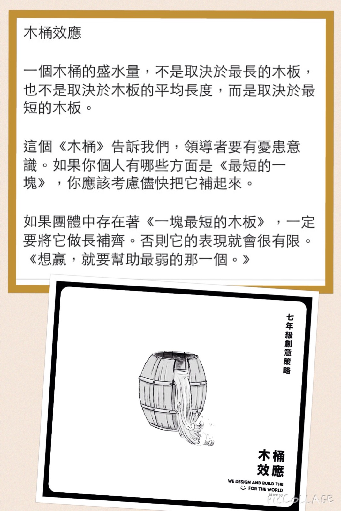

> _“Give me a place to stand, and a lever long enough, and I will move the world.” — Archimedes_

---

# Two Types of Leverage

* Permissioned Leverage
	* Labor (_worst_)
	* Capital
* Permissionless Leverage (_best_) (Intellectual Properties)
	* Code
	* Content/Media (Text, Audio, Video)

## [Adapted by Alex Hormozi](https://x.com/AlexHormozi/status/1526200829878816768)

1. Collaboration (other people’s time)
2. Capital (other people’s money)
3. Code (use a machine’s time)
4. Content (other people’s attention)

---

# 💡 Guiding Principle

## 1. In The Internal (i.e., personal) World, Focus On The Strengths (unfair advantages), Not Weaknesses

> _“Success is achieved by developing our strengths, not by eliminating our weaknesses.” — Marilyn vos Savant_

> _[Define yourself by your strengths, not your weaknesses. Acknowledge your weaknesses and figure out how to work around them, but don’t let them stop you from doing what you want to do. “I can’t do X because I’m not good at Y” is something I hear from entrepreneurs surprisingly often, and almost always reflects a lack of creativity.](https://blog.samaltman.com/how-to-be-successful)_

Emphasize strengths. Don’t fix weaknesses.

> _[It is far more lucrative and fun to leverage your strengths instead of attempting to fix all the chinks in your armor. The choice is between multiplication of results using strengths or incremental improvement fixing weaknesses that will, at best, become mediocre. Focus on better use of your best weapons instead of constant repair.](https://x.com/tferriss/status/1813970861742755865)_

> _“The superheroes you have in your mind (idols, icons, titans, billionaires, etc.) are nearly all walking flaws who’ve maximized 1 or 2 strengths. Humans are imperfect creatures. You don’t “succeed” because you have no weaknesses; you succeed because you find your unique strengths and focus on developing habits around them.” ― Timothy Ferriss, [Tools of Titans: The Tactics, Routines, and Habits of Billionaires, Icons, and World-Class Performers](https://www.goodreads.com/work/quotes/52480873)_

The Circle of Competence by Warren Buffett (The Zone of Genius)

Focus on better use of your best weapons instead of constant repair.

[First and foremost, concentrate on your strengths. Put yourself where your strengths can produce results. Second, work on improving your strengths.](https://hbr.org/2005/01/managing-oneself) [^1]

* We can only make our most significant contributions when we act from our strengths.
* We achieve the greatest impact not by focusing on improving our weaknesses, but by fully leveraging our strengths.

[Specific Knowledge](specific-knowledge.md)

## 2. In The External (i.e., non-personal) World, Focus On The Weaknesses (bottlenecks), Not The Strengths

Example: Any [system](systems-thinking.md)

[Theory of Constraints](theory-of-constraints.md)

---

[The Winner-Take-All Effects](The%20Winner-Take-All%20Effects.md)

[^1]: The only way to discover your strengths is through [feedback analysis](https://sketchplanations.com/feedback-analysis).
