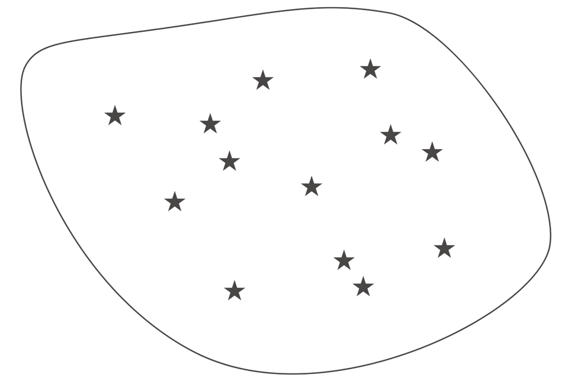
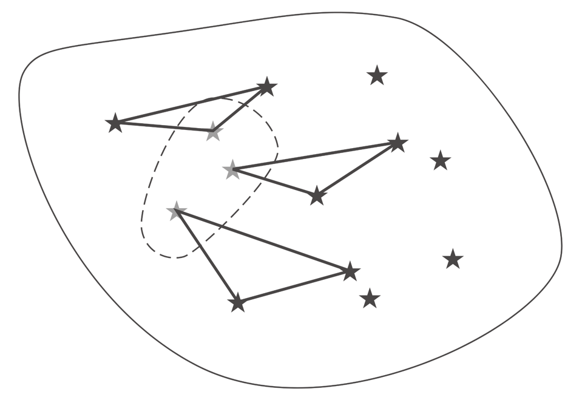
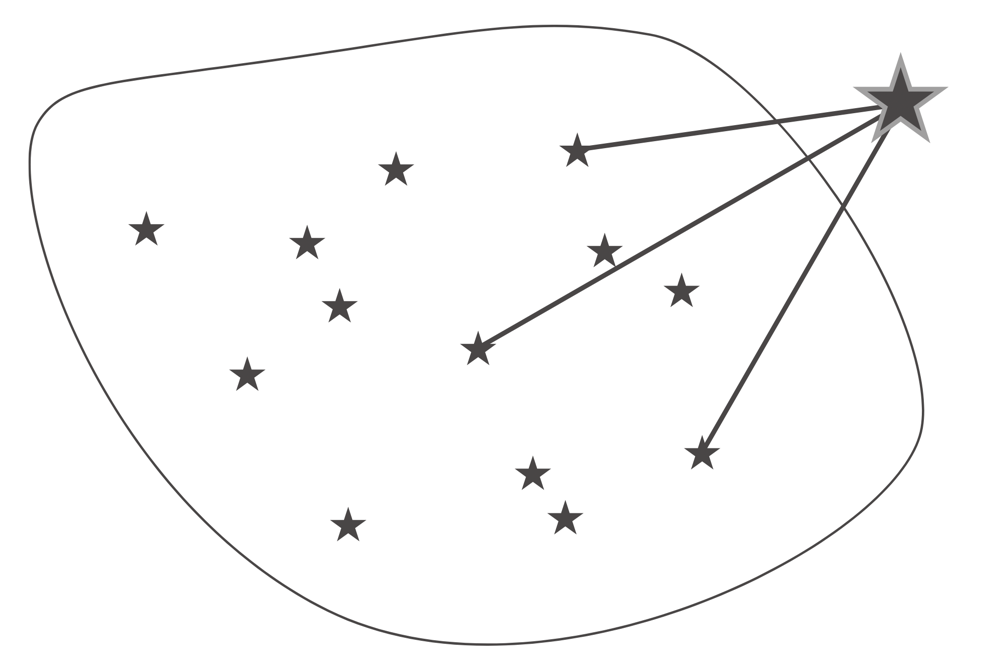

> *“Neurons that fire together wire together” — Hebb’s Rule

---

Map of Contents (MoCs)

Each link, if made deliberately, is adding value to the note. It’s adding allusions, perspective, counter-/supporting arguments.

**Cobwebs into cables**

* Turning cobwebs into cables is a metaphor for strengthening neural connections through getting [reps](Deliberate%20Practice.md).

**[The Generation Effect](https://en.wikipedia.org/wiki/Generation_effect)**
* A phenomenon whereby information is better remembered if it is generated from one’s own mind rather than simply read.

**Idea Emergence**
* It is…
	* the process of how the ideas you encounter go from “nothingness” to “somethingness.”
	* the phenomenon of new qualities forming beyond the core properties or parts when they work together.
* Example
	* Water is made up of Hydrogen and Oxygen parts, but neither of these components have the quality of wetness. Wetness emerges only when the two parts interact as a whole.
* The ability to _recognize_ Emergence is a cornerstone of [systems thinking](Systems%20Thinking.md), but the ability to _design_ Emergence is a superpower

**[Sensemaking happens by triangulation](https://notes.linkingyourthinking.com/Cards/Sensemaking+happens+by+triangulation)**
* Triangulation is using two known points to find a third unknown point. It’s the ultimate sensemaking mechanism, to both the _known_ and _unknown_.
* The 3 Powers of Triangulation
	* You can use what you know to make sense of stuff.
		* Use two known points, to better understand a third point.
			
	* You can use what you know to remember old stuff.
		* Use two known points, to remember a forgotten third point.
			
	* You can use what you know to create new stuff.
		* Use two known points to imagine a third point.
			

---

[Evergreen Notes](evergreen-notes.md)
