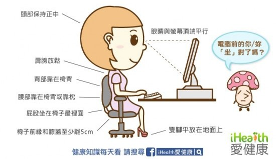

# 成因

現代工作型態（如辦公室、遠端工作）與娛樂方式（如滑手機、追劇）讓我們長時間維持不良姿勢，導致脊椎壓力增加、肌肉失衡，造成 [下背痛（Low Back Pain）](https://www.who.int/news-room/fact-sheets/detail/low-back-pain)。

## 常見類型

* **肌肉緊繃型**：長時間維持同一姿勢，導致背部肌群緊繃、僵硬。
* **[椎間盤突出](https://www.google.com/search?q=椎間盤突出)**：不當搬重物或長期姿勢不良，可能造成椎間盤壓力過大，導致突出壓迫神經。

## 例子

* 辦公室族群常因桌椅高度不合、螢幕過低，導致頭部前傾、肩膀圓弧。[^1]
* 學生族群長時間背重書包、低頭寫作業，也容易出現駝背（Thoracic Kyphosis）或背痛。
* 手機族群（低頭族）因長時間低頭滑手機，頸椎與上背部壓力大增。

# 電腦使用正確姿勢

[^1]: 進而衍生出「[烏龜頸](https://www.google.com/search?q=烏龜頸)」或「[富貴包](https://www.google.com/search?q=富貴包)」等問題。
