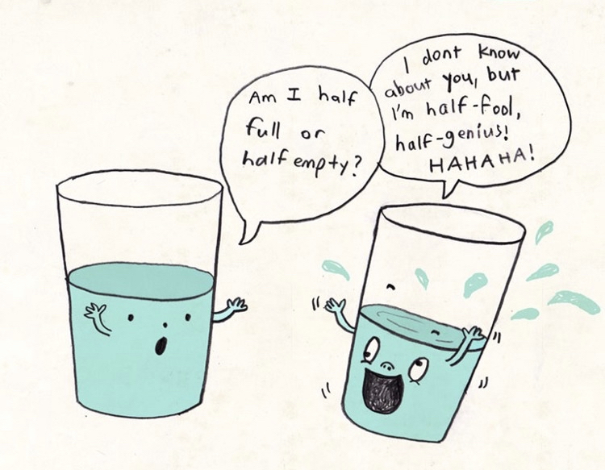

> _“A pessimist sees the difficulty in every opportunity; an optimist sees the opportunity in every difficulty.” — Winston Churchill_ [^1]

> _“It is better to light a single candle than to curse the darkness.” — Eleanor Roosevelt_

> _“We should be optimistic not because we believe that our problems are smaller than we thought. We should be optimistic because we believe that our capacity to solve problems is greater than we thought.” — from TED Talk “[The Future Will Be Shaped by Optimists](https://www.youtube.com/watch?v=FrqBWQ-mVEc)” by Kevin Kelly_

> _“[Cynacism](__temp__cynacism.md) is easy. Mimicry is easy. Optimistic contrarians are the rarest breed.” — Naval Ravikant_

---

Optimism early, pessimism in the middle, optimism late.

---

# Optimist v.s Pessimist 的形式作風 \& 決策風格

* O：因為對於未來是很堅定/確信的，所以會制定很多有遠見的長期計劃，例如做原子彈、登陸月球、開闢洲際公路等等。
* P：認為大部分事物都是靠機率\&運氣，要盡可能地小步迭代，所有東西都要做全面性的實驗。

---

# 半杯水的啟示

You can always choose to look at the _bright_ side of something. Choosing to see the good in things is a superpower.

* 樂觀者：還有半杯水 (half-full)
* 悲觀者：只剩半杯水 (half-empty)

---

A positive mind finds a way it can be done; A negative mind looks for all the ways it can’t be done.

---

[Optimism Bias](https://sketchplanations.com/optimism-bias)

[^1]: 樂觀的人看見問題背後的機會，悲觀的人看見機會背後的問題。
