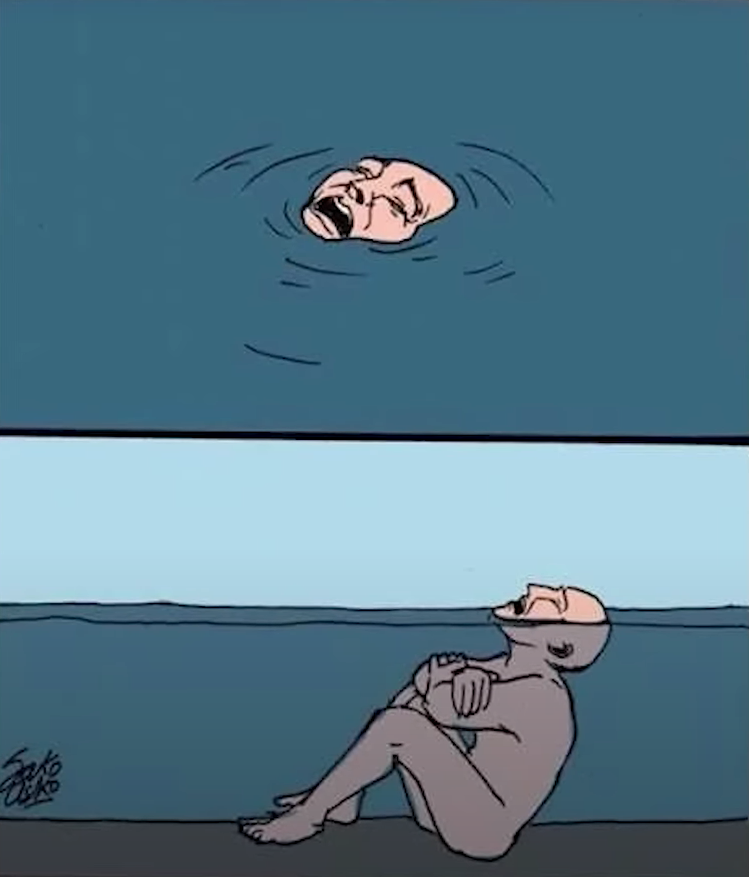

> _“Imagination and fiction make up more than three quarters of our real life.” — Simone Weil_

> _“Everything is created twice, first in the mind and then in reality.” ― Robin Sharma_

> _“I am an old man and have known a great many troubles, but most of them never happened.” — Mark Twain_

> _“We suffer more in imagination than in reality” — Seneca_

---

---

= 想太多 = 過度延伸 = 對號入座

---

The primary cause of unhappiness is never the situation but your thoughts about it.

人最大的限制是自己的想像力 — 折磨我們的恐懼，通常都是來自對於事情的「想像」，而不是事情「本身」；很多時候，我們只是被自己的一些想法「綑綁」住而已。

---

* We often worry a lot in the head throughout our life time, but most of the things that we internally panic about never actually happened.
* Usually our fears/worries are based on “_what might happen_”, not “_what is actually happening right now_”
	* Try to remind yourself: “_I am safe right now._”

---

Understand the difference between **imagination** and **rumination**

---

[Turtles all the way down](https://en.wikipedia.org/wiki/Turtles_all_the_way_down) — 你永遠找不到問題真正的答案，只會找到另一個更深層的問題 [^1]

---

A surefire way to make a bad situation worse is to continue replaying it in your mind. The damage is done. The only thing that matters now is [making the best choice given your current position.](just-focus-on-the-next-decision.md)

---

**You don’t have a thinking problem—you have an [action](cultivate-a-strong-bias-towards-action.md)/[skill](https://avthar.com/blog/growth-mindset) problem:** _Overthinking_ breeds _indecision_, leading to _inaction/underact_. Accept the consequences, stay true to your values, and move forward.
​
---

# The Poison Arrow Principle

Imagine someone is struck by a poisoned arrow. A doctor is called to remove the arrow, but the man stops him. “Not so fast! Before you remove it, I want to know who shot me. What town or village does he come from? What kind of wood was his bow made from? Was it a crossbow or a longbow?” While he asks the questions, the poison takes hold and he dies.

Like the man in the story, we occasionally get shot with the poisoned arrows of life. But ruminating too much on the nature of those arrows is unlikely to help.

---

[A true transformation begins with a mental shift](a-true-transformation-begins-with-a-mental-shift.md)

[^1]: An expression of the problem of infinite regress
