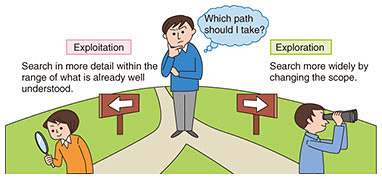
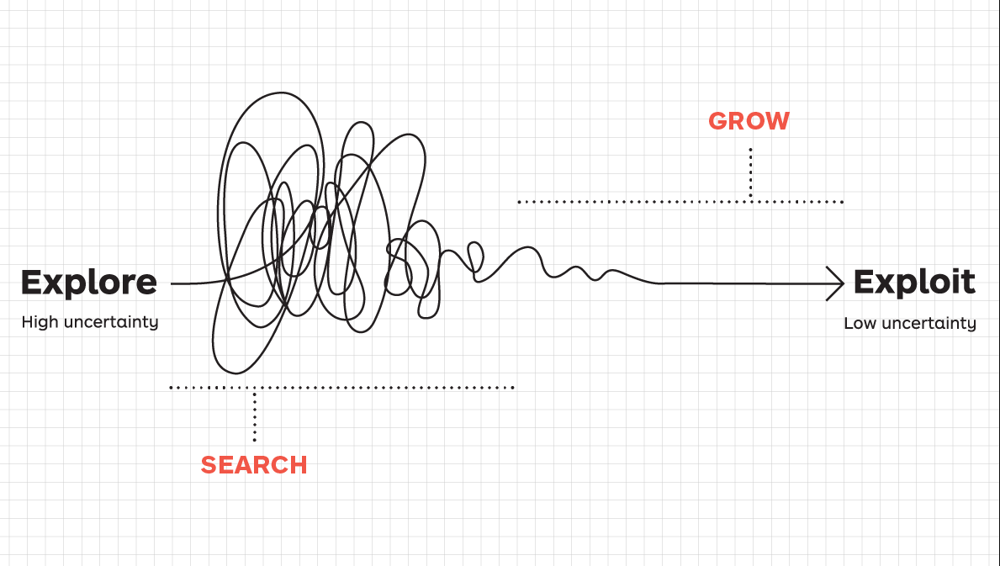

> _“At some level, all humans are broad. We’re all multivariate/multifaceted, but we get summarized in pithy ways in our lives.” — Naval Ravikant_

> _[“Exploration is how you discover what works. Persistence is how you make the most of what already works.” — James Clear](https://jamesclear.com/3-2-1/september-12-2024)_

> _“A human being should be able to change a diaper, plan an invasion, butcher a hog, conn a ship, design a building, write a sonnet, balance accounts, build a wall, set a bone, comfort the dying, take orders, give orders, cooperate, act alone, solve equations, analyze a new problem, pitch manure, program a computer, cook a tasty meal, fight efficiently, die gallantly. Specialization is for insects.” — Robert A. Heinlein_

> _“Try to learn something about everything and everything about something.” — Thomas Huxley_

---

Before you discover what you love: _fewer commitments, more experiments_. After you discover what you love: _fewer experiments, more commitments_.

The “generalist first, specialist later” Mindset

> You should explore a range of pursuits early in your career and life, with that _exploration_ leaving you better equipped for the _exploitation_ phase when you go deeper on the arena that provides you with maximum leverage.

Polymath

* Renaissance Man
* Generalist > Specialist
* A person with wide-ranging, multi-disciplinary knowledge \& skills
* 博學多聞的通才

[Don't specialize, hybridize](https://stephango.com/hybridize)

[Specific Knowledge](Specific%20Knowledge.md)

---

# T 型人才（T-shaped person）

* **橫的一橫**：表示這個人懂很多不同領域的東西（廣度），像是通才，可以跟各種人溝通，知道很多事情的大概。
* **一條腿**：表示這個人在某一個領域特別厲害（深度），是專家。

📌 比喻：像是一個會很多東西的老師，但數學特別強，可以幫忙教其他老師數學的那種感覺。

# π 型人才（Π-shaped person）

* **橫的一橫**：還是一樣代表懂很多事情（廣度）。
* **兩條腿**：表示這個人不只在一個領域很厲害，而是在**兩個（以上）不同的領域都有深度的專業**。

📌 比喻：像是一個不只數學很好，還非常會寫程式的老師，兩邊都能深入研究，也能幫大家做跨領域的事情。

| **類型** | **廣度** | **深度**   | **適合做什麼**         |
| ------ | ------ | -------- | ----------------- |
| T 型人才  | ✅      | 一個領域深入   | 合作溝通 + 擅長一件事      |
| Pi 型人才 | ✅      | 兩個領域都很深入 | 跨領域合作、創新、架橋兩領域的問題 |
