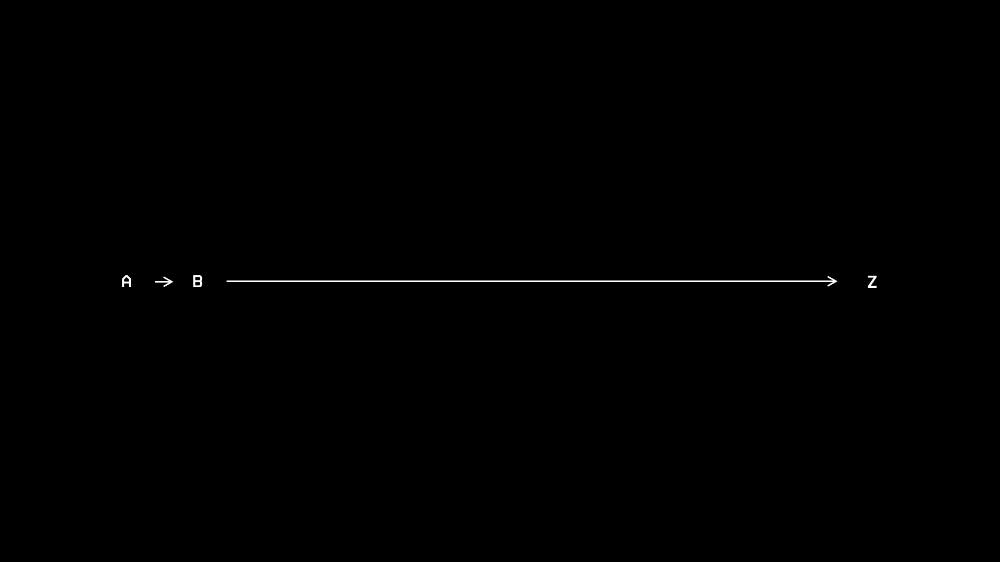
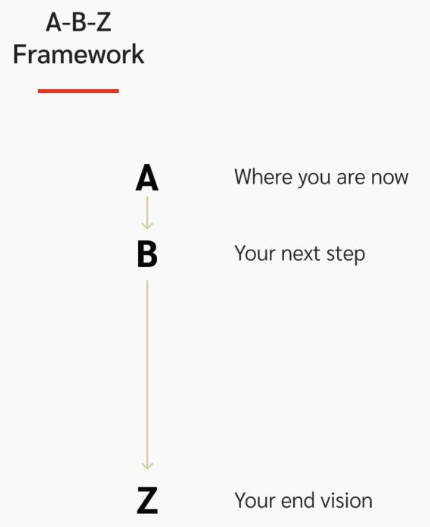

[by Shaan Puri](https://x.com/ShaanVP/status/1347252471291207681)

is a [mental model](mental%20models.md) to save you from [analysis paralysis](decision-fatigue.md) while starting new projects or achieving your life goals.

You don’t need to know steps C, D, or E at the beginning. Focusing on them will cause you to [overthinking](overthinking.md)/[procrastinate](procrastination.md) instead of [taking action](cultivate-a-strong-bias-towards-action.md).

All you need to know today is your A-B-Z: Assess where you are (A), set your direction (Z), and decide on your immediate next step (B).

[Just focus on the next action.](just-focus-on-the-next-decision.md) Take that action. You will figure out the rest along the way.

| Step  | Meaning              | Question                                                               |
| ----- | -------------------- | ---------------------------------------------------------------------- |
| **A** | Your current stand   | _“Where am I now?”_                                                    |
| **B** | Your next step       | _“What is the next step?”_                                             |
| **Z** | Your end goal/vision | _“What is the ultimate dream state?”_ _“What am I optimizing for?”_ |
