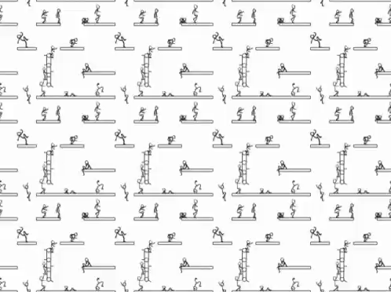

> _“Arriving someplace more desirable at some future time is an illusion. This is it.” — Jon Kabat-Zinn_

> _“The feeling ‘I’ll be happy when X happens’ will never bring you anything but discontentment. […] Consider a sailor trying to reach the horizon. It is unreachable. If the sailor sees the horizon as the point he must reach to achieve happiness, he is destined to experience eternal frustration.” ― Thomas M. Sterner, [The Practicing Mind: Developing Focus and Discipline in Your Life](https://www.goodreads.com/work/quotes/326331)_

---

= The Hedonic Treadmill/Adaptation = 抵達謬論

---

---

 The illusion that “reaching some future destination will bring lasting happiness.”

---

Humans have a tendency to quickly return to a baseline level of [happiness](happiness.md) after positive or negative events.

---

人們往往誤以為一旦達到、實現某個重要目標後，生活便會迎來穩定，所有痛苦、悲傷與煩惱都將消失，從而獲得永久的幸福與快樂。然而，現實並非如此，這個世界上並不存在「王子與公主從此過著幸福快樂的生活」的童話式結局。

---

Beware of destination addiction: The idea that happiness is in the next place, the next job, or even with the next partner. Until you give up the idea that happiness is somewhere else, it will never be where you are.

[Hedonic Happiness & Eudaimonic Happiness](hedonic-happiness-vs-eudaimonic-happiness.md)

---

「馬拉松後憂鬱症」— 因馬拉松賽事需要長時間的訓練與準備，讓跑者在賽前能夠有明確的目標及方向，然而，當比賽一結束，這種明確的目標感與方向感會突然消失，導致心理上的空虛及失落。

---

身份錯位（Identity Displacement/Dislocation/Disorder）

[Your identity dictates your actions](your-identity-dictates-your-actions.md)

---

# Actions

* [Stay in contentment](embrace-the-beauty-of-enoughness.md)
	* Contentment is the lasting goal. True joy comes from being content with what you have rather than pursuing what you don’t have.
* [Expect nothing](not-caring-lets-us-perform-better.md)
	* Reward Prediction Error = Actual Reward – Expected Reward
	* Miracles do happen when you least expect it.
	* 「[把目標砍半，以退為進](https://onyourpsy.com/010219/)」
	* 「不要將任何願望的實現視為終點，亦或是一切焦慮與煩惱的終結。」— 雖然實現目標會帶來喜悅，但這種快樂往往比不上追求過程中的期待與熱情。一旦達成一個目標，我們便會開始追尋新的方向，這也是人生 [焦慮](stress-and-anxiety.md) 不斷的根源。沒有任何狀態能帶來絕對的安全感，因為人類天性便是不斷追求與 [渴望](the-absence-of-desire-is-true-happiness.md)。**因此，我們的目標不應是永久去除焦慮，而是學習如何控制焦慮，與焦慮共處。**

---

[Journey over destination](journey-over-destination.md)

---

[Miswanting](miswanting.md)

---

[The Impact Bias](the-impact-bias.md)

---

[The Nova Effect](the-nova-effect.md)
