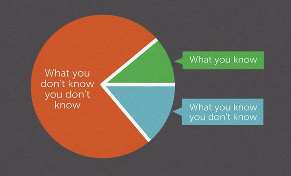

> _“It ain't what you don't know that gets you into trouble. It's what you know for sure that just ain't so.” ― Mark Twain_

> _“I am always doing that which I cannot do, in order that I may learn how to do it.” — Pablo Picasso_

> _[“In many cases, you'll find the only thing preventing you from learning is your ego. No one enjoys feeling foolish, but attempting something new requires that you climb down from your perch and struggle as a beginner. You must ask questions that reveal your ignorance or attempt skills that make you look uncoordinated. Learning demands the willingness to live in a brief state of discomfort. You must believe that looking like a fool for an hour will not ruin your reputation for life.” — James Clear](https://jamesclear.com/3-2-1/october-24-2024)_

> _“Every act of conscious [learning](learning-is-the-single-best-investment-that-you-can-make-for-your-time.md) requires the willingness to suffer an [injury to one's self-esteem](abandon-your-ego.md). That is why young children, before they are aware of their own self-importance, learn so easily; and why older persons, especially if vain or important, cannot learn at all.” — Thomas Szasz_

> _“You can't be content with mastery; you have to push yourself to become a student again.” — [@kleonShowYourWork2014]_

---

Enjoy being wrong or looking/sounding “stupid” in a public setting.

---

Be brave enough to suck at something new.

---

Admitting that you don't have all the answers. Normalize the awkwardness of saying:

* “I don't know.”
* “This sounds really hard.”
* “I don't have enough information to have an opinion on that.”

It's perfectly reasonable.

---

# [The Rumsfeld Matrix](https://www.google.com/search?q=The+Rumsfeld+Matrix) [^1] — [Unknown Unknowns](https://sketchplanations.com/unknown-unknowns)

我們所不知道的事情，遠遠超過我們所知道的事情。所以，永遠都要預設自己一無所知。

忽視或無知的代價往往極其高昂。唯有持續保持對新事物的 [好奇心](Stay%20curious.md)，才能不斷突破固有的「認知邊界」，開拓更廣闊的視野與可能性。

You don't know what you don't know, the _unknown unknowns_.

---

Every expert started out as a beginner. Embrace the embarrassment of feeling like a beginner.

---

歸零 = 回歸初心 ([Shoshin](https://www.google.com/search?q=Shoshin))

---

「20 年工作經驗」might be「1 年工作經驗重複 20 次」…

---

Naivety (= naiveness = naïveté)

* The state of being naive
* Refers to an apparent or actual lack of experience and sophistication

---

# The Empty Cup Mentality

> A long time ago, there was a wise Zen master. People from distant places would come to seek his guidance, hoping to learn the path to enlightenment.
>
> One day, a scholar arrived, eager for advice. “I wish to learn about Zen,” he told the master.
>
> However, the scholar couldn't stop talking about his own thoughts and knowledge. He kept interrupting the master, sharing his own ideas and not paying attention to what the master had to say. The master remained calm and suggested they have tea.
>
> The master began pouring tea into the scholar's cup. As the cup filled, the master continued pouring, causing the tea to spill onto the table, the floor, and finally onto the scholar's clothing. Shocked, the scholar exclaimed, “Stop! The cup is overflowing! It can't hold any more.”
>
> The master smiled and said, “Just like this cup, you are filled with your own thoughts. There's no room for anything new. Come back when your cup is empty.”

---

[Shed your identity to see reality.](https://www.navalmanack.com/almanack-of-naval-ravikant/shed-your-identity-to-see-reality)

---

## See Also

* [The Einstellung Effect](The%20Einstellung%20Effect.md)
* [Abandon your ego](abandon-your-ego.md)
* [Be ready to change your mind completely at any given time](be-ready-to-change-your-mind-completely-at-any-given-time.md)
* [The Intellectual Yet Idiot](the-intellectual-yet-idiot.md)

[^1]: aka The Awareness—Understanding Matrix
